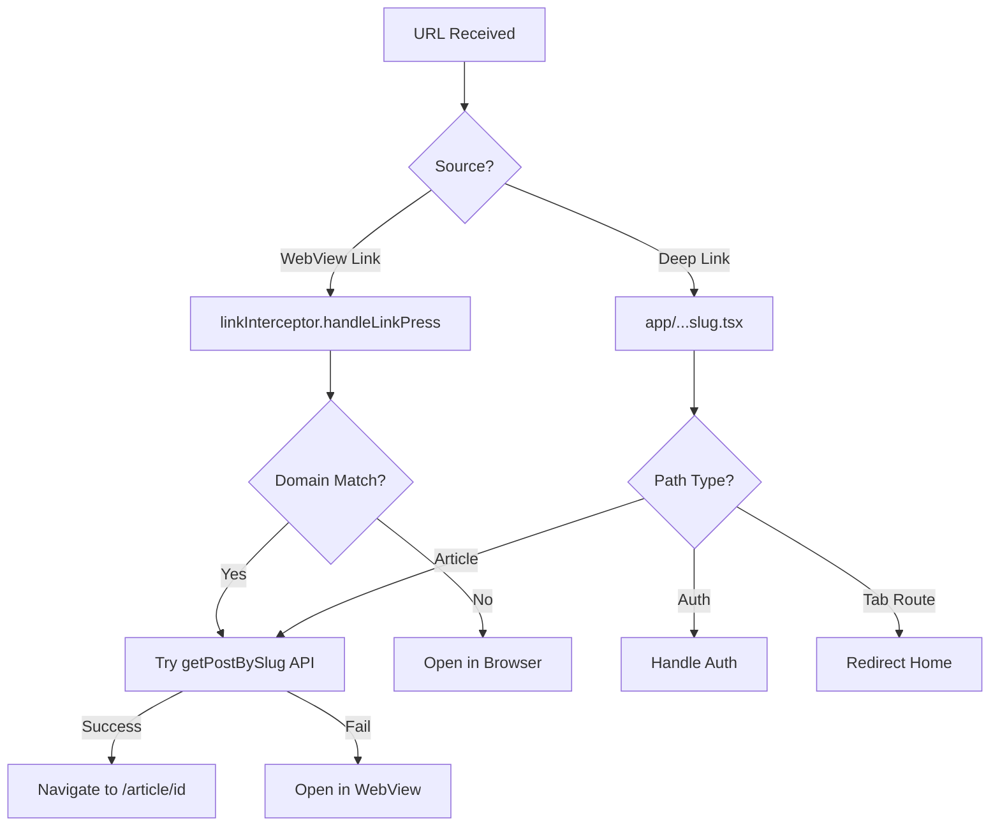
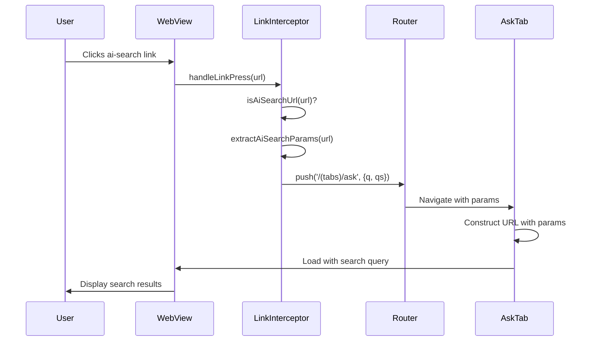

# AI Search URL Interception Implementation Plan

## Overview

Intercept URLs with `/ai-search/` path from Nursing Times domain and redirect them to the Ask tab with search query parameters, instead of opening them as articles.

## Example URL

```
https://www.nursingtimes.net/ai-search/?q=Who%20is%20a%20senior%20UK%20nurse%20leader%20recognised%20in%20public%20health%20nursing%20since%20July%202024%3F&qs=NT-347670
```

## Current Architecture Analysis

### 1. Deep Link Flow



### 2. Current Components

#### [`utils/linkInterceptor.ts`](utils/linkInterceptor.ts)

- **Purpose**: Intercepts links in WebViews and handles domain-specific routing
- **Key Functions**:
  - `isDomainLink()`: Checks if URL belongs to configured domains
  - `handleLinkPress()`: Main handler that resolves slugs to article IDs
  - `createWebViewLinkInterceptor()`: Generates JS code for WebView injection
  - `getLinkInterceptorConfig()`: Gets domain config from brand settings

#### [`app/[...slug].tsx`](app/[...slug].tsx)

- **Purpose**: Catch-all route for deep linking
- **Current Logic**:
  1. Handles auth callbacks with tokens
  2. Opens auth pages in browser
  3. Filters out tab routes
  4. Caches processed deep links (3-second window)
  5. Resolves slugs to article IDs via API
  6. Falls back to WebView if resolution fails

#### [`app/(tabs)/ask.tsx`](<app/(tabs)/ask.tsx>)

- **Purpose**: Displays AI search WebView
- **Current State**:
  - Loads WebView with base URL: `{baseUrl}/mobile-app-ai-search/?hash={hash}&user_id={userId}`
  - Uses link interceptor for domain links
  - No support for external query parameters

## Implementation Design

### 1. URL Pattern Detection

**Target Pattern**: `/ai-search/` with query parameters

- Path: `/ai-search/`
- Query params: `q` (search query), `qs` (source identifier)

### 2. Interception Points

#### Point A: WebView Link Clicks (linkInterceptor.ts)

When users click links inside WebViews (articles, news, etc.)

**Changes Needed**:

```typescript
// Add new function to detect ai-search URLs
export function isAiSearchUrl(url: string): boolean {
  try {
    const urlObj = new URL(url);
    return (
      urlObj.pathname === "/ai-search/" || urlObj.pathname === "/ai-search"
    );
  } catch {
    return false;
  }
}

// Add new function to extract search params
export function extractAiSearchParams(
  url: string
): { q?: string; qs?: string } | null {
  try {
    const urlObj = new URL(url);
    const q = urlObj.searchParams.get("q");
    const qs = urlObj.searchParams.get("qs");
    return q || qs ? { q: q || undefined, qs: qs || undefined } : null;
  } catch {
    return null;
  }
}

// Update handleLinkPress to check for ai-search before article resolution
export async function handleLinkPress(
  url: string,
  config: LinkInterceptorConfig
): Promise<void> {
  // Check if it's one of our domains
  if (isDomainLink(url, config.domains)) {
    // NEW: Check for ai-search URLs first
    if (isAiSearchUrl(url)) {
      const params = extractAiSearchParams(url);
      if (params) {
        // Navigate to Ask tab with search params
        router.push({
          pathname: "/(tabs)/ask",
          params: params,
        });
        return;
      }
    }

    // Existing article resolution logic...
  }
}
```

#### Point B: Deep Links (app/[...slug].tsx)

When app is opened via deep link or universal link

**Changes Needed**:

```typescript
// Add check before article resolution
const firstSegment = slug.split("/")[0].toLowerCase();

// NEW: Handle ai-search URLs
if (firstSegment === "ai-search") {
  console.log("🔗 AI search URL detected");

  // Extract query parameters from the full URL
  const brandConfig = brandManager.getCurrentBrand();
  const fullUrl = `https://${brandConfig.domain}/${slug}`;
  const urlObj = new URL(fullUrl);

  const q = urlObj.searchParams.get("q");
  const qs = urlObj.searchParams.get("qs");

  if (q || qs) {
    console.log("🔗 Navigating to Ask tab with search params");
    router.replace({
      pathname: "/(tabs)/ask",
      params: { q: q || undefined, qs: qs || undefined },
    });
    return;
  }

  // If no params, just go to Ask tab
  router.replace("/(tabs)/ask");
  return;
}

// Existing logic for other paths...
```

### 3. Ask Tab Updates (app/(tabs)/ask.tsx)

**Changes Needed**:

```typescript
import { useLocalSearchParams } from "expo-router";

export default function AskScreen() {
  // Get search params from route
  const routeParams = useLocalSearchParams<{ q?: string; qs?: string }>();

  // Construct the dynamic URL with search params if provided
  const webViewUrl = useMemo(() => {
    if (!brandConfig) return null;

    let baseUrl = `${brandConfig.apiConfig.baseUrl}/mobile-app-ai-search/?hash=${brandConfig.apiConfig.hash}`;

    // Add user_id if available
    if (userId) {
      baseUrl += `&user_id=${userId}`;
    }

    // Add search params if provided via route
    if (routeParams.q) {
      baseUrl += `&q=${encodeURIComponent(routeParams.q)}`;
    }
    if (routeParams.qs) {
      baseUrl += `&qs=${encodeURIComponent(routeParams.qs)}`;
    }

    console.log("Ask webviewUrl with search params:", baseUrl);
    return baseUrl;
  }, [brandConfig, userId, routeParams.q, routeParams.qs]);

  // Force WebView reload when URL changes
  const webViewKey = useMemo(() => webViewUrl, [webViewUrl]);

  // Add key prop to WebView to force reload
  <WebView
    key={webViewKey}
    source={{ uri: webViewUrl }}
    // ... rest of props
  />;
}
```

### 4. WebView Link Interceptor JavaScript

**Update in createWebViewLinkInterceptor()**:

```javascript
// Inside the injected JavaScript
document.addEventListener(
  "click",
  function (e) {
    let target = e.target;

    while (target && target.tagName !== "A") {
      target = target.parentElement;
    }

    if (target && target.tagName === "A" && target.href) {
      const href = target.href;

      // Check if it's an ai-search URL
      try {
        const url = new URL(href);
        if (url.pathname === "/ai-search/" || url.pathname === "/ai-search") {
          e.preventDefault();
          e.stopPropagation();

          // Send to React Native with special type
          if (window.ReactNativeWebView) {
            window.ReactNativeWebView.postMessage(
              JSON.stringify({
                type: "aiSearchLink",
                url: href,
              })
            );
          }
          return;
        }
      } catch (err) {}

      // Existing domain link check...
    }
  },
  true
);
```

## Implementation Flow



## Testing Strategy

### Test Cases

1. **WebView Link Click**

   - Click ai-search link in article WebView
   - Verify navigation to Ask tab
   - Verify search query is passed correctly
   - Verify WebView reloads with query

2. **Deep Link**

   - Open app with `nt://ai-search/?q=test&qs=NT-123`
   - Verify app navigates to Ask tab
   - Verify search query is displayed

3. **Universal Link**

   - Open `https://www.nursingtimes.net/ai-search/?q=test&qs=NT-123`
   - Verify same behavior as deep link

4. **Edge Cases**
   - ai-search URL without query params
   - ai-search URL with only `q` param
   - ai-search URL with only `qs` param
   - Malformed URLs

### Manual Testing Steps

1. Create test article with ai-search link
2. Open article in app
3. Click ai-search link
4. Verify Ask tab opens with search
5. Test deep link via terminal: `xcrun simctl openurl booted "nt://ai-search/?q=test"`
6. Test universal link (requires server setup)

## Files to Modify

1. **[`utils/linkInterceptor.ts`](utils/linkInterceptor.ts)**

   - Add `isAiSearchUrl()` function
   - Add `extractAiSearchParams()` function
   - Update `handleLinkPress()` to check ai-search before article resolution
   - Update `createWebViewLinkInterceptor()` to handle ai-search in WebView JS

2. **[`app/[...slug].tsx`](app/[...slug].tsx)**

   - Add ai-search path detection before article resolution
   - Extract query params and navigate to Ask tab

3. **[`app/(tabs)/ask.tsx`](<app/(tabs)/ask.tsx>)**
   - Import `useLocalSearchParams`
   - Read route params (q, qs)
   - Append params to webViewUrl
   - Add key prop to WebView for forced reload

## Benefits

1. **Seamless UX**: Users stay in-app when clicking AI search links
2. **Consistent Behavior**: Same handling for WebView clicks and deep links
3. **Maintainable**: Centralized logic in linkInterceptor
4. **Extensible**: Easy to add more query parameters in future

## Potential Issues & Solutions

### Issue 1: WebView Caching

**Problem**: WebView might cache previous search results
**Solution**: Use `key` prop on WebView component to force reload when URL changes

### Issue 2: Tab Already Active

**Problem**: If user is already on Ask tab, navigation might not trigger reload
**Solution**: Use `router.push()` with params even if on same tab, WebView key will force reload

### Issue 3: Query Parameter Encoding

**Problem**: Special characters in search query might break URL
**Solution**: Use `encodeURIComponent()` for all query parameters

### Issue 4: Multiple Rapid Clicks

**Problem**: User might click multiple ai-search links quickly
**Solution**: Existing deep link cache in `[...slug].tsx` handles this (3-second window)

## Success Criteria

- ✅ AI search links in WebViews navigate to Ask tab
- ✅ Search query parameters are preserved and passed correctly
- ✅ WebView reloads with new search query
- ✅ Deep links with ai-search path work correctly
- ✅ No regression in existing article link handling
- ✅ Works on both iOS and Android
