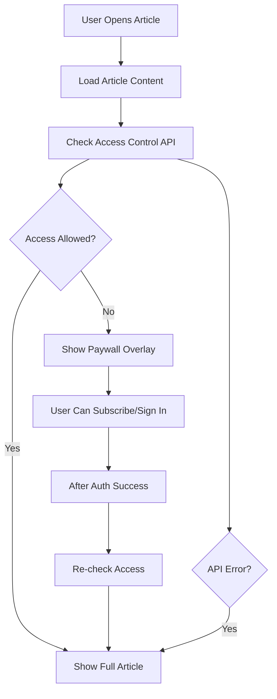

# Article Access Control & Paywall Implementation Plan

## Overview

Implement access control checking for article detail pages to determine whether to show the paywall bottom sheet based on user subscription status and permissions.

## API Endpoint

```
POST [apiConfig.baseUrl]/wp-json/mbm-apps/v1/access-control
```

### Request Parameters

- **post_id** (integer): The ID of the post/article
- **hash** (string): API Hash from brand config
- **Authorization Header**: `Bearer <JWT_TOKEN>` (optional - for authenticated users)

### Response Format

#### ✅ Access Granted

```json
{
  "user_id": 1,
  "post_id": 338771,
  "allowed": true,
  "message": "User has active subscription. Access granted."
}
```

#### ❌ Access Denied

```json
{
  "user_id": 0,
  "post_id": 338771,
  "allowed": false,
  "message": "Access denied. User does not have permission to access this post."
}
```

## Implementation Strategy

### 1. User Experience Flow



### 2. Implementation Decisions

#### Timing

- ✅ Check access **immediately** when ArticleDetailView loads
- ✅ Run in parallel with article content loading for better UX
- ✅ Don't block article rendering while checking access

#### Access Denied Behavior

- ✅ Show **paywall overlay** at the bottom of the screen
- ✅ Keep article content visible (user can see what they're missing)
- ✅ Paywall slides up from bottom with animation

#### Post ID Mapping

- ✅ Use `article_id` directly as `post_id` parameter
- ✅ Works for both WordPress articles and PDF magazine articles
- ✅ Backend handles the mapping if needed

#### Error Handling (Fail Open)

- ✅ If API fails → Show article (user-friendly approach)
- ✅ Log errors for monitoring
- ✅ Don't punish users for technical issues

## Architecture

### File Structure

```
services/
  auth.ts                          # Add checkArticleAccess function

hooks/
  useArticleAccess.ts              # New custom hook

components/
  ArticleDetailView.tsx            # Update to integrate access control
  PaywallBottomSheet.tsx           # Already exists, will be reused

types/
  index.ts                         # Add AccessControlResponse type
```

### Component Hierarchy

```
ArticleDetailView
├── Header (Back Button)
├── ScrollView (Article Content)
└── PaywallBottomSheet (Conditional)
    ├── Logo
    ├── Headline & Benefits
    └── CTA Buttons (Subscribe/Sign In)
```

## Detailed Implementation Steps

### Step 1: TypeScript Types

**File**: `types/index.ts`

Add new interfaces:

```typescript
export interface AccessControlResponse {
  user_id: number;
  post_id: number;
  allowed: boolean;
  message: string;
}

export interface AccessControlRequest {
  post_id: string | number;
  hash: string;
  token?: string; // Optional JWT token
}
```

### Step 2: Access Control API Service

**File**: `services/auth.ts`

Add new function:

```typescript
/**
 * Check if user has access to a specific article/post
 *
 * @param postId - The article/post ID to check access for
 * @param token - Optional JWT access token for authenticated users
 * @returns Access control response indicating if access is allowed
 */
export async function checkArticleAccess(
  postId: string | number,
  token?: string
): Promise<AccessControlResponse>;
```

**Implementation Details**:

- Use POST method
- Include Authorization header if token provided
- Send post_id and hash in request body
- Handle both authenticated and anonymous users
- Return structured response with allowed flag
- Log all requests for debugging
- Handle network errors gracefully

### Step 3: Custom Hook for Access Control

**File**: `hooks/useArticleAccess.ts`

Create reusable hook:

```typescript
export function useArticleAccess(articleId: string) {
  const { accessToken } = useAuth();
  const [accessState, setAccessState] = useState({
    isChecking: true,
    isAllowed: true, // Default to true (fail open)
    error: null,
    response: null,
  });

  // Check access on mount and when auth state changes
  useEffect(() => {
    checkAccess();
  }, [articleId, accessToken]);

  return {
    isChecking,
    isAllowed,
    shouldShowPaywall: !isAllowed && !isChecking,
    error,
    recheckAccess,
  };
}
```

**Features**:

- Automatic access checking on mount
- Re-check when authentication state changes
- Expose loading state for UI feedback
- Provide manual recheck function
- Default to allowed (fail open)

### Step 4: Update ArticleDetailView Component

**File**: `components/ArticleDetailView.tsx`

**Changes Required**:

1. **Import new dependencies**:

```typescript
import { useArticleAccess } from "@/hooks/useArticleAccess";
import { PaywallBottomSheet } from "./PaywallBottomSheet";
import { useAuth } from "@/contexts/AuthContext";
```

2. **Add access control state**:

```typescript
const { isAllowed, shouldShowPaywall, recheckAccess } =
  useArticleAccess(articleId);
const [paywallVisible, setPaywallVisible] = useState(false);
const { login } = useAuth();
```

3. **Show paywall when access denied**:

```typescript
useEffect(() => {
  if (shouldShowPaywall) {
    setPaywallVisible(true);
  }
}, [shouldShowPaywall]);
```

4. **Handle paywall interactions**:

```typescript
const handlePaywallClose = () => {
  setPaywallVisible(false);
};

const handleSubscribe = () => {
  // Open subscription URL from brand config
};

const handleSignIn = async () => {
  await login();
  // After successful login, recheck access
  await recheckAccess();
};
```

5. **Add PaywallBottomSheet to render**:

```typescript
return (
  <View style={styles.container}>
    {/* Existing header and content */}

    <PaywallBottomSheet
      visible={paywallVisible}
      onClose={handlePaywallClose}
      onSubscribe={handleSubscribe}
      onSignIn={handleSignIn}
    />
  </View>
);
```

### Step 5: Analytics Integration

**File**: `components/ArticleDetailView.tsx`

Add tracking events:

```typescript
// Track when paywall is shown
useEffect(() => {
  if (shouldShowPaywall) {
    analyticsService.logEvent("article_paywall_shown", {
      article_id: articleId,
      edition_id: editionId,
      user_authenticated: !!accessToken,
    });
  }
}, [shouldShowPaywall]);

// Track paywall interactions
const handlePaywallClose = () => {
  analyticsService.logEvent("article_paywall_dismissed", {
    article_id: articleId,
  });
  setPaywallVisible(false);
};
```

## Testing Strategy

### Test Cases

#### 1. Unauthenticated User - Access Denied

- **Setup**: No JWT token, article requires subscription
- **Expected**: Paywall shows immediately
- **Verify**: Article content visible, paywall overlay present

#### 2. Authenticated User - Access Granted

- **Setup**: Valid JWT token, active subscription
- **Expected**: No paywall, full article access
- **Verify**: Article loads normally, no paywall

#### 3. Authenticated User - Access Denied

- **Setup**: Valid JWT token, no active subscription
- **Expected**: Paywall shows
- **Verify**: User can sign in or subscribe

#### 4. API Error Scenario

- **Setup**: Network error or API timeout
- **Expected**: Article shows (fail open)
- **Verify**: Error logged, user not blocked

#### 5. Sign In Flow

- **Setup**: User clicks "Sign In" on paywall
- **Expected**: Auth flow starts, paywall closes on success
- **Verify**: Access rechecked after authentication

#### 6. Subscribe Flow

- **Setup**: User clicks "Subscribe" on paywall
- **Expected**: External subscription URL opens
- **Verify**: Analytics event logged

### Manual Testing Checklist

- [ ] Test with no authentication
- [ ] Test with authenticated user (subscribed)
- [ ] Test with authenticated user (not subscribed)
- [ ] Test network error handling
- [ ] Test sign-in flow from paywall
- [ ] Test subscribe button
- [ ] Verify analytics events fire
- [ ] Test on iOS
- [ ] Test on Android
- [ ] Test paywall animation
- [ ] Test paywall close button
- [ ] Verify access recheck after login

## Security Considerations

1. **JWT Token Handling**

   - Always use HTTPS for API calls
   - Token sent in Authorization header
   - Token validation on backend

2. **Fail Open Strategy**

   - Prioritizes user experience
   - Logs all access checks for monitoring
   - Backend is source of truth

3. **Rate Limiting**
   - Consider caching access control results
   - Avoid excessive API calls
   - Cache duration: 5 minutes per article

## Performance Optimization

### Caching Strategy

```typescript
// Cache access control results
const ACCESS_CACHE_DURATION = 5 * 60 * 1000; // 5 minutes

// Cache key format
const cacheKey = `access_control_${articleId}_${userId}`;
```

### Parallel Loading

- Load article content and check access simultaneously
- Don't block UI rendering
- Show paywall after content loads if needed

## Error Messages

### User-Facing Messages

- **Access Denied**: "Subscribe to read this article"
- **API Error**: Article loads normally (silent failure)
- **Network Error**: Article loads normally (silent failure)

### Developer Logs

- `🔒 Access check started for article: ${articleId}`
- `✅ Access granted for article: ${articleId}`
- `❌ Access denied for article: ${articleId}`
- `⚠️ Access check failed, allowing access (fail open)`

## Future Enhancements

1. **Preview Mode**

   - Show first 2 paragraphs before paywall
   - Blur remaining content

2. **Metered Paywall**

   - Track article views
   - Allow X free articles per month

3. **Smart Paywall Timing**

   - Show paywall after user scrolls 50%
   - Delay paywall for better engagement

4. **A/B Testing**
   - Test different paywall messages
   - Test timing strategies

## Rollout Plan

### Phase 1: Core Implementation

- [ ] Add TypeScript types
- [ ] Implement API service function
- [ ] Create useArticleAccess hook
- [ ] Update ArticleDetailView component

### Phase 2: Testing & Refinement

- [ ] Manual testing on both platforms
- [ ] Fix any bugs discovered
- [ ] Add analytics tracking
- [ ] Performance optimization

### Phase 3: Monitoring

- [ ] Monitor error rates
- [ ] Track paywall conversion rates
- [ ] Gather user feedback
- [ ] Iterate based on data

## Success Metrics

- **Technical**:

  - API response time < 500ms
  - Error rate < 1%
  - Zero crashes related to paywall

- **Business**:
  - Paywall shown rate
  - Sign-in conversion rate
  - Subscribe click-through rate
  - User retention after paywall

## Documentation Updates

After implementation, update:

- [ ] README.md with access control feature
- [ ] API documentation
- [ ] Component documentation
- [ ] Testing documentation

## Questions & Decisions Log

| Question               | Decision                | Rationale                                  |
| ---------------------- | ----------------------- | ------------------------------------------ |
| When to check access?  | Immediately on load     | Better UX, parallel loading                |
| What if access denied? | Show paywall overlay    | User sees value proposition                |
| Post ID mapping?       | Use article_id directly | Simplest approach, backend handles mapping |
| Error handling?        | Fail open               | User-friendly, don't block on errors       |
| Cache access results?  | Yes, 5 minutes          | Reduce API calls, improve performance      |

## Related Files

- [`components/ArticleDetailView.tsx`](../components/ArticleDetailView.tsx)
- [`components/PaywallBottomSheet.tsx`](../components/PaywallBottomSheet.tsx)
- [`services/auth.ts`](../services/auth.ts)
- [`contexts/AuthContext.tsx`](../contexts/AuthContext.tsx)
- [`brands/nt/config.json`](../brands/nt/config.json)

## References

- Access Meter API Documentation (provided in task)
- JWT Authentication Flow
- React Native Best Practices
- Expo WebBrowser Documentation
