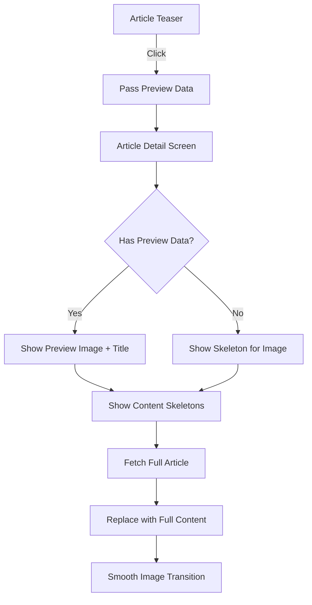

# Article Loading State Optimization Plan

## Overview

Improve the article detail screen loading experience by utilizing preview data (title, image, category, date) that's already available from article teasers, and adding skeleton loaders for content that's still loading.

## Current State Analysis

### Entry Points to Article Detail Screen

Based on code analysis, articles can be navigated to from:

1. **ArticleTeaser Component** ([`components/ArticleTeaser.tsx`](../components/ArticleTeaser.tsx))

   - Used in news feeds and article lists
   - Has: `title`, `imageUrl`, `category`, `timestamp`
   - Navigation: `router.push(\`/article/${article.id}\`)`

2. **ArticleTeaserHero Component** ([`components/ArticleTeaserHero.tsx`](../components/ArticleTeaserHero.tsx))

   - Used for featured/hero articles
   - Has: `title`, `imageUrl`
   - Navigation: `router.push(\`/article/${article.id}\`)`

3. **Deep Links** ([`app/_layout.tsx`](../app/_layout.tsx:177))

   - Push notifications
   - External links
   - No preview data available

4. **Swipe Navigation** ([`app/article/[id].tsx`](../app/article/[id].tsx:399))

   - From within article detail screen
   - Has full article data from related articles

5. **Settings Test Article** ([`app/settings.tsx`](../app/settings.tsx:44))
   - Test navigation
   - No preview data

### Current Loading Behavior

- Shows generic `ActivityIndicator` with "Loading article..." text
- No preview data utilized
- Full screen loading state blocks all content
- No progressive loading experience

## Proposed Solution

### Architecture Overview



### Implementation Strategy

#### 1. Route Parameter Enhancement

**Modify navigation to pass preview data as URL parameters:**

```typescript
// From ArticleTeaser and ArticleTeaserHero
router.push({
  pathname: `/article/${article.id}`,
  params: {
    previewTitle: article.title,
    previewImage: article.imageUrl,
    previewCategory: article.category,
    previewDate: article.timestamp || article.publishDate,
  },
});
```

**Benefits:**

- Works with React Navigation's built-in parameter system
- No global state needed
- Survives screen transitions
- Easy to make optional (graceful degradation)

#### 2. Article Detail Screen Updates

**Accept preview parameters:**

```typescript
const { id, source, previewTitle, previewImage, previewCategory, previewDate } =
  useLocalSearchParams<{
    id: string;
    source?: string;
    previewTitle?: string;
    previewImage?: string;
    previewCategory?: string;
    previewDate?: string;
  }>();
```

**Loading state logic:**

```typescript
const hasPreviewData = !!(previewTitle && previewImage);
const displayTitle = article?.title || previewTitle;
const displayImage = article?.imageUrl || previewImage;
const displayCategory = article?.category || previewCategory;
const displayDate = article?.publishDate || article?.timestamp || previewDate;
```

#### 3. New Component: ArticleDetailSkeleton

Create a specialized skeleton loader for article content area:

**Location:** [`components/ArticleDetailSkeleton.tsx`](../components/ArticleDetailSkeleton.tsx)

**Features:**

- Skeleton for author/date row
- Skeleton for title (2-3 lines)
- Skeleton for subtitle (if applicable)
- Skeleton for lead text (2-3 lines)
- Skeleton for content paragraphs
- Matches actual article layout spacing

**Usage:**

```tsx
{
  loading && hasPreviewData && <ArticleDetailSkeleton />;
}
```

#### 4. Image Loading Strategy

**Two-phase image loading:**

1. **Phase 1: Preview Image (Immediate)**

   - Show teaser image from preview data
   - Display immediately, no loading delay
   - Uses existing [`FadeInImage`](../components/FadeInImage.tsx) component

2. **Phase 2: Full Resolution (After API)**
   - Replace with full article image when loaded
   - Smooth crossfade transition
   - Handle case where images are the same URL

**Implementation approach:**

```tsx
// Show preview image immediately if available
{
  loading && previewImage && (
    <FadeInImage
      source={{ uri: previewImage }}
      style={styles.headerImage}
      fadeDuration={0} // Instant for preview
    />
  );
}

// Show full image when loaded
{
  article?.imageUrl && (
    <FadeInImage
      source={{ uri: article.imageUrl }}
      style={styles.headerImage}
      fadeDuration={300} // Smooth transition
    />
  );
}
```

#### 5. Content Area Layout

**Loading state with preview data:**

```tsx
<Animated.ScrollView>
  <View style={styles.headerSpacer} />

  <View style={styles.contentContainer}>
    {/* Show preview metadata if available */}
    {loading && hasPreviewData && (
      <>
        <View style={styles.metaContainer}>
          <Text style={styles.timestamp}>{previewDate?.toUpperCase()}</Text>
        </View>

        <Text style={styles.title}>{previewTitle}</Text>

        {/* Skeleton for rest of content */}
        <ArticleDetailSkeleton />
      </>
    )}

    {/* Show full content when loaded */}
    {!loading && article && <>{/* Full article content */}</>}
  </View>
</Animated.ScrollView>
```

**Loading state without preview data:**

```tsx
{
  loading && !hasPreviewData && (
    <SafeAreaView style={styles.container}>
      <ThemedView style={styles.centerContent}>
        <ActivityIndicator size="large" />
        <ThemedText style={styles.loadingText}>Loading article...</ThemedText>
      </ThemedView>
    </SafeAreaView>
  );
}
```

### Edge Cases & Considerations

#### 1. Deep Links (No Preview Data)

- Fall back to current loading behavior
- Show full skeleton including image placeholder
- Graceful degradation

#### 2. Image URL Changes

- Handle case where preview image URL differs from full article image
- Ensure smooth transition without flicker
- Consider caching strategy

#### 3. Navigation from Article to Article

- Swipe navigation already has full article data
- Can pass complete preview data
- Optimize for this common case

#### 4. Performance Considerations

- URL parameters have length limits (~2000 chars)
- Titles should be safe (typically <200 chars)
- Image URLs should be safe (typically <500 chars)
- Total preview data well within limits

#### 5. Accessibility

- Ensure skeleton loaders have proper accessibility labels
- Maintain screen reader compatibility
- Preserve existing accessibility features

### File Changes Required

#### Modified Files

1. [`components/ArticleTeaser.tsx`](../components/ArticleTeaser.tsx)

   - Update `handlePress` to pass preview params

2. [`components/ArticleTeaserHero.tsx`](../components/ArticleTeaserHero.tsx)

   - Update `handlePress` to pass preview params

3. [`app/article/[id].tsx`](../app/article/[id].tsx)

   - Accept preview params from route
   - Implement preview data display logic
   - Add ArticleDetailSkeleton usage
   - Update loading state rendering

4. [`app/(tabs)/clinical.tsx`](<../app/(tabs)/clinical.tsx>)

   - Update `handleArticlePress` to pass preview params

5. [`app/(tabs)/news.tsx`](<../app/(tabs)/news.tsx>)
   - Update `handleArticlePress` to pass preview params

#### New Files

1. [`components/ArticleDetailSkeleton.tsx`](../components/ArticleDetailSkeleton.tsx)
   - New specialized skeleton component
   - Matches article detail layout
   - Reuses existing skeleton animation logic

### Testing Strategy

#### Test Scenarios

1. **Navigation from ArticleTeaser**

   - Verify preview data displays immediately
   - Verify smooth transition to full content
   - Verify image replacement works

2. **Navigation from ArticleTeaserHero**

   - Same as above
   - Verify hero-specific layout

3. **Deep Link Navigation**

   - Verify fallback to loading spinner
   - Verify no errors when preview data missing

4. **Swipe Navigation**

   - Verify smooth transitions
   - Verify preview data from related articles

5. **Slow Network Conditions**

   - Verify skeleton shows appropriate duration
   - Verify no layout shifts
   - Verify smooth content replacement

6. **Fast Network Conditions**
   - Verify no flicker
   - Verify preview data still provides value

### Success Metrics

1. **Perceived Performance**

   - Content visible within 100ms (preview data)
   - Full content loads in background
   - No blank screens

2. **User Experience**

   - Smooth transitions
   - No layout shifts
   - Clear loading indicators

3. **Technical Quality**
   - No performance regressions
   - Maintains accessibility
   - Works across all entry points

## Implementation Order

1. ✅ Create detailed plan (this document)
2. Create ArticleDetailSkeleton component
3. Update article detail screen to accept preview params
4. Implement preview data display logic
5. Update ArticleTeaser navigation
6. Update ArticleTeaserHero navigation
7. Update other navigation points
8. Test all scenarios
9. Refine transitions and timing
10. Final QA and polish

## Notes

- This approach maintains backward compatibility
- Preview data is optional - graceful degradation
- No breaking changes to existing functionality
- Leverages existing components (FadeInImage, SkeletonLoader patterns)
- Follows React Navigation best practices
