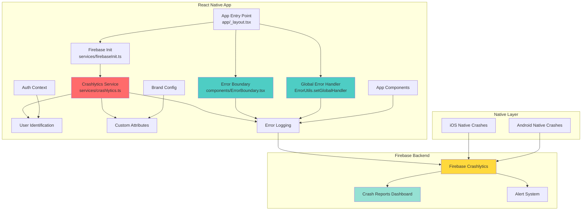
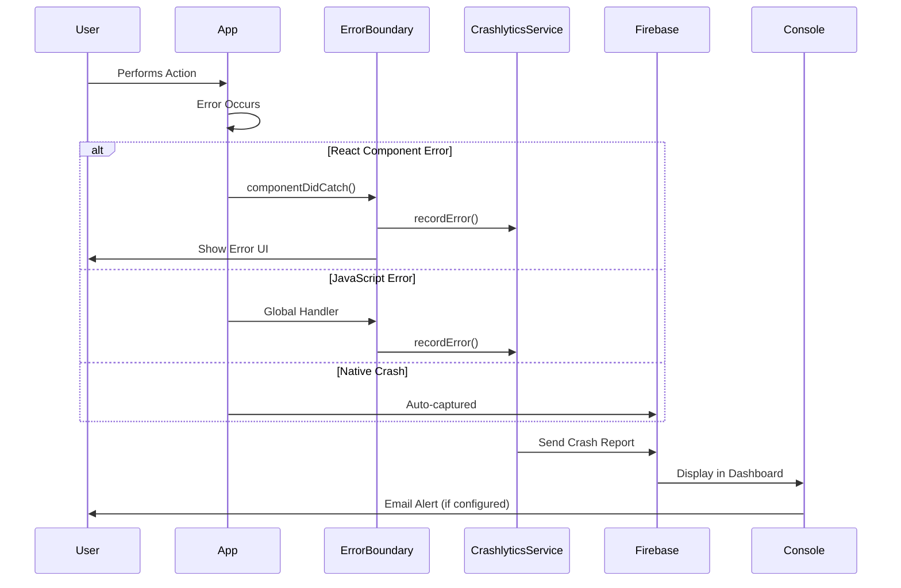
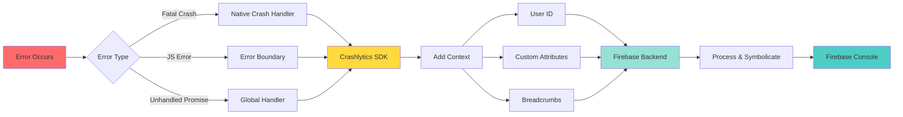
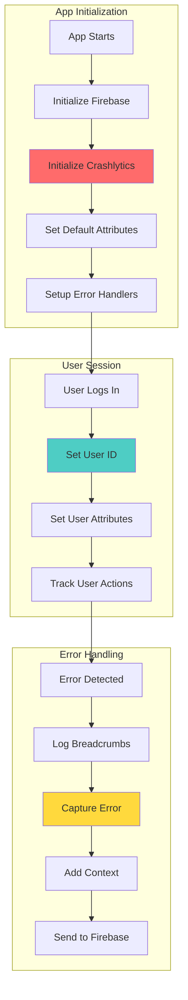
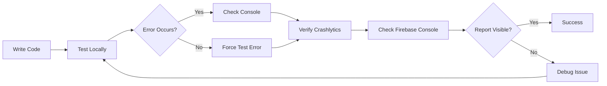
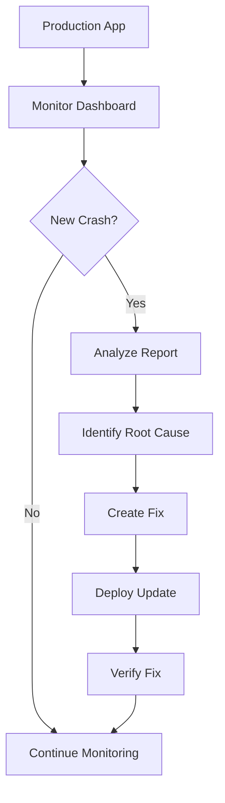

# Firebase Crashlytics Architecture

## System Architecture



## Error Flow Diagram



## Data Flow



## Component Integration



## Key Components

### 1. Crashlytics Service

- **Location**: `services/crashlytics.ts`
- **Purpose**: Central interface for all Crashlytics operations
- **Key Methods**:
  - `initialize()`: Setup Crashlytics
  - `setUserId()`: Identify users
  - `recordError()`: Log non-fatal errors
  - `log()`: Add breadcrumbs
  - `testCrash()`: Testing utility

### 2. Error Boundary

- **Location**: `components/ErrorBoundary.tsx`
- **Purpose**: Catch React component errors
- **Features**:
  - Automatic error capture
  - User-friendly error UI
  - Automatic Crashlytics logging
  - Reset functionality

### 3. Global Error Handler

- **Location**: `app/_layout.tsx` or `utils/errorHandler.ts`
- **Purpose**: Catch uncaught JavaScript errors
- **Coverage**:
  - Unhandled exceptions
  - Promise rejections
  - Native module errors

### 4. Debug Screen

- **Location**: `app/(tabs)/debug.tsx`
- **Purpose**: Testing and verification
- **Features**:
  - Test fatal crashes
  - Test non-fatal errors
  - Check unsent reports
  - Send reports manually

## Error Types & Handling

| Error Type        | Handler         | Automatic | User Impact        |
| ----------------- | --------------- | --------- | ------------------ |
| Native Crash      | Crashlytics SDK | ✅ Yes    | App restarts       |
| React Error       | Error Boundary  | ✅ Yes    | Error screen shown |
| JS Exception      | Global Handler  | ✅ Yes    | Varies             |
| Promise Rejection | Promise Handler | ✅ Yes    | Varies             |
| API Error         | Manual logging  | ❌ No     | Handled gracefully |
| Validation Error  | Manual logging  | ❌ No     | User feedback      |

## Custom Attributes

### Automatically Set

- `brand`: Active brand (NT/CN)
- `platform`: iOS or Android
- `app_version`: Current app version
- `user_id`: Authenticated user ID

### Optionally Set

- `subscription_status`: User subscription level
- `device_model`: Device information
- `os_version`: Operating system version
- `network_type`: WiFi/Cellular
- `screen_name`: Current screen when error occurred

## Testing Strategy

### Development Testing



### Production Monitoring



## Best Practices

### DO ✅

- Initialize Crashlytics early in app lifecycle
- Set user ID after authentication
- Add breadcrumbs before critical operations
- Log non-fatal errors for handled exceptions
- Test crash reporting in development
- Monitor crash-free rate regularly
- Fix high-impact crashes first

### DON'T ❌

- Log sensitive user data (passwords, tokens)
- Over-log minor issues (spam reports)
- Ignore crash reports
- Test crashes in production
- Disable Crashlytics in release builds
- Log expected validation errors

## Monitoring Checklist

- [ ] Crash-free users > 99.5%
- [ ] Crash-free sessions > 99.9%
- [ ] No critical crashes in top 10
- [ ] Average time to fix < 7 days
- [ ] All crashes have symbols
- [ ] User identification working
- [ ] Custom attributes present
- [ ] Alerts configured
- [ ] Team has access to console

## Integration Points

### With Analytics

```typescript
// Log error to both services
crashlyticsService.recordError(error, "API Call Failed");
analyticsService.logEvent("api_error", { endpoint: "/articles" });
```

### With Auth

```typescript
// Set user context on login
await crashlyticsService.setUserId(user.id);
await crashlyticsService.setUserAttributes({
  email: user.email,
  subscription: user.subscription,
});
```

### With Navigation

```typescript
// Add breadcrumbs for navigation
crashlyticsService.log(`Navigated to: ${screenName}`);
```

## Troubleshooting Guide

### Issue: Reports Not Appearing

**Possible Causes**:

1. Crashlytics not initialized
2. Debug build (not release)
3. Waiting period (5-10 minutes)
4. Wrong Firebase project

**Solutions**:

1. Check initialization logs
2. Build release version
3. Wait longer
4. Verify `google-services.json`/`GoogleService-Info.plist`

### Issue: Missing Symbols

**Possible Causes**:

1. ProGuard mapping not uploaded (Android)
2. dSYM files not uploaded (iOS)
3. Build configuration issue

**Solutions**:

1. Check Gradle plugin configuration
2. Verify CocoaPods setup
3. Upload symbols manually

### Issue: User ID Not Set

**Possible Causes**:

1. `setUserId()` not called
2. Called before initialization
3. User not authenticated

**Solutions**:

1. Call after login
2. Ensure Crashlytics initialized first
3. Check auth flow

## Performance Impact

| Metric       | Impact     | Notes                      |
| ------------ | ---------- | -------------------------- |
| App Size     | +2-3 MB    | SDK size                   |
| Startup Time | +50-100ms  | Initialization             |
| Memory       | +5-10 MB   | Runtime overhead           |
| Network      | Minimal    | Reports sent in background |
| Battery      | Negligible | Efficient reporting        |

## Security Considerations

- Reports sent over HTTPS
- Data encrypted in transit
- Stored securely in Firebase
- Access controlled via Firebase IAM
- GDPR compliant (with proper configuration)
- User can opt-out (if implemented)

## Future Enhancements

1. **Custom Keys**: Add more context-specific attributes
2. **Performance Monitoring**: Integrate Firebase Performance
3. **Remote Config**: Dynamic crash reporting settings
4. **A/B Testing**: Test crash fixes with subsets
5. **Advanced Analytics**: Correlate crashes with user behavior
