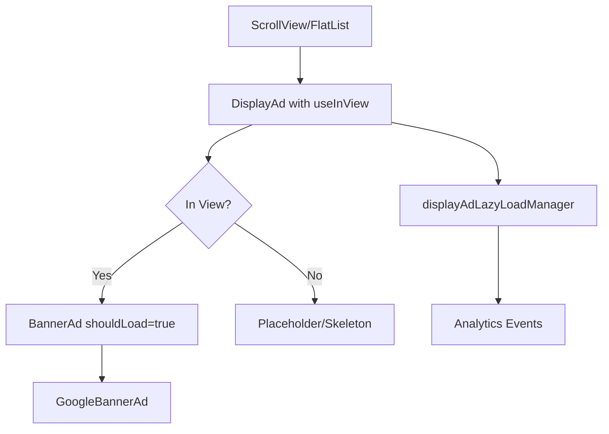
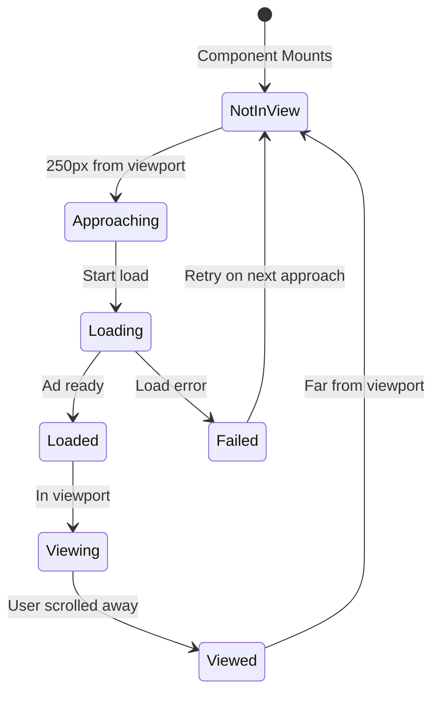

# Display Banner Ads Lazy Loading - Implementation Plan

## Overview

Implement lazy loading for display banner ads to improve viewability metrics by loading ads just before they come into view (250px threshold). This follows a similar pattern to the existing native ads lazy loading implementation but adapted for display banner ads in article detail and list views.

## Goals

1. **Improve Viewability**: Load ads 250px before they enter the viewport
2. **Smooth Scrolling**: Prioritize smooth user experience over aggressive loading
3. **Memory Efficiency**: Load ads one at a time as needed
4. **Consistent UX**: Maintain loading indicators and error handling
5. **Analytics**: Track lazy loading performance and viewability metrics

## Technical Requirements

### User Requirements

- **Lazy loading threshold**: 250px before viewport
- **Implementation approach**: Use `react-native-component-inview` (with custom hook fallback)
- **Preloading strategy**: Load ads one at a time as they approach viewport
- **Performance priority**: Smooth scrolling

### Current Implementation Analysis

#### Existing Display Ad Flow

```
DisplayAd Component
  ↓
BannerAd Component
  ↓
GoogleBannerAd (react-native-google-mobile-ads)
```

**Current Behavior:**

- Ads load immediately when component mounts
- No viewport detection
- All ads in view load simultaneously
- No unloading mechanism

#### Usage Locations

1. **Article Detail** ([`app/article/[id].tsx`](app/article/[id].tsx))

   - After lead text
   - In-content (via [`RichContentRenderer`](components/RichContentRenderer.tsx))

2. **List Views**
   - News tab ([`app/(tabs)/news.tsx`](<app/(tabs)/news.tsx>))
   - Clinical tab ([`app/(tabs)/clinical.tsx`](<app/(tabs)/clinical.tsx>))

## Architecture Design

### Component Hierarchy



### State Management Flow



## Implementation Plan

### Phase 1: Foundation (Library & Hook)

#### 1.1 Evaluate react-native-component-inview

**Check:**

- Compatibility with React Native 0.81.4
- TypeScript support
- Performance characteristics
- Bundle size impact

**Decision Criteria:**

- If compatible and performant → Use library
- If incompatible → Create custom hook

#### 1.2 Create Custom useInView Hook (Fallback)

**File:** `hooks/useInView.ts`

**Features:**

- Track component position using `onLayout`
- Monitor scroll position
- Calculate distance from viewport
- Trigger callbacks at threshold (250px)
- Support both ScrollView and FlatList contexts

**API:**

```typescript
interface UseInViewOptions {
  threshold?: number; // Default: 250
  rootMargin?: number; // Additional margin
  once?: boolean; // Fire callback only once
  onEnterView?: () => void;
  onExitView?: () => void;
}

function useInView(options: UseInViewOptions): {
  ref: RefObject;
  inView: boolean;
  entry: {
    isIntersecting: boolean;
    boundingClientRect: LayoutRectangle;
  };
};
```

### Phase 2: Service Layer

#### 2.1 Create displayAdLazyLoadManager Service

**File:** `services/displayAdLazyLoadManager.ts`

**Purpose:** Manage display ad lazy loading state, lifecycle, and analytics

**Key Features:**

- Track which ads are loaded/loading
- Prevent duplicate loads
- Handle load success/failure
- Track viewability metrics
- Integrate with analytics

**API:**

```typescript
class DisplayAdLazyLoadManager {
  // Lifecycle management
  registerAd(adId: string, context: string): void;
  startLoading(adId: string): void;
  markAsLoaded(adId: string, loadTime: number): void;
  markAsFailed(adId: string, error: any): void;
  markAsViewed(adId: string): void;
  unregisterAd(adId: string): void;

  // State queries
  isLoading(adId: string): boolean;
  isLoaded(adId: string): boolean;
  shouldLoad(adId: string): boolean;

  // Analytics
  getStats(): AdLoadStats;
  trackViewability(adId: string, viewTime: number): void;
}
```

**Analytics Events:**

- `display_ad_approaching` - Ad entering threshold
- `display_ad_load_started` - Load initiated
- `display_ad_loaded` - Successfully loaded
- `display_ad_load_failed` - Load failed
- `display_ad_viewed` - Ad entered viewport
- `display_ad_viewability` - Viewability metrics

### Phase 3: Component Updates

#### 3.1 Update DisplayAd Component

**File:** `components/DisplayAd.tsx`

**Changes:**

1. Add `useInView` hook integration
2. Add `shouldLoad` state management
3. Pass `shouldLoad` to BannerAd
4. Add loading placeholder
5. Integrate with displayAdLazyLoadManager
6. Add analytics tracking

**New Props:**

```typescript
interface DisplayAdProps {
  // ... existing props
  enableLazyLoad?: boolean; // Default: true
  lazyLoadThreshold?: number; // Default: 250
  showPlaceholder?: boolean; // Default: true
}
```

**Implementation:**

```typescript
export function DisplayAd({
  context,
  size,
  enableLazyLoad = true,
  lazyLoadThreshold = 250,
  showPlaceholder = true,
  ...props
}: DisplayAdProps) {
  const adId = useRef(generateAdId()).current;
  const [shouldLoad, setShouldLoad] = useState(!enableLazyLoad);

  const { ref, inView } = useInView({
    threshold: lazyLoadThreshold,
    once: false,
    onEnterView: () => {
      if (enableLazyLoad && !shouldLoad) {
        displayAdLazyLoadManager.startLoading(adId);
        setShouldLoad(true);
      }
    },
  });

  useEffect(() => {
    displayAdLazyLoadManager.registerAd(adId, context);
    return () => displayAdLazyLoadManager.unregisterAd(adId);
  }, []);

  if (!shouldRender) return null;

  return (
    <View ref={ref} style={[styles.container, style]}>
      {shouldLoad ? (
        <BannerAd
          {...props}
          onAdLoaded={() => {
            displayAdLazyLoadManager.markAsLoaded(adId, Date.now());
            props.onAdLoaded?.();
          }}
        />
      ) : showPlaceholder ? (
        <AdPlaceholder size={size} />
      ) : null}
    </View>
  );
}
```

#### 3.2 Update BannerAd Component

**File:** `components/BannerAd.tsx`

**Changes:**

1. Add conditional rendering based on load state
2. Improve loading indicator visibility
3. Add placeholder support
4. Optimize re-renders

**No API changes needed** - component already handles loading states well

#### 3.3 Create AdPlaceholder Component

**File:** `components/AdPlaceholder.tsx`

**Purpose:** Show placeholder while ad is loading

**Features:**

- Match ad dimensions
- Subtle loading indicator
- Prevent layout shift
- Themed styling

### Phase 4: Integration

#### 4.1 Article Detail Integration

**Files:**

- [`app/article/[id].tsx`](app/article/[id].tsx) - After-lead ad
- [`components/RichContentRenderer.tsx`](components/RichContentRenderer.tsx) - In-content ads

**Changes:**

1. Enable lazy loading for after-lead ad
2. Enable lazy loading for in-content ads
3. Ensure proper scroll context

**Example:**

```typescript
<DisplayAd
  context="article_detail"
  size={afterLeadAdPosition.size}
  enableLazyLoad={true}
  lazyLoadThreshold={250}
  onAdLoaded={() => console.log("After-lead ad loaded")}
/>
```

#### 4.2 List View Integration

**Files:**

- [`app/(tabs)/news.tsx`](<app/(tabs)/news.tsx>)
- [`app/(tabs)/clinical.tsx`](<app/(tabs)/clinical.tsx>)

**Changes:**

1. Enable lazy loading for list ads
2. Integrate with FlatList/ScrollView
3. Handle rapid scrolling

**Considerations:**

- FlatList already has viewport optimization
- Ensure lazy loading works with FlatList's `windowSize`
- Test with `onViewableItemsChanged`

### Phase 5: Configuration

#### 5.1 Update Brand Configuration

**Files:**

- `brands/nt/config.json`
- `brands/jnl/config.json`

**New Configuration:**

```json
{
  "displayAds": {
    "enabled": true,
    "lazyLoading": {
      "enabled": true,
      "threshold": 250,
      "showPlaceholder": true,
      "preloadDistance": 250,
      "analytics": true
    },
    "articleDetail": {
      // ... existing config
    },
    "listView": {
      // ... existing config
    }
  }
}
```

#### 5.2 Update Type Definitions

**File:** `types/ads.ts`

**Add:**

```typescript
export interface DisplayAdLazyLoadConfig {
  enabled: boolean;
  threshold: number;
  showPlaceholder: boolean;
  preloadDistance: number;
  analytics: boolean;
}

export interface DisplayAdsConfig {
  // ... existing fields
  lazyLoading?: DisplayAdLazyLoadConfig;
}
```

### Phase 6: Analytics & Monitoring

#### 6.1 Analytics Events

**Events to Track:**

```typescript
// Load lifecycle
analytics.logEvent("display_ad_approaching", {
  ad_id: string,
  context: string,
  distance_from_viewport: number,
});

analytics.logEvent("display_ad_load_started", {
  ad_id: string,
  context: string,
  size: string,
});

analytics.logEvent("display_ad_loaded", {
  ad_id: string,
  context: string,
  load_time_ms: number,
  size: string,
});

analytics.logEvent("display_ad_load_failed", {
  ad_id: string,
  context: string,
  error: string,
  size: string,
});

// Viewability
analytics.logEvent("display_ad_viewed", {
  ad_id: string,
  context: string,
  time_to_view_ms: number,
  was_preloaded: boolean,
});

analytics.logEvent("display_ad_viewability", {
  ad_id: string,
  context: string,
  view_duration_ms: number,
  viewport_percentage: number,
});
```

#### 6.2 Performance Metrics

**Track:**

- Average load time
- Load success rate
- Viewability rate (% of loaded ads that were viewed)
- Time in viewport
- Scroll speed impact
- Memory usage

### Phase 7: Testing Strategy

#### 7.1 Unit Tests

**Test Cases:**

- useInView hook threshold detection
- displayAdLazyLoadManager state management
- Component rendering with/without lazy load
- Analytics event firing

#### 7.2 Integration Tests

**Test Scenarios:**

1. **Slow Scroll**: Verify ads load before entering viewport
2. **Fast Scroll**: Verify ads don't load if scrolled past quickly
3. **Backward Scroll**: Verify ads load when scrolling up
4. **Multiple Ads**: Verify sequential loading
5. **Network Failure**: Verify error handling
6. **Memory**: Verify no memory leaks

#### 7.3 Manual Testing Checklist

- [ ] Article detail after-lead ad loads lazily
- [ ] Article in-content ads load lazily
- [ ] List view ads load lazily
- [ ] Placeholders show correctly
- [ ] Loading indicators work
- [ ] Smooth scrolling maintained
- [ ] Analytics events fire correctly
- [ ] Works on iOS
- [ ] Works on Android
- [ ] Works with slow network
- [ ] Works with network failures
- [ ] No layout shift when ads load
- [ ] Proper cleanup on unmount

## Implementation Order

### Sprint 1: Foundation

1. ✅ Research react-native-component-inview
2. ✅ Create useInView hook (if needed)
3. ✅ Create displayAdLazyLoadManager service
4. ✅ Create AdPlaceholder component

### Sprint 2: Core Components

5. ✅ Update DisplayAd component
6. ✅ Update BannerAd component (if needed)
7. ✅ Add analytics integration
8. ✅ Update type definitions

### Sprint 3: Integration

9. ✅ Integrate into article detail
10. ✅ Integrate into RichContentRenderer
11. ✅ Integrate into list views
12. ✅ Update brand configurations

### Sprint 4: Testing & Documentation

13. ✅ Write unit tests
14. ✅ Perform integration testing
15. ✅ Create user documentation
16. ✅ Performance testing
17. ✅ Production deployment

## Risk Mitigation

### Risk 1: Library Compatibility

**Mitigation:** Create custom useInView hook as fallback

### Risk 2: Performance Impact

**Mitigation:**

- Use React.memo for components
- Throttle scroll events
- Optimize re-renders

### Risk 3: Viewability Decrease

**Mitigation:**

- 250px threshold ensures ads load before visible
- Monitor analytics closely
- Adjust threshold if needed

### Risk 4: Layout Shift

**Mitigation:**

- Use placeholders with fixed dimensions
- Reserve space before ad loads
- Smooth transitions

## Success Metrics

### Primary Metrics

- **Viewability Rate**: Target >80% (ads viewed / ads loaded)
- **Load Success Rate**: Target >95%
- **Average Load Time**: Target <500ms
- **Scroll Performance**: Maintain 60 FPS

### Secondary Metrics

- Memory usage reduction
- Initial page load time improvement
- User engagement (time on page)
- Ad click-through rate

## Rollout Plan

### Phase 1: Development Testing

- Test with test ad units
- Verify all functionality
- Fix any issues

### Phase 2: Staging

- Deploy to staging environment
- Test with production-like data
- Monitor analytics

### Phase 3: Gradual Rollout

- Enable for 10% of users
- Monitor metrics for 48 hours
- Increase to 50% if successful
- Full rollout after 1 week

### Phase 4: Monitoring

- Daily metric reviews for first week
- Weekly reviews for first month
- Adjust configuration as needed

## Rollback Plan

If issues arise:

1. Disable lazy loading via feature flag
2. Revert to immediate loading
3. Investigate and fix issues
4. Re-deploy with fixes

## Documentation

### User Documentation

- Configuration guide
- Best practices
- Troubleshooting
- Migration guide

### Developer Documentation

- Architecture overview
- API reference
- Integration examples
- Testing guide

## Timeline

- **Week 1**: Foundation & Core Components
- **Week 2**: Integration & Configuration
- **Week 3**: Testing & Documentation
- **Week 4**: Rollout & Monitoring

## Conclusion

This implementation will significantly improve display ad viewability by ensuring ads load just before they come into view. By following the proven pattern from native ads lazy loading and prioritizing smooth scrolling, we'll deliver a better user experience while maintaining or improving ad performance metrics.

---

**Status**: Planning Complete - Ready for Implementation
**Next Step**: Begin Sprint 1 - Foundation
**Owner**: Development Team
**Review Date**: After Sprint 1 completion
