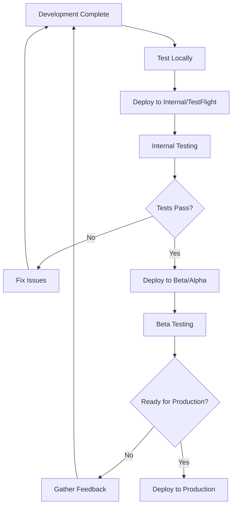

# Fastlane Deployment Guide

This guide provides comprehensive instructions for deploying Construction News and Nursing Times apps to TestFlight and Google Play Store using Fastlane.

## 📋 Table of Contents

- [Overview](#overview)
- [Prerequisites](#prerequisites)
- [Quick Start](#quick-start)
- [Available Commands](#available-commands)
- [Deployment Workflows](#deployment-workflows)
- [Environment Configuration](#environment-configuration)
- [Authentication Setup](#authentication-setup)
- [Troubleshooting](#troubleshooting)
- [CI/CD Integration](#cicd-integration)

## 🎯 Overview

Our Fastlane setup provides automated deployment for:

- **Construction News** (`metropolis.co.uk.constructionnews`)
- **Nursing Times** (`metropolis.net.nursingtimes`)

Both apps support deployment to:

- **iOS**: TestFlight and App Store
- **Android**: Google Play Store (Internal, Alpha, Beta, Production tracks)

## ✅ Prerequisites

### Required Software

- [Fastlane](https://fastlane.tools/) (already installed)
- [EAS CLI](https://docs.expo.dev/build/setup/) (for building)
- Node.js and npm/yarn
- Xcode (for iOS development)
- Android Studio (for Android development)

### Required Accounts

- Apple Developer Account (for iOS)
- Google Play Console Account (for Android)
- App Store Connect access
- Google Cloud Console access

### Required Files

- App Store Connect API Key (`.p8` file)
- Google Play Service Account JSON key
- Configured `.env.fastlane` file

## 🚀 Quick Start

### 1. Set Up Authentication

```bash
# Copy environment template
cp fastlane/.env.template fastlane/.env.fastlane

# Edit with your credentials
nano fastlane/.env.fastlane
```

Follow the detailed [Authentication Setup Guide](../fastlane/README-AUTH-SETUP.md).

### 2. Validate Setup

```bash
# Check environment configuration
fastlane validate_env

# List available lanes
fastlane list
```

### 3. Deploy Your First Build

```bash
# Deploy Construction News to TestFlight
./scripts/deploy-cn-ios.sh testflight

# Deploy Nursing Times to Google Play Beta
./scripts/deploy-nt-android.sh beta
```

## 📱 Available Commands

### iOS Deployment

#### Construction News

```bash
# TestFlight
fastlane ios upload_cn_testflight
./scripts/deploy-cn-ios.sh testflight

# App Store
fastlane ios upload_cn_appstore
./scripts/deploy-cn-ios.sh appstore
```

#### Nursing Times

```bash
# TestFlight
fastlane ios upload_nt_testflight
./scripts/deploy-nt-ios.sh testflight

# App Store
fastlane ios upload_nt_appstore
./scripts/deploy-nt-ios.sh appstore
```

### Android Deployment

#### Construction News

```bash
# Internal Track
fastlane android upload_cn_internal
./scripts/deploy-cn-android.sh internal

# Alpha Track
fastlane android upload_cn_alpha
./scripts/deploy-cn-android.sh alpha

# Beta Track
fastlane android upload_cn_beta
./scripts/deploy-cn-android.sh beta

# Production Track
fastlane android upload_cn_production
./scripts/deploy-cn-android.sh production
```

#### Nursing Times

```bash
# Internal Track
fastlane android upload_nt_internal
./scripts/deploy-nt-android.sh internal

# Alpha Track
fastlane android upload_nt_alpha
./scripts/deploy-nt-android.sh alpha

# Beta Track
fastlane android upload_nt_beta
./scripts/deploy-nt-android.sh beta

# Production Track
fastlane android upload_nt_production
./scripts/deploy-nt-android.sh production
```

### Utility Commands

```bash
# List all available lanes
fastlane list

# Validate environment setup
fastlane validate_env
```

## 🔄 Deployment Workflows

### Standard Deployment Process

1. **Build with EAS**

   - Fastlane automatically triggers EAS build
   - Uses appropriate profile (`production-cn` or `production-nt`)
   - Waits for build completion

2. **Download Build**

   - Downloads the latest build artifact
   - Validates the build file

3. **Upload to Store**

   - Uploads to appropriate store/track
   - Includes metadata and release notes
   - Handles retry logic for failed uploads

4. **Cleanup**
   - Removes temporary build files
   - Sends notifications (if configured)

### Recommended Deployment Flow



## ⚙️ Environment Configuration

### Required Environment Variables

Create `fastlane/.env.fastlane` with:

```bash
# iOS Configuration
APPLE_ID=your-apple-id@example.com
APPLE_TEAM_ID=YOUR_TEAM_ID
APP_STORE_CONNECT_API_KEY_ID=YOUR_API_KEY_ID
APP_STORE_CONNECT_ISSUER_ID=YOUR_ISSUER_ID
APP_STORE_CONNECT_API_KEY_PATH=./fastlane/AuthKey_YOUR_API_KEY_ID.p8

# Android Configuration
GOOGLE_PLAY_JSON_KEY_PATH=./fastlane/google-play-service-account.json

# Optional: Notifications
SLACK_WEBHOOK_URL=https://hooks.slack.com/services/YOUR/SLACK/WEBHOOK
SLACK_CHANNEL=#deployments

# Optional: App Store Review Info
APP_REVIEW_FIRST_NAME=John
APP_REVIEW_LAST_NAME=Doe
APP_REVIEW_PHONE=+44 20 1234 5678
APP_REVIEW_EMAIL=app-review@metropolis.co.uk
```

### Brand-Specific Configuration

The `BRAND` environment variable is automatically set by deployment scripts:

- `cn` = Construction News
- `nt` = Nursing Times

This controls:

- App identifiers and package names
- Metadata and descriptions
- Build profiles used

## 🔐 Authentication Setup

See the detailed [Authentication Setup Guide](../fastlane/README-AUTH-SETUP.md) for:

- App Store Connect API key generation
- Google Play Service Account setup
- Security best practices
- Troubleshooting authentication issues

## 🐛 Troubleshooting

### Common Issues

#### Build Failures

```bash
# Check EAS build status
eas build:list --platform ios --limit 5

# View build logs
eas build:view BUILD_ID
```

#### Upload Failures

- **iOS**: Check App Store Connect API key permissions
- **Android**: Verify Google Play Console service account roles
- **Both**: Ensure app versions are incremented

#### Environment Issues

```bash
# Validate all environment variables
fastlane validate_env

# Check file permissions
ls -la fastlane/AuthKey_*.p8
ls -la fastlane/google-play-service-account.json
```

### Debug Mode

Add `--verbose` flag to Fastlane commands for detailed logging:

```bash
fastlane ios upload_cn_testflight --verbose
```

### Log Files

Check these locations for logs:

- `fastlane/report.xml` - Fastlane execution report
- `fastlane/Preview.html` - App Store metadata preview
- EAS build logs in Expo dashboard

## 🔄 CI/CD Integration

### GitHub Actions Example

```yaml
name: Deploy to Stores
on:
  push:
    tags:
      - "v*"

jobs:
  deploy-ios:
    runs-on: macos-latest
    steps:
      - uses: actions/checkout@v3
      - name: Setup Node.js
        uses: actions/setup-node@v3
        with:
          node-version: "18"
      - name: Install dependencies
        run: npm ci
      - name: Setup Fastlane
        run: bundle install
      - name: Deploy to TestFlight
        env:
          APPLE_ID: ${{ secrets.APPLE_ID }}
          APPLE_TEAM_ID: ${{ secrets.APPLE_TEAM_ID }}
          APP_STORE_CONNECT_API_KEY_ID: ${{ secrets.APP_STORE_CONNECT_API_KEY_ID }}
          APP_STORE_CONNECT_ISSUER_ID: ${{ secrets.APP_STORE_CONNECT_ISSUER_ID }}
          APP_STORE_CONNECT_API_KEY_CONTENT: ${{ secrets.APP_STORE_CONNECT_API_KEY_CONTENT }}
        run: |
          echo "$APP_STORE_CONNECT_API_KEY_CONTENT" | base64 -d > fastlane/AuthKey_$APP_STORE_CONNECT_API_KEY_ID.p8
          ./scripts/deploy-cn-ios.sh testflight
          ./scripts/deploy-nt-ios.sh testflight

  deploy-android:
    runs-on: ubuntu-latest
    steps:
      - uses: actions/checkout@v3
      - name: Setup Node.js
        uses: actions/setup-node@v3
        with:
          node-version: "18"
      - name: Install dependencies
        run: npm ci
      - name: Setup Fastlane
        run: bundle install
      - name: Deploy to Play Store
        env:
          GOOGLE_PLAY_JSON_KEY_CONTENT: ${{ secrets.GOOGLE_PLAY_JSON_KEY_CONTENT }}
        run: |
          echo "$GOOGLE_PLAY_JSON_KEY_CONTENT" | base64 -d > fastlane/google-play-service-account.json
          ./scripts/deploy-cn-android.sh beta
          ./scripts/deploy-nt-android.sh beta
```

### Environment Variables for CI/CD

Store these as encrypted secrets in your CI/CD platform:

```bash
# iOS
APPLE_ID
APPLE_TEAM_ID
APP_STORE_CONNECT_API_KEY_ID
APP_STORE_CONNECT_ISSUER_ID
APP_STORE_CONNECT_API_KEY_CONTENT  # base64 encoded .p8 file

# Android
GOOGLE_PLAY_JSON_KEY_CONTENT  # base64 encoded JSON file

# Optional
SLACK_WEBHOOK_URL
```

## 📊 Monitoring and Notifications

### Slack Integration

Configure Slack notifications in `.env.fastlane`:

```bash
SLACK_WEBHOOK_URL=https://hooks.slack.com/services/YOUR/SLACK/WEBHOOK
SLACK_CHANNEL=#deployments
```

### Build Status Tracking

- Monitor builds in [Expo Dashboard](https://expo.dev/)
- Check upload status in App Store Connect and Google Play Console
- Review Fastlane reports in `fastlane/report.xml`

## 📚 Additional Resources

- [Fastlane Documentation](https://docs.fastlane.tools/)
- [EAS Build Documentation](https://docs.expo.dev/build/introduction/)
- [App Store Connect API](https://developer.apple.com/documentation/appstoreconnectapi)
- [Google Play Console API](https://developers.google.com/android-publisher)
- [Authentication Setup Guide](../fastlane/README-AUTH-SETUP.md)

## 🆘 Support

For deployment issues:

1. Check this guide and the authentication setup guide
2. Validate your environment with `fastlane validate_env`
3. Review build logs in the Expo dashboard
4. Check Fastlane logs for detailed error messages
5. Consult the official Fastlane documentation

---

**Last Updated**: December 2024
**Version**: 1.0.0
