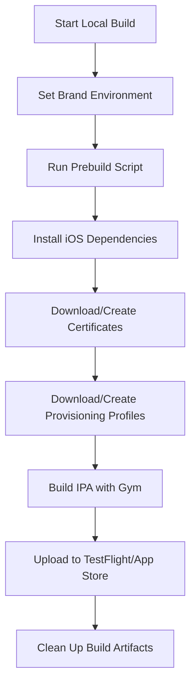

# Fastlane Local Build Guide

This guide explains how to use Fastlane for local iOS and Android builds without EAS, including automatic certificate/provisioning profile management and store uploads.

## 📋 Overview

The local build system provides an alternative to EAS builds with the following benefits:

- **Faster builds**: 2-5 minutes vs 10-15 minutes with EAS
- **Cost savings**: No EAS build credits consumed
- **Better debugging**: Full access to build logs and intermediate files
- **Offline capability**: Build without internet connection (after initial setup)
- **Complete control**: Full control over build environment and process

## 🛠️ Prerequisites

### Required Tools

1. **Xcode** (latest version recommended)

   ```bash
   # Install from App Store or Apple Developer Portal
   xcode-select --install  # Install command line tools
   ```

2. **CocoaPods**

   ```bash
   sudo gem install cocoapods
   ```

3. **Expo CLI**

   ```bash
   npm install -g @expo/cli
   ```

4. **Fastlane** (should already be installed)
   ```bash
   sudo gem install fastlane
   ```
5. **Android Studio and SDK** (for Android builds)

   ```bash
   # Install Android Studio from https://developer.android.com/studio
   # Set ANDROID_HOME environment variable
   export ANDROID_HOME=$HOME/Library/Android/sdk
   export PATH=$PATH:$ANDROID_HOME/emulator
   export PATH=$PATH:$ANDROID_HOME/tools
   export PATH=$PATH:$ANDROID_HOME/tools/bin
   export PATH=$PATH:$ANDROID_HOME/platform-tools
   ```

6. **Java 17** (for React Native compatibility)

   ```bash
   # Install via Homebrew
   brew install openjdk@17
   # Set JAVA_HOME
   export JAVA_HOME=/opt/homebrew/opt/openjdk@17/libexec/openjdk.jdk/Contents/Home
   ```

   ```

   ```

### Project Setup

1. **Generate native iOS project** (if not already done):

   ```bash
   expo prebuild --platform ios --clear
   ```

2. **Generate native Android project** (if not already done):

   ```bash
   expo prebuild --platform android --clear
   ```

3. **Create Android keystore** (required for signing):

   ```bash
   # Generate a new keystore (only needed once)
   keytool -genkey -v -keystore android/app/release.keystore \
     -alias your-key-alias -keyalg RSA -keysize 2048 -validity 10000

   # Follow the prompts to set passwords and certificate details
   ```

4. **Install iOS dependencies**:

   ```bash
   cd ios && pod install && cd ..
   ```

5. **Create build directory**:
   ```bash
   mkdir -p build
   ```

## ⚙️ Configuration

### Environment Variables

Copy the template and configure your environment:

```bash
cp fastlane/.env.template fastlane/.env.fastlane
```

Edit `fastlane/.env.fastlane` with your values:

```bash
# Required for iOS deployment
APPLE_ID=your-apple-id@example.com
APPLE_TEAM_ID=YOUR_TEAM_ID

# Required for Android deployment
GOOGLE_PLAY_JSON_KEY_PATH=./fastlane/google-play-service-account.json

# Optional: Beta feedback email
BETA_FEEDBACK_EMAIL=beta-feedback@metropolis.co.uk

# iOS Local build configuration
IOS_WORKSPACE=../ios/NursingTimes.xcworkspace
IOS_SCHEME=NursingTimes
CERT_METHOD=manual

# Android Local build configuration
ANDROID_KEYSTORE_PATH=./android/app/release.keystore
ANDROID_KEYSTORE_PASSWORD=your_keystore_password
ANDROID_KEY_ALIAS=your_key_alias
ANDROID_KEY_PASSWORD=your_key_password

# Build output directory
BUILD_OUTPUT_DIRECTORY=../build
```

### Xcode Project Configuration

Ensure your Xcode project is configured for automatic signing:

1. Open `ios/NursingTimes.xcworkspace` in Xcode
2. Select your target → Signing & Capabilities
3. Enable "Automatically manage signing"
4. Select your Team ID
5. Verify Bundle Identifier matches your app configuration

### Android Project Configuration

Ensure your Android project is configured for release builds:

1. **Configure signing in `android/app/build.gradle`**:

   ```gradle
   android {
       signingConfigs {
           release {
               if (project.hasProperty('MYAPP_RELEASE_STORE_FILE')) {
                   storeFile file(MYAPP_RELEASE_STORE_FILE)
                   storePassword MYAPP_RELEASE_STORE_PASSWORD
                   keyAlias MYAPP_RELEASE_KEY_ALIAS
                   keyPassword MYAPP_RELEASE_KEY_PASSWORD
               }
           }
       }
       buildTypes {
           release {
               signingConfig signingConfigs.release
               minifyEnabled true
               proguardFiles getDefaultProguardFile("proguard-android.txt"), "proguard-rules.pro"
           }
       }
   }
   ```

2. **Create `android/gradle.properties`** (if not exists):

   ```properties
   MYAPP_RELEASE_STORE_FILE=release.keystore
   MYAPP_RELEASE_KEY_ALIAS=your_key_alias
   MYAPP_RELEASE_STORE_PASSWORD=your_keystore_password
   MYAPP_RELEASE_KEY_PASSWORD=your_key_password
   ```

3. **Google Play Console Service Account**:
   - Go to Google Play Console → Setup → API access
   - Create a service account and download the JSON key
   - Place it in `fastlane/google-play-service-account.json`

## 🚀 Usage

### Available Commands

#### TestFlight Deployment

```bash
# Construction News to TestFlight
fastlane ios build_upload_cn_testflight

# Nursing Times to TestFlight
fastlane ios build_upload_nt_testflight
```

#### App Store Deployment

```bash
# Construction News to App Store
fastlane ios build_upload_cn_appstore

# Nursing Times to App Store
fastlane ios build_upload_nt_appstore
```

#### Existing EAS-based Commands (still available)

```bash
# EAS build + TestFlight upload
fastlane ios upload_cn_testflight
fastlane ios upload_nt_testflight

# EAS build + App Store upload
fastlane ios upload_cn_appstore
fastlane ios upload_nt_appstore
```

#### Android Google Play Deployment

```bash
# Construction News to Google Play
fastlane android build_upload_cn_internal     # Internal testing
fastlane android build_upload_cn_alpha        # Alpha testing
fastlane android build_upload_cn_beta         # Beta testing
fastlane android build_upload_cn_production   # Production

# Nursing Times to Google Play
fastlane android build_upload_nt_internal     # Internal testing
fastlane android build_upload_nt_alpha        # Alpha testing
fastlane android build_upload_nt_beta         # Beta testing
fastlane android build_upload_nt_production   # Production
```

#### Existing EAS-based Android Commands (still available)

```bash
# EAS build + Google Play upload
fastlane android upload_cn_internal
fastlane android upload_nt_internal
fastlane android upload_cn_alpha
fastlane android upload_nt_alpha
fastlane android upload_cn_beta
fastlane android upload_nt_beta
fastlane android upload_cn_production
fastlane android upload_nt_production
```

### Command Comparison

| Command Type     | Build Method | Speed     | Cost        | Use Case                                |
| ---------------- | ------------ | --------- | ----------- | --------------------------------------- |
| `build_upload_*` | Local        | 2-5 min   | Free        | Development, debugging, frequent builds |
| `upload_*`       | EAS          | 10-15 min | EAS credits | Production, CI/CD, team builds          |

## 🔄 Build Process Flow

When you run a local build command, here's what happens:



### Detailed Steps

1. **Brand Configuration**: Sets `BRAND` environment variable and runs prebuild script
2. **Dependency Installation**: Runs `pod install` to ensure latest dependencies
3. **Certificate Management**: Uses Fastlane's `cert` action to download/create certificates
4. **Provisioning Profiles**: Uses Fastlane's `sigh` action to download/create profiles
5. **Build Process**: Uses Fastlane's `gym` action to build and sign the IPA
6. **Upload**: Uses `upload_to_testflight` or `upload_to_app_store` actions
7. **Cleanup**: Removes temporary build files

## 🔐 Certificate Management

### Automatic Management (Recommended)

The local build system uses Fastlane's automatic certificate management:

- **Certificates**: Downloaded from Apple Developer Portal or created if needed
- **Provisioning Profiles**: Downloaded or created automatically for your app
- **Keychain**: Certificates installed in your local keychain
- **Signing**: Handled automatically during build process

### Manual Certificate Management

If you need more control, you can:

1. **Force regenerate profiles**:

   ```bash
   # Set in .env.fastlane
   FORCE_PROVISIONING_PROFILES=true
   ```

2. **Use specific certificates**:
   - Manually install certificates in Keychain Access
   - Fastlane will use existing certificates if available

### Team Certificate Management (Match)

For team environments, consider using Fastlane Match:

1. **Setup Match repository**:

   ```bash
   fastlane match init
   ```

2. **Configure in .env.fastlane**:

   ```bash
   CERT_METHOD=match
   MATCH_GIT_URL=https://github.com/your-org/certificates.git
   MATCH_PASSWORD=your_match_password
   ```

3. **Update Fastfile** to use match instead of cert+sigh (see advanced configuration)

## 🐛 Troubleshooting

### Common Issues

#### Build Failures

**Issue**: Xcode build fails with signing errors

```bash
# Solution: Clean and regenerate
rm -rf ios/build
fastlane ios build_upload_cn_testflight
```

**Issue**: CocoaPods dependency issues

```bash
# Solution: Clean and reinstall
cd ios
rm -rf Pods Podfile.lock
pod install
cd ..
```

#### Certificate Issues

**Issue**: Certificate not found or expired

```bash
# Solution: Force regenerate certificates
# Set FORCE_PROVISIONING_PROFILES=true in .env.fastlane
```

**Issue**: Multiple certificates in keychain

```bash
# Solution: Clean keychain and let Fastlane manage
# Open Keychain Access → Delete old certificates
```

#### Upload Issues

**Issue**: App Store Connect authentication fails

```bash
# Solution: Check Apple ID and Team ID
fastlane validate_env
```

**Issue**: Binary already exists

```bash
# Solution: Increment build number in app.json or expo.json
```

### Debug Mode

Enable verbose logging for troubleshooting:

```bash
# Add to command
fastlane ios build_upload_cn_testflight --verbose

# Or set environment variable
export FASTLANE_VERBOSE=1
```

### Log Files

Build logs are available in:

- Fastlane logs: `fastlane/logs/`
- Xcode build logs: `ios/build/Logs/`
- Gym logs: `build/gym/`

## 📊 Performance Comparison

### Build Times

| Build Type  | Average Time | Range         |
| ----------- | ------------ | ------------- |
| Local Build | 3 minutes    | 2-5 minutes   |
| EAS Build   | 12 minutes   | 10-15 minutes |

### Cost Analysis

| Build Method | Cost per Build | Monthly Cost (30 builds) |
| ------------ | -------------- | ------------------------ |
| Local Build  | $0             | $0                       |
| EAS Build    | ~$0.50         | ~$15                     |

## 🔧 Advanced Configuration

### Custom Build Settings

You can customize the build process by modifying the Fastfile:

```ruby
# Custom gym configuration
gym(
  workspace: ENV["IOS_WORKSPACE"],
  scheme: ENV["IOS_SCHEME"],
  configuration: "Release",
  output_directory: ENV["BUILD_OUTPUT_DIRECTORY"],
  clean: true,
  include_bitcode: false,
  include_symbols: true,
  export_method: "app-store",
  export_options: {
    teamID: ENV["APPLE_TEAM_ID"],
    uploadBitcode: false,
    uploadSymbols: true,
    compileBitcode: false
  }
)
```

### Using Match for Team Environments

If you're working in a team, consider using Match:

```ruby
# Replace cert + sigh with match
match(
  type: "appstore",
  app_identifier: bundle_id,
  team_id: ENV["APPLE_TEAM_ID"],
  git_url: ENV["MATCH_GIT_URL"],
  readonly: true
)
```

### Custom Deployment Scripts

Update your deployment scripts to use local builds:

```bash
#!/bin/bash
# scripts/deploy-cn-ios-local.sh
export BRAND=cn
fastlane ios build_upload_cn_testflight
```

## 📝 Best Practices

### Development Workflow

1. **Use local builds for development**: Faster iteration and debugging
2. **Use EAS builds for production**: Consistent environment and CI/CD integration
3. **Test both methods**: Ensure compatibility between local and EAS builds

### Certificate Management

1. **Keep certificates up to date**: Monitor expiration dates
2. **Use Match for teams**: Centralized certificate management
3. **Backup certificates**: Store securely outside of keychain

### Build Optimization

1. **Clean builds periodically**: Remove old build artifacts
2. **Update dependencies regularly**: Keep CocoaPods and npm packages current
3. **Monitor build times**: Identify and optimize slow steps

## 🆘 Support

### Validation Commands

```bash
# Check environment setup
fastlane validate_env

# List available lanes
fastlane show_lanes

# Test certificate access
fastlane ios cert

# Test provisioning profile access
fastlane ios sigh
```

### Getting Help

1. **Check logs**: Review Fastlane and Xcode logs for errors
2. **Validate environment**: Run `fastlane validate_env`
3. **Clean and retry**: Remove build artifacts and try again
4. **Check documentation**: Review Fastlane documentation for specific actions

### Useful Resources

- [Fastlane Documentation](https://docs.fastlane.tools/)
- [Fastlane Gym Action](https://docs.fastlane.tools/actions/gym/)
- [Fastlane Cert Action](https://docs.fastlane.tools/actions/cert/)
- [Fastlane Sigh Action](https://docs.fastlane.tools/actions/sigh/)
- [Fastlane Match](https://docs.fastlane.tools/actions/match/)

## 🎯 Next Steps

1. **Setup environment**: Configure `.env.fastlane` with your values
2. **Test local build**: Run `fastlane ios build_upload_cn_testflight`
3. **Verify upload**: Check TestFlight for successful upload
4. **Update deployment scripts**: Integrate local builds into your workflow
5. **Train team**: Share this guide with team members

---

_This guide covers the local build functionality added to your existing Fastlane setup. The original EAS-based commands remain available for comparison and fallback purposes._
