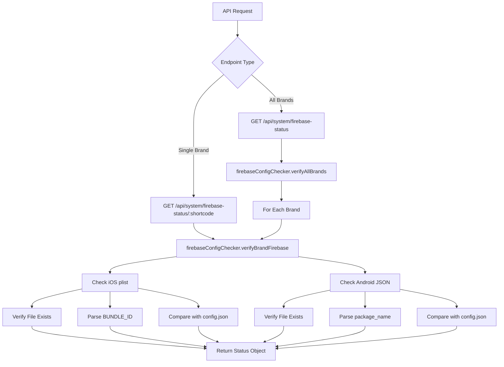

# Firebase Configuration Verification Refactoring Plan

## Overview

Replace the manual push notification status management system with an automated Firebase configuration verification system that checks for the presence and validity of Firebase configuration files for each brand.

## Current Implementation Analysis

### Components to Remove

1. **File**: [`server/utils/pushCredentialsChecker.js`](../server/utils/pushCredentialsChecker.js)

   - `checkPushCredentials()` - Manual status update function
   - `getPushCredentialsStatus()` - Retrieves stored status from config

2. **Endpoints in** [`server/routes/system.js`](../server/routes/system.js):

   - `GET /api/system/push-credentials/:shortcode` (lines 179-207)
   - `POST /api/system/push-credentials/:shortcode/check` (lines 214-250)

3. **Data Fields in Brand Config**:
   - `pushCredentials` object in [`brands/*/config.json`](../brands/)
     ```json
     "pushCredentials": {
       "configured": true,
       "details": "Push credentials configured (manually verified)",
       "lastChecked": "2025-10-19T19:27:20.061Z"
     }
     ```

### Current Limitations

- Requires manual verification via `npx eas credentials -p ios`
- Status must be manually updated through API calls
- No automatic validation of actual Firebase files
- No verification that bundle IDs match between config and Firebase files
- Stored status can become stale/inaccurate

## New Implementation Design

### Architecture Overview



### File Structure

```
server/
├── utils/
│   ├── firebaseConfigChecker.js (NEW)
│   └── pushCredentialsChecker.js (DELETE)
└── routes/
    └── system.js (MODIFY)
```

### New Utility: `firebaseConfigChecker.js`

**Location**: [`server/utils/firebaseConfigChecker.js`](../server/utils/firebaseConfigChecker.js)

**Functions**:

1. **`verifyBrandFirebase(shortcode)`**

   - Checks both iOS and Android Firebase configuration files
   - Validates bundle ID/package name matches
   - Returns detailed status object

2. **`verifyAllBrands()`**

   - Iterates through all brands
   - Calls `verifyBrandFirebase()` for each
   - Returns array of status objects

3. **`verifyIOSConfig(shortcode, bundleId)`**

   - Checks for `GoogleService-Info.plist` in brand folder
   - Parses XML to extract `BUNDLE_ID` key
   - Compares with expected bundle ID from config.json

4. **`verifyAndroidConfig(shortcode, bundleId)`**
   - Checks for `google-services.json` in brand folder
   - Parses JSON to extract `package_name`
   - Compares with expected bundle ID from config.json

### Response Format

#### Single Brand Response

```json
{
  "success": true,
  "shortcode": "nt",
  "bundleId": "metropolis.net.nursingtimes",
  "firebase": {
    "ios": {
      "configured": true,
      "fileExists": true,
      "filePath": "brands/nt/GoogleService-Info.plist",
      "bundleIdMatch": true,
      "bundleIdFound": "metropolis.net.nursingtimes",
      "error": null
    },
    "android": {
      "configured": true,
      "fileExists": true,
      "filePath": "brands/nt/google-services.json",
      "packageNameMatch": true,
      "packageNameFound": "metropolis.net.nursingtimes",
      "error": null
    },
    "overallStatus": "configured",
    "message": "Firebase configuration is valid for both platforms"
  }
}
```

#### Error Example (Missing Files)

```json
{
  "success": true,
  "shortcode": "cn",
  "bundleId": "metropolis.co.uk.constructionnews",
  "firebase": {
    "ios": {
      "configured": false,
      "fileExists": false,
      "filePath": "brands/cn/GoogleService-Info.plist",
      "bundleIdMatch": false,
      "bundleIdFound": null,
      "error": "GoogleService-Info.plist not found"
    },
    "android": {
      "configured": false,
      "fileExists": false,
      "filePath": "brands/cn/google-services.json",
      "packageNameMatch": false,
      "packageNameFound": null,
      "error": "google-services.json not found"
    },
    "overallStatus": "not_configured",
    "message": "Firebase configuration files are missing for both platforms"
  }
}
```

#### Bundle ID Mismatch Example

```json
{
  "success": true,
  "shortcode": "nt",
  "bundleId": "metropolis.net.nursingtimes",
  "firebase": {
    "ios": {
      "configured": false,
      "fileExists": true,
      "filePath": "brands/nt/GoogleService-Info.plist",
      "bundleIdMatch": false,
      "bundleIdFound": "com.wrong.bundleid",
      "error": "Bundle ID mismatch: expected 'metropolis.net.nursingtimes', found 'com.wrong.bundleid'"
    },
    "android": {
      "configured": true,
      "fileExists": true,
      "filePath": "brands/nt/google-services.json",
      "packageNameMatch": true,
      "packageNameFound": "metropolis.net.nursingtimes",
      "error": null
    },
    "overallStatus": "misconfigured",
    "message": "Firebase configuration has errors on iOS platform"
  }
}
```

#### All Brands Response

```json
{
  "success": true,
  "count": 3,
  "brands": [
    {
      "shortcode": "nt",
      "bundleId": "metropolis.net.nursingtimes",
      "firebase": {
        /* ... */
      },
      "overallStatus": "configured"
    },
    {
      "shortcode": "cn",
      "bundleId": "metropolis.co.uk.constructionnews",
      "firebase": {
        /* ... */
      },
      "overallStatus": "not_configured"
    },
    {
      "shortcode": "jnl",
      "bundleId": "metropolis.net.jnl",
      "firebase": {
        /* ... */
      },
      "overallStatus": "not_configured"
    }
  ],
  "summary": {
    "total": 3,
    "configured": 1,
    "not_configured": 2,
    "misconfigured": 0
  }
}
```

### New API Endpoints

#### 1. Get All Brands Firebase Status

```
GET /api/system/firebase-status
```

**Description**: Checks Firebase configuration for all brands

**Response**: Array of brand Firebase status objects with summary

**Example**:

```bash
curl http://localhost:3001/api/system/firebase-status
```

#### 2. Get Single Brand Firebase Status

```
GET /api/system/firebase-status/:shortcode
```

**Description**: Checks Firebase configuration for a specific brand

**Parameters**:

- `shortcode` (path) - Brand shortcode (e.g., "nt", "cn", "jnl")

**Response**: Single brand Firebase status object

**Example**:

```bash
curl http://localhost:3001/api/system/firebase-status/nt
```

### Implementation Details

#### iOS Configuration Parsing

- File: `GoogleService-Info.plist`
- Format: XML Property List
- Key to extract: `BUNDLE_ID`
- Library: Use Node.js built-in XML parser or `plist` npm package

Example plist structure:

```xml
<?xml version="1.0" encoding="UTF-8"?>
<!DOCTYPE plist PUBLIC "-//Apple//DTD PLIST 1.0//EN" "http://www.apple.com/DTDs/PropertyList-1.0.dtd">
<plist version="1.0">
<dict>
    <key>BUNDLE_ID</key>
    <string>metropolis.net.nursingtimes</string>
    <!-- other keys -->
</dict>
</plist>
```

#### Android Configuration Parsing

- File: `google-services.json`
- Format: JSON
- Path to extract: `client[0].client_info.android_client_info.package_name`
- Library: Native JSON.parse()

Example JSON structure:

```json
{
  "client": [
    {
      "client_info": {
        "android_client_info": {
          "package_name": "metropolis.net.nursingtimes"
        }
      }
    }
  ]
}
```

## Migration Steps

### Phase 1: Create New System

1. Create [`server/utils/firebaseConfigChecker.js`](../server/utils/firebaseConfigChecker.js)
2. Implement verification functions
3. Add new endpoints to [`server/routes/system.js`](../server/routes/system.js)
4. Test with existing brands

### Phase 2: Remove Old System

1. Remove old endpoints from [`server/routes/system.js`](../server/routes/system.js):
   - Lines 179-207: `GET /api/system/push-credentials/:shortcode`
   - Lines 214-250: `POST /api/system/push-credentials/:shortcode/check`
2. Remove imports of `pushCredentialsChecker` (lines 17-20)
3. Delete [`server/utils/pushCredentialsChecker.js`](../server/utils/pushCredentialsChecker.js)

### Phase 3: Clean Up Brand Configs

1. Remove `pushCredentials` field from:
   - [`brands/nt/config.json`](../brands/nt/config.json) (lines 64-68)
   - [`brands/cn/config.json`](../brands/cn/config.json) (lines 64-68)
   - Any other brand configs that have this field

### Phase 4: Update Documentation

1. Update [`server/index.js`](../server/index.js) root endpoint documentation
2. Update [`server/README.md`](../server/README.md) if it exists
3. Create API documentation for new endpoints

## Testing Strategy

### Test Cases

1. **Brand with valid Firebase files** (nt)

   - Should return `configured: true` for both platforms
   - Should match bundle IDs correctly

2. **Brand without Firebase files** (cn, jnl)

   - Should return `configured: false` for both platforms
   - Should provide clear error messages

3. **Brand with mismatched bundle ID** (manual test)

   - Create test brand with wrong bundle ID in Firebase files
   - Should detect mismatch and report error

4. **Brand with only iOS config** (manual test)

   - Should show iOS as configured, Android as not configured

5. **Brand with only Android config** (manual test)

   - Should show Android as configured, iOS as not configured

6. **Invalid/corrupted Firebase files** (manual test)
   - Should handle parsing errors gracefully
   - Should return appropriate error messages

### Test Commands

```bash
# Test all brands
curl http://localhost:3001/api/system/firebase-status

# Test specific brand (configured)
curl http://localhost:3001/api/system/firebase-status/nt

# Test specific brand (not configured)
curl http://localhost:3001/api/system/firebase-status/cn

# Test non-existent brand
curl http://localhost:3001/api/system/firebase-status/invalid
```

## Benefits of New System

1. **Automatic Verification**: No manual status updates required
2. **Real-time Accuracy**: Always reflects current file state
3. **Bundle ID Validation**: Ensures Firebase files match brand configuration
4. **Better Error Messages**: Specific details about what's wrong
5. **Easier Debugging**: Clear indication of missing or misconfigured files
6. **No Stale Data**: Status is computed on-demand, not stored
7. **Platform-specific Status**: Separate iOS and Android status
8. **Comprehensive Reporting**: Overall status plus detailed breakdown

## Dependencies

### Required npm Packages

- `plist` - For parsing iOS .plist files
  ```bash
  cd server && npm install plist
  ```

### Built-in Node.js Modules

- `fs/promises` - For file system operations
- `path` - For file path handling
- Native `JSON.parse()` - For Android JSON parsing

## Rollback Plan

If issues arise during implementation:

1. Keep [`server/utils/pushCredentialsChecker.js`](../server/utils/pushCredentialsChecker.js) until new system is verified
2. Keep old endpoints commented out initially
3. Don't remove `pushCredentials` from configs until new system is stable
4. Test thoroughly in development before deploying to production

## Timeline Estimate

- **Phase 1** (Create New System): 2-3 hours
- **Phase 2** (Remove Old System): 30 minutes
- **Phase 3** (Clean Up Configs): 15 minutes
- **Phase 4** (Documentation): 30 minutes
- **Testing**: 1 hour

**Total**: ~4-5 hours

## Success Criteria

- ✅ New endpoints return accurate Firebase configuration status
- ✅ Bundle ID validation works correctly
- ✅ Error messages are clear and actionable
- ✅ All old push credentials code is removed
- ✅ Brand configs are cleaned up
- ✅ Documentation is updated
- ✅ All test cases pass
- ✅ No breaking changes to other parts of the system
