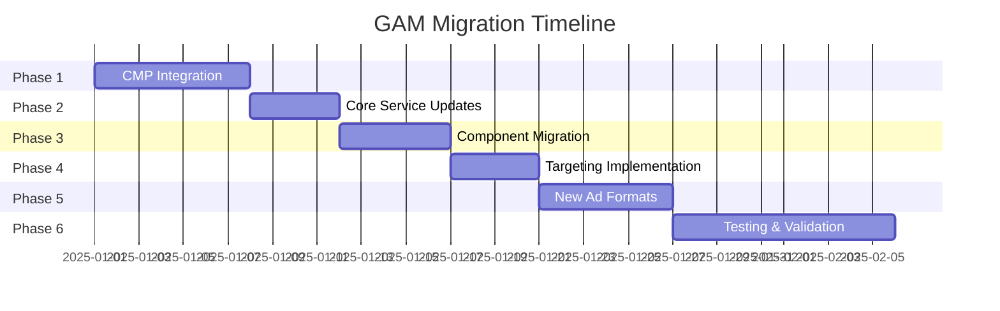

# Google Ad Manager (GAM) Migration Plan

## Executive Summary

This document outlines the comprehensive migration strategy from AdMob to Google Ad Manager (GAM) for the EMAP mobile application. The migration will enable advanced ad serving capabilities including direct sold campaigns, house ads, and sophisticated targeting while maintaining compatibility with the existing `react-native-google-mobile-ads` v15.8.0 SDK.

### Key Changes Overview

- **CMP Integration**: Implement IAB TCF 2.2 compliant consent management
- **Ad Service Migration**: Transition from AdMob classes to GAM classes
- **Targeting Implementation**: Add slot-level (POS) and page-level (CMS tags) targeting
- **New Ad Formats**: Implement video (Out-of-Page) and native Fluid (1x1) formats
- **Ad Unit Structure**: Migrate to GAM-specific ad unit IDs with platform separation
- **Configuration Updates**: Enhance brand configs to support GAM requirements

### Migration Benefits

- Direct sold and house ad support
- Advanced targeting capabilities
- Better ad inventory control
- Improved reporting and analytics
- Future programmatic integration readiness

---

## Migration Phases

### Phase 1: CMP Integration (Foundation)

**Duration**: 5-7 days  
**Priority**: Critical - Must complete before any ad requests

### Phase 2: Core Service Updates

**Duration**: 3-4 days  
**Priority**: High - Foundation for all ad types

### Phase 3: Component Migration

**Duration**: 4-5 days  
**Priority**: High - User-facing changes

### Phase 4: Targeting Implementation

**Duration**: 3-4 days  
**Priority**: High - GAM requirement

### Phase 5: New Ad Formats

**Duration**: 5-6 days  
**Priority**: Medium - Feature enhancement

### Phase 6: Testing & Validation

**Duration**: 7-10 days  
**Priority**: Critical - Quality assurance

**Total Estimated Duration**: 27-36 days

---

## Phase 1: CMP Integration

### Objectives

- Implement IAB TCF 2.2 compliant consent management
- Ensure consent is obtained before first ad request
- Support GDPR, CCPA, and other privacy regulations
- Provide user-friendly consent UI

### Deliverables

1. CMP SDK integration
2. Consent flow implementation
3. Consent storage and retrieval
4. Privacy policy integration
5. Consent status tracking

### Files to Modify/Create

#### New Files

- [`services/cmp/consentManager.ts`](services/cmp/consentManager.ts) - Core CMP service
- [`services/cmp/tcfManager.ts`](services/cmp/tcfManager.ts) - IAB TCF 2.2 implementation
- [`components/ConsentDialog.tsx`](components/ConsentDialog.tsx) - Consent UI component
- [`types/consent.ts`](types/consent.ts) - Consent type definitions
- [`hooks/useConsent.ts`](hooks/useConsent.ts) - Consent React hook

#### Modified Files

- [`app/_layout.tsx`](app/_layout.tsx) - Initialize CMP on app start
- [`services/admob.ts`](services/admob.ts) - Add consent checks before ad requests

### Technical Specifications

#### CMP SDK Selection

**Recommended**: Google User Messaging Platform (UMP) SDK

**Rationale**:

- Native Google integration
- IAB TCF 2.2 compliant
- Supports multiple privacy frameworks
- Free and well-maintained
- Works with both AdMob and GAM

**Installation**:

```bash
npm install @react-native-google-mobile-ads/consent
```

#### Consent Flow Architecture

```typescript
// services/cmp/consentManager.ts
interface ConsentStatus {
  canRequestAds: boolean;
  consentType: "OBTAINED" | "NOT_REQUIRED" | "REQUIRED" | "UNKNOWN";
  tcfString?: string;
  gdprApplies: boolean;
  ccpaApplies: boolean;
}

class ConsentManager {
  async initialize(): Promise<void>;
  async requestConsentIfNeeded(): Promise<ConsentStatus>;
  async showConsentForm(): Promise<void>;
  getConsentStatus(): ConsentStatus;
  resetConsent(): Promise<void>;
}
```

#### Implementation Steps

1. **Install CMP SDK**

   ```bash
   npm install @react-native-google-mobile-ads/consent
   cd ios && pod install
   ```

2. **Create Consent Manager Service**

   - Implement IAB TCF 2.2 compliance
   - Handle consent status persistence
   - Provide consent update callbacks

3. **Create Consent UI Components**

   - Privacy policy display
   - Consent options (Accept/Reject/Customize)
   - Vendor list display
   - Settings screen integration

4. **Integrate with App Lifecycle**

   - Check consent on app launch
   - Show consent dialog if needed
   - Block ad requests until consent obtained

5. **Add Consent Status Tracking**
   - Log consent events to analytics
   - Track consent changes
   - Monitor consent rates

### Dependencies

- None (foundation phase)

### Testing Requirements

#### Unit Tests

- Consent status detection
- TCF string generation
- Storage persistence
- Status callbacks

#### Integration Tests

- App launch with no consent
- App launch with existing consent
- Consent dialog display
- Consent update flow
- Privacy policy navigation

#### Manual Testing

- [ ] First launch shows consent dialog
- [ ] Consent choices are persisted
- [ ] Ads blocked without consent
- [ ] Ads load after consent
- [ ] Settings allow consent changes
- [ ] Privacy policy accessible
- [ ] GDPR regions handled correctly
- [ ] Non-GDPR regions handled correctly

### Rollback Strategy

- CMP can be disabled via feature flag
- Fallback to "consent not required" mode
- Existing ad functionality preserved
- No data loss on rollback

### Risk Assessment

**High Risk**:

- Consent dialog blocking app usage
- **Mitigation**: Implement skip option for non-GDPR regions

**Medium Risk**:

- User confusion about consent options
- **Mitigation**: Clear, simple language; privacy policy link

**Low Risk**:

- Performance impact of consent checks
- **Mitigation**: Cache consent status; async initialization

---

## Phase 2: Core Service Updates

### Objectives

- Migrate from AdMob to GAM classes
- Update ad unit ID structure
- Implement GAM-specific configuration
- Maintain backward compatibility during transition

### Deliverables

1. Updated ad service with GAM support
2. New ad unit ID management
3. GAM request configuration
4. Migration utilities

### Files to Modify

#### Core Service Files

- [`services/admob.ts`](services/admob.ts) → [`services/gamAdService.ts`](services/gamAdService.ts)
- [`services/nativeAds.ts`](services/nativeAds.ts)
- [`services/displayAdManager.ts`](services/displayAdManager.ts)
- [`types/ads.ts`](types/ads.ts)

#### Configuration Files

- [`brands/jnl/config.json`](brands/jnl/config.json)
- All brand config files

### Technical Specifications

#### Class Name Mappings

| AdMob Class      | GAM Class        | Notes                                |
| ---------------- | ---------------- | ------------------------------------ |
| `BannerAd`       | `BannerAd`       | Same class, different ad unit format |
| `NativeAd`       | `NativeAd`       | Same class, different ad unit format |
| `InterstitialAd` | `InterstitialAd` | Same class, different ad unit format |
| `RewardedAd`     | `RewardedAd`     | Same class, different ad unit format |
| N/A              | `AppOpenAd`      | New format (future)                  |

**Key Difference**: GAM uses network code in ad unit IDs:

- AdMob: `ca-app-pub-XXXXXXXXXXXXXXXX/YYYYYYYYYY`
- GAM: `/NETWORK_CODE/ad_unit_path`

#### Ad Unit ID Structure

**Format**: `/NETWORK_CODE/brand_app_platform/format`

**Examples**:

```typescript
// iOS
/NETWORK_CODE/__aegiiimnnopprssstu /
  banner /
  NETWORK_CODE /
  nursingtimes_app_ios /
  mpu /
  NETWORK_CODE /
  nursingtimes_app_ios /
  native /
  NETWORK_CODE /
  nursingtimes_app_ios /
  video /
  // Android
  NETWORK_CODE /
  nursingtimes_app_android /
  banner /
  NETWORK_CODE /
  nursingtimes_app_android /
  mpu /
  NETWORK_CODE /
  nursingtimes_app_android /
  native /
  NETWORK_CODE /
  nursingtimes_app_android /
  video;
```

#### Updated Service Architecture

```typescript
// services/gamAdService.ts
interface GAMConfig {
  enabled: boolean;
  testMode: boolean;
  networkCode: string;
  brand: "cn" | "nt";
  consentRequired: boolean;
}

interface GAMAdUnitConfig {
  banner: { ios: string; android: string };
  mpu: { ios: string; android: string };
  native: { ios: string; android: string };
  video: { ios: string; android: string };
}

class GAMAdService {
  async initialize(config: GAMConfig): Promise<void>;
  getAdUnitId(format: AdFormat, platform?: Platform): string;
  setTargeting(targeting: TargetingParams): void;
  clearTargeting(): void;
  isReady(): boolean;
}
```

#### Implementation Steps

1. **Create GAM Ad Service**

   - Copy [`admob.ts`](services/admob.ts) to [`gamAdService.ts`](services/gamAdService.ts)
   - Update ad unit ID logic for GAM format
   - Add network code configuration
   - Implement consent checks

2. **Update Ad Unit ID Management**

   - Support both AdMob and GAM formats
   - Add format-specific ID retrieval
   - Implement platform-specific logic
   - Add validation for GAM format

3. **Update Type Definitions**

   - Add GAM-specific types
   - Update ad configuration interfaces
   - Add targeting parameter types
   - Maintain backward compatibility

4. **Create Migration Utilities**
   - Ad unit ID converter
   - Configuration validator
   - Test mode helpers

### Configuration Changes

#### Brand Config Schema Updates

```json
{
  "ads": {
    "enabled": true,
    "provider": "gam",
    "networkCode": "NETWORK_CODE",
    "testMode": true,
    "consentRequired": true,

    "displayAds": {
      "enabled": true,
      "formats": {
        "banner": {
          "enabled": true,
          "size": "320x100",
          "adUnitIds": {
            "ios": "/NETWORK_CODE/nursingtimes_app_ios/banner",
            "android": "/NETWORK_CODE/nursingtimes_app_android/banner"
          }
        },
        "mpu": {
          "enabled": true,
          "size": "300x250",
          "adUnitIds": {
            "ios": "/NETWORK_CODE/nursingtimes_app_ios/mpu",
            "android": "/NETWORK_CODE/nursingtimes_app_android/mpu"
          }
        }
      },
      "articleDetail": {
        "enabled": true,
        "maxAdsPerPage": 2,
        "paragraphInterval": 5,
        "allowedFormats": ["banner", "mpu"]
      },
      "listView": {
        "enabled": true,
        "maxAdsPerPage": 3,
        "blockInterval": 4,
        "allowedFormats": ["banner"]
      }
    },

    "nativeAds": {
      "enabled": true,
      "formats": {
        "carousel": {
          "enabled": true,
          "adUnitIds": {
            "ios": "/NETWORK_CODE/nursingtimes_app_ios/native",
            "android": "/NETWORK_CODE/nursingtimes_app_android/native"
          }
        },
        "list": {
          "enabled": true,
          "adUnitIds": {
            "ios": "/NETWORK_CODE/nursingtimes_app_ios/native",
            "android": "/NETWORK_CODE/nursingtimes_app_android/native"
          }
        },
        "fluid": {
          "enabled": false,
          "size": "1x1",
          "adUnitIds": {
            "ios": "/NETWORK_CODE/nursingtimes_app_ios/native",
            "android": "/NETWORK_CODE/nursingtimes_app_android/native"
          }
        }
      }
    },

    "videoAds": {
      "enabled": false,
      "format": "outstream",
      "adUnitIds": {
        "ios": "/NETWORK_CODE/nursingtimes_app_ios/video",
        "android": "/NETWORK_CODE/nursingtimes_app_android/video"
      }
    }
  }
}
```

### Dependencies

- Phase 1 (CMP Integration) must be complete
- Consent status must be available

### Testing Requirements

#### Unit Tests

- Ad unit ID generation
- Platform detection
- Format validation
- Configuration parsing
- Consent integration

#### Integration Tests

- Service initialization
- Ad unit ID retrieval
- Multi-brand support
- Test mode switching
- Consent blocking

#### Manual Testing

- [ ] Service initializes correctly
- [ ] Correct ad unit IDs generated
- [ ] Platform-specific IDs work
- [ ] Test mode uses test IDs
- [ ] Consent blocks ad requests
- [ ] Multiple brands supported

### Rollback Strategy

- Keep AdMob service as fallback
- Feature flag to switch providers
- Configuration-based rollback
- No data migration needed

---

## Phase 3: Component Migration

### Objectives

- Update ad components to use GAM service
- Maintain existing UI/UX
- Add GAM-specific features
- Ensure smooth user experience

### Deliverables

1. Updated banner ad component
2. Updated native ad components
3. Updated display ad wrapper
4. Component testing suite

### Files to Modify

#### Component Files

- [`components/BannerAd.tsx`](components/BannerAd.tsx)
- [`components/NativeAdCarouselItem.tsx`](components/NativeAdCarouselItem.tsx)
- [`components/NativeAdListItem.tsx`](components/NativeAdListItem.tsx)
- [`components/DisplayAd.tsx`](components/DisplayAd.tsx)

#### Service Files

- [`services/nativeAdLoader.ts`](services/nativeAdLoader.ts)
- [`services/nativeAdListLoader.ts`](services/nativeAdListLoader.ts)
- [`services/displayAdLazyLoadManager.ts`](services/displayAdLazyLoadManager.ts)

### Technical Specifications

#### Component Updates

**BannerAd Component Changes**:

```typescript
// Before (AdMob)
import { adMobService } from "@/services/admob";
const adUnitId = adMobService.getBannerAdUnitId();

// After (GAM)
import { gamAdService } from "@/services/gamAdService";
const adUnitId = gamAdService.getAdUnitId("banner", Platform.OS);

// Add targeting
<GoogleBannerAd
  unitId={adUnitId}
  size={size}
  requestOptions={{
    requestNonPersonalizedAdsOnly: false,
    customTargeting: {
      pos: position,
      ...pageTargeting,
    },
  }}
/>;
```

**Native Ad Component Changes**:

```typescript
// Update ad loader to use GAM service
const adLoader = NativeAdLoader.createForAdRequest(
  gamAdService.getAdUnitId("native", Platform.OS),
  {
    customTargeting: {
      pos: position,
      ...pageTargeting,
    },
  }
);
```

#### Implementation Steps

1. **Update BannerAd Component**

   - Replace AdMob service calls with GAM service
   - Add targeting parameter support
   - Update ad unit ID retrieval
   - Maintain existing props interface

2. **Update Native Ad Components**

   - Update carousel item component
   - Update list item component
   - Add targeting support
   - Maintain existing UI

3. **Update Display Ad Wrapper**

   - Integrate GAM service
   - Add targeting propagation
   - Update lazy loading logic
   - Maintain placement logic

4. **Update Ad Loaders**
   - Modify native ad loader
   - Update list ad loader
   - Add targeting support
   - Maintain caching logic

### Dependencies

- Phase 2 (Core Service Updates) must be complete
- GAM service must be initialized

### Testing Requirements

#### Unit Tests

- Component rendering
- Ad unit ID usage
- Targeting parameter passing
- Error handling
- Loading states

#### Integration Tests

- Ad loading flow
- Targeting application
- Multi-format support
- Lazy loading behavior
- Cache integration

#### Manual Testing

- [ ] Banner ads display correctly
- [ ] Native carousel ads work
- [ ] Native list ads work
- [ ] Targeting applied correctly
- [ ] Loading states shown
- [ ] Error states handled
- [ ] Lazy loading works
- [ ] Multiple ad formats coexist

### Rollback Strategy

- Keep old components as backup
- Feature flag for component version
- Gradual rollout per ad type
- Quick revert capability

---

## Phase 4: Targeting Implementation

### Objectives

- Implement slot-level targeting (POS parameter)
- Implement page-level targeting (CMS tags)
- Support dynamic targeting updates
- Enable targeting-based ad serving

### Deliverables

1. Targeting service
2. Slot-level targeting implementation
3. Page-level targeting implementation
4. Targeting configuration system

### Files to Create/Modify

#### New Files

- [`services/targeting/targetingManager.ts`](services/targeting/targetingManager.ts)
- [`services/targeting/slotTargeting.ts`](services/targeting/slotTargeting.ts)
- [`services/targeting/pageTargeting.ts`](services/targeting/pageTargeting.ts)
- [`types/targeting.ts`](types/targeting.ts)
- [`hooks/useTargeting.ts`](hooks/useTargeting.ts)

#### Modified Files

- [`services/gamAdService.ts`](services/gamAdService.ts)
- [`components/BannerAd.tsx`](components/BannerAd.tsx)
- [`components/NativeAdCarouselItem.tsx`](components/NativeAdCarouselItem.tsx)
- [`components/NativeAdListItem.tsx`](components/NativeAdListItem.tsx)

### Technical Specifications

#### Targeting Architecture

```typescript
// types/targeting.ts
interface SlotTargeting {
  pos: string; // Position identifier (e.g., "top", "mid1", "mid2", "bottom")
}

interface PageTargeting {
  content_type?: string; // "article", "list", "home"
  category?: string; // Article category
  tags?: string[]; // Article tags
  author?: string; // Article author
  brand?: string; // "cn" or "nt"
  section?: string; // Site section
}

interface TargetingParams extends SlotTargeting, PageTargeting {}

// services/targeting/targetingManager.ts
class TargetingManager {
  setPageTargeting(targeting: PageTargeting): void;
  getPageTargeting(): PageTargeting;
  createSlotTargeting(position: string): SlotTargeting;
  mergeTargeting(slot: SlotTargeting, page: PageTargeting): TargetingParams;
  clearTargeting(): void;
}
```

#### Slot-Level Targeting (POS Parameter)

**Purpose**: Identify ad slot position for frequency capping and competitive exclusions

**Implementation**:

```typescript
// Position naming convention
const POS_VALUES = {
  // Article Detail
  ARTICLE_TOP: "article_top",
  ARTICLE_MID_1: "article_mid1",
  ARTICLE_MID_2: "article_mid2",
  ARTICLE_BOTTOM: "article_bottom",

  // List View
  LIST_TOP: "list_top",
  LIST_MID: "list_mid",
  LIST_BOTTOM: "list_bottom",

  // Native Carousel
  CAROUSEL: "carousel",

  // Native List
  NATIVE_LIST: "native_list",
};

// Usage in component
const slotTargeting = targetingManager.createSlotTargeting("article_mid1");
```

#### Page-Level Targeting (CMS Tags)

**Purpose**: Enable content-based ad targeting and reporting

**Implementation**:

```typescript
// Extract from article/page data
const pageTargeting: PageTargeting = {
  content_type: "article",
  category: article.category?.slug,
  tags: article.tags?.map((t) => t.slug).slice(0, 5), // Limit to 5 tags
  author: article.author?.slug,
  brand: brandConfig.shortcode,
  section: article.section?.slug,
};

targetingManager.setPageTargeting(pageTargeting);
```

#### Implementation Steps

1. **Create Targeting Manager Service**

   - Implement page-level targeting storage
   - Create slot targeting generator
   - Add targeting merge logic
   - Implement targeting validation

2. **Integrate with GAM Service**

   - Add targeting to ad requests
   - Support custom targeting parameters
   - Handle targeting updates
   - Clear targeting on navigation

3. **Update Components**

   - Add POS parameter to all ad slots
   - Extract page targeting from context
   - Pass targeting to ad requests
   - Handle targeting changes

4. **Add Targeting Hooks**
   - Create `useTargeting` hook
   - Provide targeting context
   - Auto-update on navigation
   - Clear on unmount

### Configuration Changes

#### Targeting Configuration

```json
{
  "ads": {
    "targeting": {
      "enabled": true,
      "slotLevel": {
        "enabled": true,
        "parameter": "pos"
      },
      "pageLevel": {
        "enabled": true,
        "parameters": [
          "content_type",
          "category",
          "tags",
          "author",
          "brand",
          "section"
        ],
        "maxTags": 5
      }
    }
  }
}
```

### Dependencies

- Phase 2 (Core Service Updates) must be complete
- Phase 3 (Component Migration) must be complete

### Testing Requirements

#### Unit Tests

- Targeting parameter generation
- Targeting merge logic
- Targeting validation
- Context updates

#### Integration Tests

- Page targeting extraction
- Slot targeting application
- Multi-component targeting
- Navigation clearing

#### Manual Testing

- [ ] POS parameter sent correctly
- [ ] Page targeting extracted from articles
- [ ] Targeting updates on navigation
- [ ] Multiple ad slots have unique POS
- [ ] Tags limited to configured max
- [ ] Targeting cleared appropriately
- [ ] GAM receives targeting parameters

### Rollback Strategy

- Targeting can be disabled via config
- Ads work without targeting
- No breaking changes
- Feature flag control

---

## Phase 5: New Ad Formats

### Objectives

- Implement video ad format (Out-of-Page)
- Implement native Fluid format (1x1)
- Add format-specific components
- Support new ad placements

### Deliverables

1. Video ad component
2. Native Fluid ad component
3. Format-specific services
4. Placement logic updates

### Files to Create/Modify

#### New Files

- [`components/VideoAd.tsx`](components/VideoAd.tsx)
- [`components/NativeFluidAd.tsx`](components/NativeFluidAd.tsx)
- [`services/videoAdManager.ts`](services/videoAdManager.ts)
- [`types/videoAds.ts`](types/videoAds.ts)

#### Modified Files

- [`services/gamAdService.ts`](services/gamAdService.ts)
- [`services/displayAdManager.ts`](services/displayAdManager.ts)
- [`types/ads.ts`](types/ads.ts)
- Brand config files

### Technical Specifications

#### Video Ad Format (Out-of-Page)

**Characteristics**:

- Outstream video format
- Auto-play with sound off
- Expands on interaction
- Collapses when complete
- Viewability tracking

**Implementation**:

```typescript
// components/VideoAd.tsx
import { AppOpenAd } from "react-native-google-mobile-ads";

interface VideoAdProps {
  position: string;
  autoPlay?: boolean;
  muted?: boolean;
  onVideoStart?: () => void;
  onVideoComplete?: () => void;
}

export function VideoAd({
  position,
  autoPlay = true,
  muted = true,
  onVideoStart,
  onVideoComplete,
}: VideoAdProps) {
  const adUnitId = gamAdService.getAdUnitId("video", Platform.OS);
  const targeting = targetingManager.mergeTargeting(
    { pos: position },
    targetingManager.getPageTargeting()
  );

  // Video ad implementation
  // Note: May need custom native module for outstream video
}
```

**Placement Strategy**:

- Article detail: After 3rd paragraph
- List view: Every 10 items
- Maximum 1 video ad per page
- Minimum 2 screen heights between videos

#### Native Fluid Format (1x1)

**Characteristics**:

- Flexible size (adapts to container)
- Responsive layout
- Native styling
- Seamless integration

**Implementation**:

```typescript
// components/NativeFluidAd.tsx
interface NativeFluidAdProps {
  position: string;
  minHeight?: number;
  maxHeight?: number;
  aspectRatio?: number;
}

export function NativeFluidAd({
  position,
  minHeight = 200,
  maxHeight = 400,
  aspectRatio = 16 / 9,
}: NativeFluidAdProps) {
  const adUnitId = gamAdService.getAdUnitId("native", Platform.OS);

  return (
    <NativeAdView
      nativeAd={nativeAd}
      style={{
        minHeight,
        maxHeight,
        aspectRatio,
      }}
    >
      {/* Fluid layout implementation */}
    </NativeAdView>
  );
}
```

**Placement Strategy**:

- In-feed placements
- Between content blocks
- Responsive to container width
- Maintains aspect ratio

#### Implementation Steps

1. **Implement Video Ad Component**

   - Create video ad component
   - Add playback controls
   - Implement viewability tracking
   - Add error handling

2. **Implement Native Fluid Component**

   - Create fluid ad component
   - Add responsive sizing
   - Implement layout adaptation
   - Add loading states

3. **Update Ad Services**

   - Add video ad support to GAM service
   - Add fluid format support
   - Update ad unit ID management
   - Add format-specific configuration

4. **Update Placement Logic**

   - Add video ad placement rules
   - Add fluid ad placement rules
   - Update display ad manager
   - Implement frequency capping

5. **Add Format Configuration**
   - Video ad settings
   - Fluid ad settings
   - Placement rules
   - Feature flags

### Configuration Changes

```json
{
  "ads": {
    "videoAds": {
      "enabled": true,
      "format": "outstream",
      "autoPlay": true,
      "muted": true,
      "adUnitIds": {
        "ios": "/NETWORK_CODE/nursingtimes_app_ios/video",
        "android": "/NETWORK_CODE/nursingtimes_app_android/video"
      },
      "placement": {
        "articleDetail": {
          "enabled": true,
          "afterParagraph": 3,
          "maxPerPage": 1
        },
        "listView": {
          "enabled": true,
          "interval": 10,
          "maxPerPage": 1
        }
      }
    },
    "nativeAds": {
      "formats": {
        "fluid": {
          "enabled": true,
          "size": "1x1",
          "minHeight": 200,
          "maxHeight": 400,
          "aspectRatio": 1.78,
          "adUnitIds": {
            "ios": "/NETWORK_CODE/nursingtimes_app_ios/native",
            "android": "/NETWORK_CODE/nursingtimes_app_android/native"
          }
        }
      }
    }
  }
}
```

### Dependencies

- Phase 2 (Core Service Updates) must be complete
- Phase 3 (Component Migration) must be complete
- Phase 4 (Targeting Implementation) recommended

### Testing Requirements

#### Unit Tests

- Video ad component rendering
- Fluid ad component rendering
- Format detection
- Placement calculation

#### Integration Tests

- Video ad loading
- Video playback
- Fluid ad sizing
- Multi-format coexistence

#### Manual Testing

- [ ] Video ads load correctly
- [ ] Video auto-plays (muted)
- [ ] Video controls work
- [ ] Fluid ads adapt to container
- [ ] Fluid ads maintain aspect ratio
- [ ] Multiple formats don't conflict
- [ ] Placement rules respected
- [ ] Frequency capping works

### Rollback Strategy

- New formats disabled by default
- Feature flags for each format
- No impact on existing formats
- Independent rollback per format

---

## Phase 6: Testing & Validation

### Objectives

- Comprehensive testing of all changes
- Validate GAM integration
- Performance testing
- User acceptance testing

### Deliverables

1. Complete test suite
2. Performance benchmarks
3. UAT results
4. Production readiness checklist

### Testing Strategy

#### Unit Testing

**Coverage Requirements**: >80%

**Test Files to Create**:

- `services/__tests__/gamAdService.test.ts`
- `services/__tests__/consentManager.test.ts`
- `services/__tests__/targetingManager.test.ts`
- `components/__tests__/BannerAd.test.tsx`
- `components/__tests__/VideoAd.test.tsx`
- `components/__tests__/NativeFluidAd.test.tsx`

**Test Scenarios**:

```typescript
describe("GAMAdService", () => {
  it("should initialize with valid config", async () => {});
  it("should generate correct ad unit IDs", () => {});
  it("should apply targeting parameters", () => {});
  it("should block requests without consent", () => {});
  it("should handle network errors gracefully", () => {});
});

describe("ConsentManager", () => {
  it("should detect consent requirement", () => {});
  it("should show consent dialog when needed", () => {});
  it("should persist consent choices", () => {});
  it("should generate valid TCF string", () => {});
});

describe("TargetingManager", () => {
  it("should create slot targeting", () => {});
  it("should extract page targeting", () => {});
  it("should merge targeting correctly", () => {});
  it("should validate targeting parameters", () => {});
});
```

#### Integration Testing

**Test Scenarios**:

1. **End-to-End Ad Loading**

   - App launch → Consent → Ad request → Ad display
   - Test all ad formats
   - Test all placements
   - Test targeting application

2. **Multi-Brand Support**

   - Switch brands
   - Verify correct ad units
   - Verify targeting updates
   - Verify configuration loading

3. **Consent Flow**

   - First launch (no consent)
   - Subsequent launches (with consent)
   - Consent changes
   - GDPR vs non-GDPR regions

4. **Targeting Propagation**

   - Article navigation
   - Category changes
   - Tag updates
   - Slot positioning

5. **Error Handling**
   - Network failures
   - Invalid ad units
   - No fill scenarios
   - Timeout handling

#### Platform-Specific Testing

**iOS Testing**:

- [ ] iOS 14+ consent framework
- [ ] App Tracking Transparency
- [ ] All ad formats display
- [ ] Targeting works correctly
- [ ] Performance acceptable
- [ ] Memory usage normal
- [ ] No crashes

**Android Testing**:

- [ ] Android 8+ support
- [ ] Consent dialog displays
- [ ] All ad formats display
- [ ] Targeting works correctly
- [ ] Performance acceptable
- [ ] Memory usage normal
- [ ] No crashes

#### Manual Testing Checklist

**Pre-Migration Baseline**:

- [ ] Document current ad performance
- [ ] Capture current load times
- [ ] Record current fill rates
- [ ] Note current revenue

\*\*Post

-Migration Testing\*\*:

- [ ] All ad formats load
- [ ] Targeting applied correctly
- [ ] Consent flow works
- [ ] Performance maintained
- [ ] No regressions
- [ ] Analytics tracking works

**Regression Testing**:

- [ ] Existing features unaffected
- [ ] Navigation works
- [ ] Article display correct
- [ ] List views functional
- [ ] Brand switching works
- [ ] Settings accessible

**Performance Testing**:

- [ ] App launch time < 3s
- [ ] Ad load time < 2s
- [ ] Memory usage < 200MB
- [ ] CPU usage < 30%
- [ ] Battery impact minimal
- [ ] Network usage reasonable

**User Acceptance Testing**:

- [ ] Ads display naturally
- [ ] No intrusive behavior
- [ ] Consent flow clear
- [ ] Privacy respected
- [ ] Performance smooth
- [ ] No user complaints

### Dependencies

- All previous phases must be complete
- Test environment configured
- Test ad units available
- Analytics configured

### Testing Timeline

| Week | Focus               | Activities                     |
| ---- | ------------------- | ------------------------------ |
| 1    | Unit Testing        | Write and run unit tests       |
| 2    | Integration Testing | End-to-end test scenarios      |
| 3    | Platform Testing    | iOS and Android specific tests |
| 4    | Performance Testing | Load testing, benchmarking     |
| 5    | UAT                 | User acceptance testing        |
| 6    | Bug Fixes           | Address issues found           |
| 7    | Regression Testing  | Final validation               |

### Success Criteria

**Must Have**:

- ✅ All unit tests pass
- ✅ All integration tests pass
- ✅ No critical bugs
- ✅ Performance within targets
- ✅ Consent flow works
- ✅ All ad formats display

**Should Have**:

- ✅ >80% test coverage
- ✅ No high-priority bugs
- ✅ Analytics tracking complete
- ✅ Documentation complete

**Nice to Have**:

- ✅ >90% test coverage
- ✅ No medium-priority bugs
- ✅ Performance improvements
- ✅ Enhanced error handling

---

## Configuration Changes

### Environment Variables

**New Variables Required**:

```bash
# GAM Configuration
GAM_NETWORK_CODE=your_network_code
GAM_TEST_MODE=true
GAM_CONSENT_REQUIRED=true

# CMP Configuration
CMP_PUBLISHER_ID=your_publisher_id
CMP_PRIVACY_POLICY_URL=https://yoursite.com/privacy

# Targeting Configuration
TARGETING_ENABLED=true
TARGETING_MAX_TAGS=5
```

### Brand Configuration Schema

**Complete Schema**:

```json
{
  "shortcode": "nt",
  "name": "Nursing Times",

  "ads": {
    "enabled": true,
    "provider": "gam",
    "networkCode": "NETWORK_CODE",
    "testMode": true,
    "consentRequired": true,

    "consent": {
      "enabled": true,
      "publisherId": "pub-XXXXXXXXXXXXXXXX",
      "privacyPolicyUrl": "https://nursingtimes.net/privacy",
      "debugGeography": "EEA"
    },

    "targeting": {
      "enabled": true,
      "slotLevel": {
        "enabled": true,
        "parameter": "pos"
      },
      "pageLevel": {
        "enabled": true,
        "parameters": [
          "content_type",
          "category",
          "tags",
          "author",
          "brand",
          "section"
        ],
        "maxTags": 5
      }
    },

    "displayAds": {
      "enabled": true,
      "lazyLoading": {
        "enabled": true,
        "threshold": 250,
        "showPlaceholder": true,
        "analytics": true
      },
      "formats": {
        "banner": {
          "enabled": true,
          "size": "320x100",
          "adUnitIds": {
            "ios": "/NETWORK_CODE/nursingtimes_app_ios/banner",
            "android": "/NETWORK_CODE/nursingtimes_app_android/banner"
          }
        },
        "mpu": {
          "enabled": true,
          "size": "300x250",
          "adUnitIds": {
            "ios": "/NETWORK_CODE/nursingtimes_app_ios/mpu",
            "android": "/NETWORK_CODE/nursingtimes_app_android/mpu"
          }
        }
      },
      "articleDetail": {
        "enabled": true,
        "maxAdsPerPage": 2,
        "paragraphInterval": 5,
        "allowedFormats": ["banner", "mpu"],
        "positions": [
          {
            "type": "in_content",
            "format": "banner",
            "enabled": true,
            "afterParagraph": 5,
            "pos": "article_mid1"
          }
        ]
      },
      "listView": {
        "enabled": true,
        "maxAdsPerPage": 3,
        "blockInterval": 4,
        "allowedFormats": ["banner"],
        "positions": [
          {
            "type": "between_blocks",
            "format": "banner",
            "enabled": true,
            "afterBlock": 4,
            "pos": "list_mid"
          }
        ]
      }
    },

    "nativeAds": {
      "enabled": true,
      "formats": {
        "carousel": {
          "enabled": true,
          "firstAdPosition": 2,
          "adInterval": 5,
          "preloadDistance": 2,
          "unloadDistance": 3,
          "maxCachedAds": 3,
          "maxAdsPerSession": null,
          "showLoadingIndicator": true,
          "skipIfNotReady": true,
          "adUnitIds": {
            "ios": "/NETWORK_CODE/nursingtimes_app_ios/native",
            "android": "/NETWORK_CODE/nursingtimes_app_android/native"
          }
        },
        "list": {
          "enabled": true,
          "views": {
            "news": {
              "enabled": true,
              "positions": [4, 9, 14],
              "maxAdsPerList": 3
            },
            "clinical": {
              "enabled": true,
              "positions": [4, 9, 14],
              "maxAdsPerList": 3
            }
          },
          "preloadAds": true,
          "showLoadingIndicator": true,
          "skipIfNotReady": true,
          "adUnitIds": {
            "ios": "/NETWORK_CODE/nursingtimes_app_ios/native",
            "android": "/NETWORK_CODE/nursingtimes_app_android/native"
          }
        },
        "fluid": {
          "enabled": false,
          "size": "1x1",
          "minHeight": 200,
          "maxHeight": 400,
          "aspectRatio": 1.78,
          "adUnitIds": {
            "ios": "/NETWORK_CODE/nursingtimes_app_ios/native",
            "android": "/NETWORK_CODE/nursingtimes_app_android/native"
          }
        }
      }
    },

    "videoAds": {
      "enabled": false,
      "format": "outstream",
      "autoPlay": true,
      "muted": true,
      "adUnitIds": {
        "ios": "/NETWORK_CODE/nursingtimes_app_ios/video",
        "android": "/NETWORK_CODE/nursingtimes_app_android/video"
      },
      "placement": {
        "articleDetail": {
          "enabled": true,
          "afterParagraph": 3,
          "maxPerPage": 1,
          "pos": "article_video"
        },
        "listView": {
          "enabled": false,
          "interval": 10,
          "maxPerPage": 1,
          "pos": "list_video"
        }
      }
    }
  }
}
```

---

## Risk Assessment

### Critical Risks

#### 1. Consent Blocking Ad Revenue

**Impact**: High  
**Probability**: Medium  
**Mitigation**:

- Implement consent dialog only in GDPR regions
- Provide clear value proposition for consent
- Allow app usage without consent (ads disabled)
- Monitor consent rates closely
- A/B test consent messaging

**Rollback Plan**:

- Disable consent requirement via feature flag
- Revert to AdMob if needed
- Maintain revenue tracking

#### 2. Ad Fill Rate Decrease

**Impact**: High  
**Probability**: Medium  
**Mitigation**:

- Start with test campaigns
- Gradually increase direct sold inventory
- Maintain programmatic fallback (future)
- Monitor fill rates daily
- Have house ads ready

**Rollback Plan**:

- Switch back to AdMob ad units
- Re-enable programmatic demand
- Adjust targeting to increase fill

#### 3. Performance Degradation

**Impact**: High  
**Probability**: Low  
**Mitigation**:

- Implement lazy loading
- Optimize ad request timing
- Cache targeting parameters
- Monitor performance metrics
- Set performance budgets

**Rollback Plan**:

- Disable new ad formats
- Reduce ad frequency
- Optimize targeting logic

### High Risks

#### 4. Targeting Implementation Errors

**Impact**: Medium  
**Probability**: Medium  
**Mitigation**:

- Extensive testing of targeting logic
- Validate targeting parameters
- Monitor GAM reports
- Log targeting data
- Implement targeting validation

**Rollback Plan**:

- Disable targeting temporarily
- Fix issues in staging
- Gradual re-enable

#### 5. Multi-Brand Configuration Issues

**Impact**: Medium  
**Probability**: Medium  
**Mitigation**:

- Test each brand separately
- Validate configuration schema
- Implement config validation
- Monitor per-brand metrics
- Have brand-specific rollback

**Rollback Plan**:

- Revert to previous config
- Fix per-brand issues
- Staged rollout per brand

### Medium Risks

#### 6. New Ad Format Compatibility

**Impact**: Medium  
**Probability**: Low  
**Mitigation**:

- Test on multiple devices
- Implement fallbacks
- Monitor crash reports
- Gradual format rollout
- Device-specific testing

**Rollback Plan**:

- Disable problematic formats
- Fix compatibility issues
- Re-enable after validation

#### 7. Analytics Data Loss

**Impact**: Low  
**Probability**: Low  
**Mitigation**:

- Maintain existing analytics
- Add new GAM-specific events
- Validate data collection
- Compare pre/post migration
- Backup analytics data

**Rollback Plan**:

- Restore previous analytics
- Fix tracking issues
- Validate data integrity

---

## Timeline Estimates

### Detailed Phase Timeline



### Phase Dependencies

**Critical Path**:

1. Phase 1 (CMP) → Phase 2 (Core) → Phase 3 (Components) → Phase 6 (Testing)

**Parallel Work Possible**:

- Phase 4 (Targeting) can start after Phase 2
- Phase 5 (New Formats) can start after Phase 3
- Documentation can be written throughout

### Resource Requirements

**Development Team**:

- 1 Senior Developer (full-time, all phases)
- 1 Mid-level Developer (full-time, phases 3-6)
- 1 QA Engineer (full-time, phase 6)
- 1 DevOps Engineer (part-time, deployment)

**Estimated Effort**:

- Development: 25-30 days
- Testing: 10-15 days
- Documentation: 5 days
- **Total**: 40-50 days

### Suggested Implementation Order

**Week 1-2**: Phase 1 (CMP Integration)

- Critical foundation
- Blocks all ad work
- Must be solid

**Week 3**: Phase 2 (Core Service Updates)

- Foundation for components
- Can be tested independently
- Enables parallel work

**Week 4**: Phase 3 (Component Migration)

- User-facing changes
- Requires careful testing
- Visible impact

**Week 5**: Phase 4 (Targeting Implementation)

- GAM requirement
- Can be done in parallel with Phase 5
- Less risky

**Week 6**: Phase 5 (New Ad Formats)

- Optional enhancement
- Can be deferred if needed
- Lower priority

**Week 7-9**: Phase 6 (Testing & Validation)

- Critical for quality
- Cannot be rushed
- Includes UAT

**Week 10**: Production Deployment

- Staged rollout
- Monitor closely
- Quick rollback ready

---

## Backward Compatibility

### Maintaining AdMob Support

**Strategy**: Dual-provider support during transition

```typescript
// services/adProvider.ts
type AdProvider = "admob" | "gam";

interface AdProviderConfig {
  provider: AdProvider;
  fallbackProvider?: AdProvider;
}

class AdProviderManager {
  private currentProvider: AdProvider;

  async initialize(config: AdProviderConfig): Promise<void> {
    this.currentProvider = config.provider;

    if (config.provider === "gam") {
      await gamAdService.initialize();
    } else {
      await adMobService.initialize();
    }
  }

  getAdUnitId(format: AdFormat): string {
    if (this.currentProvider === "gam") {
      return gamAdService.getAdUnitId(format);
    } else {
      return adMobService.getAdUnitId(format);
    }
  }
}
```

### Migration Path

**Phase 1**: Dual Support

- Both AdMob and GAM code present
- Feature flag controls active provider
- Easy switching between providers

**Phase 2**: GAM Primary

- GAM as default provider
- AdMob as fallback
- Monitor for issues

**Phase 3**: GAM Only

- Remove AdMob code
- Clean up legacy code
- Optimize for GAM

### Rollback Considerations

**Configuration Rollback**:

```json
{
  "ads": {
    "provider": "admob", // Switch back to AdMob
    "fallbackProvider": "gam"
  }
}
```

**Code Rollback**:

- Keep AdMob service files
- Maintain AdMob ad unit IDs
- Preserve AdMob components as backup

**Data Rollback**:

- No data migration needed
- Analytics continue working
- No user data affected

---

## Performance Impact Analysis

### Expected Performance Changes

#### Positive Impacts

**Targeting Efficiency**:

- Better ad relevance
- Higher engagement rates
- Improved user experience
- **Expected**: +10-15% CTR

**Lazy Loading**:

- Reduced initial load time
- Lower memory usage
- Better scroll performance
- **Expected**: -20% memory usage

**Ad Caching**:

- Faster ad display
- Smoother transitions
- Better UX
- **Expected**: -30% ad load time

#### Negative Impacts

**Consent Dialog**:

- Additional app launch step
- User friction
- Potential abandonment
- **Expected**: +0.5s launch time

**Targeting Overhead**:

- Additional processing
- Parameter extraction
- Network payload increase
- **Expected**: +50ms per ad request

**New Ad Formats**:

- Video processing
- Additional memory
- CPU usage
- **Expected**: +10% resource usage

### Performance Budgets

**App Launch**:

- Target: < 3 seconds
- Current: ~2.5 seconds
- Budget: +0.5 seconds
- **Status**: Within budget

**Ad Load Time**:

- Target: < 2 seconds
- Current: ~1.5 seconds
- Budget: +0.5 seconds
- **Status**: Within budget

**Memory Usage**:

- Target: < 200MB
- Current: ~150MB
- Budget: +50MB
- **Status**: Within budget

**Battery Impact**:

- Target: < 5% per hour
- Current: ~3% per hour
- Budget: +2% per hour
- **Status**: Within budget

### Monitoring Plan

**Key Metrics**:

- App launch time
- Ad load time
- Memory usage
- CPU usage
- Battery drain
- Network usage
- Crash rate
- ANR rate

**Monitoring Tools**:

- Firebase Performance Monitoring
- Crashlytics
- Custom analytics events
- GAM reporting
- Device logs

**Alert Thresholds**:

- Launch time > 4s
- Ad load time > 3s
- Memory > 250MB
- Crash rate > 1%
- ANR rate > 0.5%

---

## Deployment Strategy

### Staged Rollout Plan

#### Stage 1: Internal Testing (Week 1)

**Audience**: Development team only  
**Size**: 5-10 users  
**Duration**: 3-5 days  
**Focus**: Basic functionality, critical bugs

**Success Criteria**:

- All ad formats load
- No crashes
- Consent flow works
- Targeting applied

#### Stage 2: Beta Testing (Week 2)

**Audience**: Beta testers  
**Size**: 50-100 users  
**Duration**: 5-7 days  
**Focus**: Real-world usage, edge cases

**Success Criteria**:

- No critical bugs
- Performance acceptable
- User feedback positive
- Analytics working

#### Stage 3: Limited Release (Week 3)

**Audience**: 10% of users  
**Size**: ~1,000 users  
**Duration**: 7 days  
**Focus**: Scale testing, monitoring

**Success Criteria**:

- Fill rates maintained
- Revenue stable
- No performance issues
- Error rate < 1%

#### Stage 4: Expanded Release (Week 4)

**Audience**: 50% of users  
**Size**: ~5,000 users  
**Duration**: 7 days  
**Focus**: Full scale validation

**Success Criteria**:

- All metrics stable
- No major issues
- User satisfaction maintained
- Revenue targets met

#### Stage 5: Full Release (Week 5)

**Audience**: 100% of users  
**Size**: All users  
**Duration**: Ongoing  
**Focus**: Monitoring, optimization

**Success Criteria**:

- Complete migration
- All features working
- Metrics improved
- No rollback needed

### Feature Flags

**Implementation**:

```typescript
interface FeatureFlags {
  gamEnabled: boolean;
  consentEnabled: boolean;
  targetingEnabled: boolean;
  videoAdsEnabled: boolean;
  fluidAdsEnabled: boolean;
  rolloutPercentage: number;
}

// Remote config via Firebase
const featureFlags = await remoteConfig.getFeatureFlags();
```

**Flag Strategy**:

- `gamEnabled`: Master switch for GAM
- `consentEnabled`: CMP on/off
- `targetingEnabled`: Targeting on/off
- `videoAdsEnabled`: Video format on/off
- `fluidAdsEnabled`: Fluid format on/off
- `rolloutPercentage`: Gradual rollout control

### Monitoring During Rollout

**Real-time Dashboards**:

- Ad fill rates
- Revenue metrics
- Error rates
- Performance metrics
- User engagement

**Alert Conditions**:

- Fill rate drops > 10%
- Revenue drops > 15%
- Error rate > 2%
- Crash rate > 1%
- Performance degradation > 20%

**Rollback Triggers**:

- Critical bugs affecting > 5% users
- Revenue drop > 25%
- Fill rate drop > 30%
- Crash rate > 2%
- Major user complaints

---

## Success Metrics

### Key Performance Indicators (KPIs)

#### Revenue Metrics

- **Ad Revenue**: Maintain or increase
- **eCPM**: Target +10-15%
- **Fill Rate**: Maintain > 90%
- **Viewability**: Target > 70%

#### Technical Metrics

- **Ad Load Time**: < 2 seconds
- **App Launch Time**: < 3 seconds
- **Crash Rate**: < 0.5%
- **Error Rate**: < 1%

#### User Experience Metrics

- **Consent Rate**: > 70%
- **Ad Engagement**: +10-15% CTR
- **User Retention**: Maintain current
- **App Rating**: Maintain > 4.0

#### Operational Metrics

- **Deployment Success**: 100%
- **Rollback Rate**: 0%
- **Bug Resolution Time**: < 24 hours
- **Support Tickets**: No increase

### Measurement Plan

**Pre-Migration Baseline** (Week -1):

- Capture all current metrics
- Document current performance
- Establish benchmarks
- Set target improvements

**During Migration** (Weeks 1-10):

- Daily metric monitoring
- Weekly progress reports
- Issue tracking
- Performance validation

**Post-Migration** (Weeks 11-14):

- Compare to baseline
- Validate improvements
- Document learnings
- Optimize further

### Success Criteria

**Must Achieve**:

- ✅ All ad formats working
- ✅ Revenue maintained
- ✅ No critical bugs
- ✅ Performance within budgets
- ✅ Consent compliance

**Should Achieve**:

- ✅ Revenue increased 10%
- ✅ Fill rate > 90%
- ✅ User satisfaction maintained
- ✅ Targeting working correctly

**Nice to Achieve**:

- ✅ Revenue increased 20%
- ✅ Fill rate > 95%
- ✅ Performance improved
- ✅ User engagement increased

---

## Documentation Requirements

### Technical Documentation

**Required Documents**:

1. ✅ This migration plan
2. [ ] GAM integration guide
3. [ ] CMP implementation guide
4. [ ] Targeting specification
5. [ ] API documentation
6. [ ] Configuration guide
7. [ ] Troubleshooting guide

### Code Documentation

**Required**:

- JSDoc comments for all public APIs
- README files for new services
- Inline comments for complex logic
- Type definitions with descriptions
- Example usage code

### Operational Documentation

**Required**:

1. [ ] Deployment runbook
2. [ ] Rollback procedures
3. [ ] Monitoring guide
4. [ ] Alert response guide
5. [ ] Support playbook

### User Documentation

**Required**:

1. [ ] Privacy policy updates
2. [ ] Consent flow explanation
3. [ ] Ad settings guide
4. [ ] FAQ updates

---

## Appendix

### A. Glossary

**AdMob**: Google's mobile advertising platform for app monetization  
**GAM**: Google Ad Manager, enterprise ad serving platform  
**CMP**: Consent Management Platform  
**IAB TCF 2.2**: Interactive Advertising Bureau Transparency & Consent Framework v2.2  
**GDPR**: General Data Protection Regulation  
**CCPA**: California Consumer Privacy Act  
**POS**: Position targeting parameter  
**eCPM**: Effective Cost Per Mille (thousand impressions)  
**Fill Rate**: Percentage of ad requests that return an ad  
**Viewability**: Percentage of ads that are actually viewed  
**CTR**: Click-Through Rate  
**MPU**: Mid-Page Unit (300x250 ad)  
**Outstream**: Video ad format that plays outside of video content  
**Fluid**: Responsive native ad format (1x1 aspect ratio)

### B. Reference Links

**Google Documentation**:

- [Google Ad Manager Help](https://support.google.com/admanager)
- [Mobile Ads SDK Documentation](https://developers.google.com/admob/android/quick-start)
- [IAB TCF 2.2 Specification](https://iabeurope.eu/tcf-2-0/)
- [User Messaging Platform](https://developers.google.com/admob/ump/android/quick-start)

**React Native**:

- [react-native-google-mobile-ads](https://github.com/invertase/react-native-google-mobile-ads)
- [React Native Documentation](https://reactnative.dev/)

**Privacy & Compliance**:

- [GDPR Official Text](https://gdpr-info.eu/)
- [CCPA Official Text](https://oag.ca.gov/privacy/ccpa)
- [Google Privacy & Terms](https://policies.google.com/)

### C. Contact Information

**Project Team**:

- Project Lead: [Name]
- Technical Lead: [Name]
- QA Lead: [Name]
- Product Owner: [Name]

**External Contacts**:

- Google Ad Manager Support
- Google Mobile Ads SDK Support
- Legal/Privacy Team
- Revenue Operations Team

### D. Change Log

| Date       | Version | Changes                        | Author         |
| ---------- | ------- | ------------------------------ | -------------- |
| 2025-01-11 | 1.0     | Initial migration plan created | Architect Mode |

---

## Next Steps

### Immediate Actions (This Week)

1. **Review & Approve Plan**

   - Stakeholder review
   - Technical review
   - Legal review
   - Budget approval

2. **Setup Infrastructure**

   - Create GAM account
   - Configure ad units
   - Setup test campaigns
   - Configure analytics

3. **Prepare Development Environment**
   - Create feature branches
   - Setup CI/CD pipelines
   - Configure test devices
   - Prepare staging environment

### Short-term Actions (Next 2 Weeks)

1. **Begin Phase 1 (CMP Integration)**

   - Install CMP SDK
   - Implement consent manager
   - Create consent UI
   - Test consent flow

2. **Prepare for Phase 2**
   - Design GAM service architecture
   - Plan configuration changes
   - Prepare test ad units
   - Document API changes

### Long-term Actions (Next 3 Months)

1. **Execute Migration Phases**

   - Follow phase timeline
   - Monitor progress
   - Address issues
   - Adjust as needed

2. **Post-Migration Optimization**
   - Analyze performance
   - Optimize targeting
   - Improve fill rates
   - Enhance user experience

---

**Document Status**: ✅ Complete  
**Last Updated**: 2025-01-11  
**Next Review**: Before Phase 1 start  
**Approval Required**: Yes
