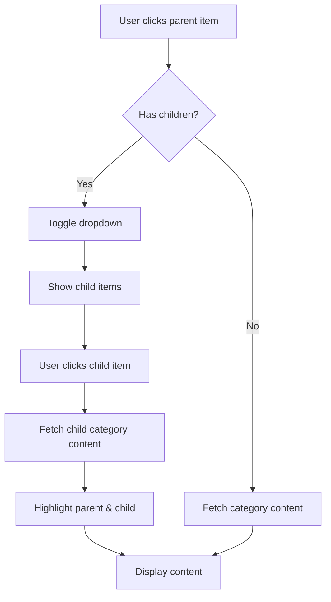
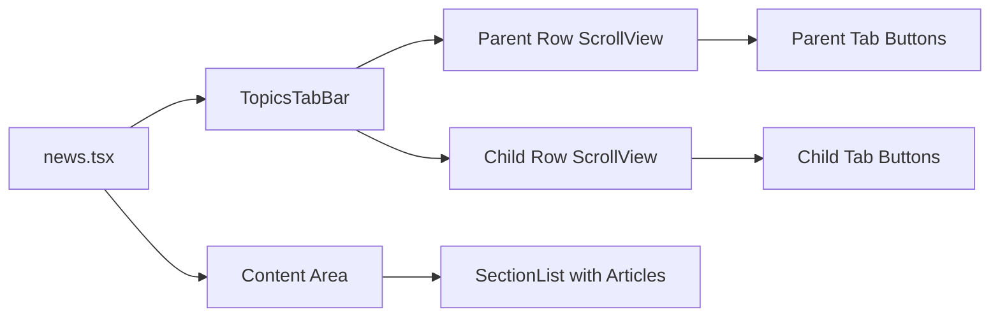

# Hierarchical Menu with Dropdowns Implementation Plan

## Overview

Implement a two-tier hierarchical menu system for the News tab where parent menu items (parent="0") can have child items that appear in a second row below the main menu bar. When a parent with children is clicked, it expands to show its children. When a child is clicked, it fetches that category's content.

## Current State Analysis

### Existing Components

- **TopicsTabBar** (`components/TopicsTabBar.tsx`): Single-row horizontal scrollable tab bar
- **news.tsx** (`app/(tabs)/news.tsx`): Main news screen with tab navigation
- **fetchMenuItems** (`services/api/wordpress/menu.ts`): Fetches flat menu structure

### Current Menu Structure

```typescript
interface MenuItem {
  ID: number;
  title: string;
  url: string;
  object_id: string;
  object: string;
  type: string;
  type_label: string;
  menu_order: number;
  parent: string; // "0" for top-level, or parent ID for children
  target: string;
  // Missing: image_url field from API
}
```

## API Response Structure

The endpoint returns:

```json
{
  "menu_id": 162196,
  "menu_items": [
    {
      "ID": 345506,
      "title": "Home",
      "parent": "0",
      "object_id": "24938",
      "image_url": ""
    },
    {
      "ID": 347763,
      "title": "All topics",
      "parent": "0",
      "object_id": "347763"
    },
    {
      "ID": 347769,
      "title": "Anatomy and physiology",
      "parent": "347763", // Child of "All topics"
      "object_id": "161511",
      "image_url": ""
    }
  ]
}
```

## Implementation Plan

### Phase 1: Type Updates and Data Structure

#### 1.1 Update MenuItem Type

**File**: `types/index.ts`

Add `image_url` field to MenuItem interface:

```typescript
export interface MenuItem {
  ID: number;
  title: string;
  url: string;
  object_id: string;
  object: string;
  type: string;
  type_label: string;
  menu_order: number;
  parent: string;
  target: string;
  image_url?: string; // NEW: Optional image URL from API
}
```

#### 1.2 Create Hierarchical Menu Types

**File**: `types/index.ts`

Add new types for hierarchical menu structure:

```typescript
export interface HierarchicalMenuItem extends MenuItem {
  children?: MenuItem[];
  hasChildren: boolean;
}

export interface MenuState {
  expandedParentId: string | null; // ID of currently expanded parent
  selectedChildId: string | null; // ID of currently selected child
  selectedParentId: string | null; // ID of parent of selected child
}
```

### Phase 2: Menu Data Processing

#### 2.1 Create Menu Utility Functions

**File**: `services/api/wordpress/menuUtils.ts` (NEW)

```typescript
/**
 * Organize flat menu items into hierarchical structure
 */
export function organizeMenuHierarchy(
  menuItems: MenuItem[]
): HierarchicalMenuItem[] {
  // Separate parents and children
  const parents = menuItems.filter((item) => item.parent === "0");
  const children = menuItems.filter((item) => item.parent !== "0");

  // Build hierarchy
  return parents.map((parent) => {
    const parentChildren = children.filter(
      (child) => child.parent === parent.ID.toString()
    );

    return {
      ...parent,
      children: parentChildren,
      hasChildren: parentChildren.length > 0,
    };
  });
}

/**
 * Get all children for a specific parent ID
 */
export function getChildrenForParent(
  menuItems: MenuItem[],
  parentId: string
): MenuItem[] {
  return menuItems.filter((item) => item.parent === parentId);
}

/**
 * Check if a menu item has children
 */
export function hasChildren(menuItems: MenuItem[], itemId: string): boolean {
  return menuItems.some((item) => item.parent === itemId);
}

/**
 * Find parent item for a given child
 */
export function findParentItem(
  menuItems: MenuItem[],
  childId: string
): MenuItem | null {
  const child = menuItems.find((item) => item.ID.toString() === childId);
  if (!child || child.parent === "0") return null;

  return menuItems.find((item) => item.ID.toString() === child.parent) || null;
}
```

#### 2.2 Update fetchMenuItems

**File**: `services/api/wordpress/menu.ts`

Update to return hierarchical structure:

```typescript
export async function fetchMenuItems(): Promise<HierarchicalMenuItem[]> {
  const apiConfig = getApiConfig() as any;
  const { hash, menuId, baseUrl } = apiConfig;

  if (!menuId) {
    throw new Error("Menu ID not configured for this brand");
  }

  const response = await fetch(
    `${baseUrl}${ENDPOINTS.MENU}/${menuId}/?hash=${hash}`
  );

  if (!response.ok) {
    throw new Error("Failed to fetch menu items");
  }

  const menuData = await response.json();
  const menuItems = menuData.menu_items || [];

  // Organize into hierarchy
  return organizeMenuHierarchy(menuItems);
}
```

### Phase 3: Enhanced TopicsTabBar Component

#### 3.1 Update TopicsTabBar Props

**File**: `components/TopicsTabBar.tsx`

```typescript
interface TopicsTabBarProps {
  tabs: HierarchicalMenuItem[];
  activeParentIndex: number;
  activeChildId: string | null;
  expandedParentId: string | null;
  onParentTabChange: (index: number, item: HierarchicalMenuItem) => void;
  onChildTabChange: (childItem: MenuItem, parentIndex: number) => void;
}
```

#### 3.2 Implement Two-Row Layout

**Structure**:

```
┌─────────────────────────────────────────────────┐
│ [Home] [News] [Topics*] [Newly Registered]     │ ← Parent Row
├─────────────────────────────────────────────────┤
│ [Cancer] [Diabetes] [Mental Health] [...]      │ ← Child Row (when expanded)
└─────────────────────────────────────────────────┘
```

**Key Features**:

- Parent row always visible
- Child row appears below when parent with children is clicked
- Both rows horizontally scrollable
- Visual highlighting:
  - Active parent: highlighted background
  - Active child: highlighted background
  - Parent of active child: also highlighted

**Implementation**:

```typescript
export default function TopicsTabBar({
  tabs,
  activeParentIndex,
  activeChildId,
  expandedParentId,
  onParentTabChange,
  onChildTabChange,
}: TopicsTabBarProps) {
  const scrollViewRef = useRef<ScrollView>(null);
  const childScrollViewRef = useRef<ScrollView>(null);

  // Get currently expanded parent's children
  const expandedParent = tabs.find(
    (tab) => tab.ID.toString() === expandedParentId
  );
  const childItems = expandedParent?.children || [];

  // Determine if parent should be highlighted
  const isParentHighlighted = (index: number, tab: HierarchicalMenuItem) => {
    // Highlight if it's the active parent
    if (index === activeParentIndex) return true;

    // Highlight if one of its children is selected
    if (activeChildId && tab.children) {
      return tab.children.some(
        (child) => child.ID.toString() === activeChildId
      );
    }

    return false;
  };

  const handleParentPress = (index: number, item: HierarchicalMenuItem) => {
    onParentTabChange(index, item);
  };

  const handleChildPress = (childItem: MenuItem, parentIndex: number) => {
    onChildTabChange(childItem, parentIndex);
  };

  return (
    <View style={styles.container}>
      {/* Parent Row */}
      <ScrollView
        ref={scrollViewRef}
        horizontal
        showsHorizontalScrollIndicator={false}
        contentContainerStyle={styles.scrollContent}
      >
        {tabs.map((tab, index) => {
          const isHighlighted = isParentHighlighted(index, tab);

          return (
            <TouchableOpacity
              key={tab.ID}
              style={[styles.tab, isHighlighted && styles.activeTab]}
              onPress={() => handleParentPress(index, tab)}
            >
              <ThemedText style={styles.tabText}>
                {tab.title.toUpperCase()}
              </ThemedText>
              {tab.hasChildren && <Icon name="chevron-down" size={12} />}
            </TouchableOpacity>
          );
        })}
      </ScrollView>

      {/* Child Row - Only visible when parent is expanded */}
      {childItems.length > 0 && (
        <ScrollView
          ref={childScrollViewRef}
          horizontal
          showsHorizontalScrollIndicator={false}
          contentContainerStyle={styles.childScrollContent}
        >
          {childItems.map((child) => {
            const isActive = child.ID.toString() === activeChildId;

            return (
              <TouchableOpacity
                key={child.ID}
                style={[styles.childTab, isActive && styles.activeChildTab]}
                onPress={() => handleChildPress(child, activeParentIndex)}
              >
                <ThemedText style={styles.childTabText}>
                  {child.title}
                </ThemedText>
              </TouchableOpacity>
            );
          })}
        </ScrollView>
      )}
    </View>
  );
}
```

### Phase 4: Update News Screen Logic

#### 4.1 Add Menu State Management

**File**: `app/(tabs)/news.tsx`

```typescript
export default function NewsScreen() {
  const [menuItems, setMenuItems] = useState<HierarchicalMenuItem[]>([]);
  const [menuState, setMenuState] = useState<MenuState>({
    expandedParentId: null,
    selectedChildId: null,
    selectedParentId: null,
  });
  const [activeParentIndex, setActiveParentIndex] = useState(0);

  // ... existing state ...
}
```

#### 4.2 Handle Parent Tab Changes

```typescript
const handleParentTabChange = (index: number, item: HierarchicalMenuItem) => {
  setActiveParentIndex(index);

  if (item.hasChildren) {
    // Toggle expansion
    const isCurrentlyExpanded =
      menuState.expandedParentId === item.ID.toString();

    setMenuState((prev) => ({
      ...prev,
      expandedParentId: isCurrentlyExpanded ? null : item.ID.toString(),
      // Don't clear selected child when toggling
    }));

    // Don't fetch category content for parents with children
  } else {
    // Parent without children - fetch its content
    setMenuState((prev) => ({
      ...prev,
      expandedParentId: null,
      selectedChildId: null,
      selectedParentId: null,
    }));

    loadTabContent(index, item.object_id);
  }
};
```

#### 4.3 Handle Child Tab Changes

```typescript
const handleChildTabChange = (childItem: MenuItem, parentIndex: number) => {
  // Update menu state
  setMenuState((prev) => ({
    ...prev,
    selectedChildId: childItem.ID.toString(),
    selectedParentId: childItem.parent,
  }));

  // Fetch category content for the child
  loadChildContent(childItem.object_id, parentIndex);
};

const loadChildContent = async (categoryId: string, parentIndex: number) => {
  const tabKey = categoryId;

  setTabLoadingStates((prev) => ({ ...prev, [tabKey]: true }));

  try {
    const categoryContent = await fetchCategoryContent(categoryId);
    setTabContent((prev) => ({ ...prev, [tabKey]: categoryContent }));
  } catch (err) {
    console.error(`Error loading child content:`, err);
  } finally {
    setTabLoadingStates((prev) => ({ ...prev, [tabKey]: false }));
  }
};
```

#### 4.4 Persist Menu State

```typescript
// Save menu state when it changes
useEffect(() => {
  if (menuState.selectedChildId) {
    // Could save to AsyncStorage for persistence across app restarts
    // For now, just keep in memory (persists across tab switches)
  }
}, [menuState]);

// Restore menu state when returning to tab
useFocusEffect(
  useCallback(() => {
    // Menu state is already in memory, no need to restore
    // It will persist as long as the component is mounted
  }, [])
);
```

### Phase 5: Styling and Visual Polish

#### 5.1 Add Theme Colors

**File**: `constants/Colors.ts`

Add colors for child menu items:

```typescript
export const Colors = {
  light: {
    // ... existing colors ...
    topicsChildBackground: "#f5f5f5",
    topicsChildActiveTab: "#ffffff",
    topicsChildActiveText: "#000000",
    topicsChildInactiveText: "#666666",
  },
  dark: {
    // ... existing colors ...
    topicsChildBackground: "#1a1a1a",
    topicsChildActiveTab: "#2a2a2a",
    topicsChildActiveText: "#ffffff",
    topicsChildInactiveText: "#999999",
  },
};
```

#### 5.2 Component Styles

```typescript
const styles = StyleSheet.create({
  container: {
    backgroundColor: topicsBackground,
  },
  scrollContent: {
    flexDirection: "row",
    gap: 16,
    paddingVertical: 12,
    paddingHorizontal: 16,
  },
  tab: {
    flexDirection: "row",
    alignItems: "center",
    gap: 4,
    paddingHorizontal: 12,
    paddingVertical: 10,
    borderRadius: 4,
  },
  activeTab: {
    backgroundColor: activeTabBg,
  },
  tabText: {
    fontSize: 12,
    fontWeight: "600",
  },
  childScrollContent: {
    flexDirection: "row",
    gap: 12,
    paddingVertical: 8,
    paddingHorizontal: 16,
    backgroundColor: topicsChildBackground,
  },
  childTab: {
    paddingHorizontal: 16,
    paddingVertical: 8,
    borderRadius: 4,
    backgroundColor: "transparent",
  },
  activeChildTab: {
    backgroundColor: topicsChildActiveTab,
  },
  childTabText: {
    fontSize: 11,
    fontWeight: "500",
  },
});
```

## Testing Checklist

- [ ] Parent items without children fetch category content correctly
- [ ] Parent items with children show dropdown on click (no fetch)
- [ ] Child items fetch their category content when clicked
- [ ] Both parent and child are highlighted when child is selected
- [ ] Child row appears when clicking parent with children
- [ ] Selected child persists when switching to other tabs and back
- [ ] Horizontal scrolling works for both rows
- [ ] Visual styling matches brand theme
- [ ] Works with provided API response structure
- [ ] Handles edge cases (no children, empty menu, etc.)

## Migration Notes

### Breaking Changes

- `TopicsTabBar` props interface changed
- `news.tsx` menu handling logic updated
- New utility functions required

### Backward Compatibility

- Existing menu items without children work as before
- No changes to category content fetching API
- No changes to article display logic

## Future Enhancements

1. **Animation**: Add smooth slide-in animation for child row appearance
2. **Icons**: Support menu item icons from `image_url` field
3. **Badges**: Show notification badges on menu items
4. **Search**: Add search within child items for long lists
5. **Favorites**: Allow users to favorite/pin menu items
6. **Analytics**: Track menu navigation patterns

## Implementation Order

1. ✅ Update types (MenuItem, HierarchicalMenuItem, MenuState)
2. ✅ Create menu utility functions
3. ✅ Update fetchMenuItems to return hierarchical structure
4. ✅ Enhance TopicsTabBar with two-row layout
5. ✅ Update news.tsx menu state management
6. ✅ Implement parent/child click handlers
7. ✅ Add state persistence
8. ✅ Apply styling and theme colors
9. ✅ Test with real API data
10. ✅ Polish and optimize

## Diagram: Menu Hierarchy Flow



## Diagram: Component Structure


