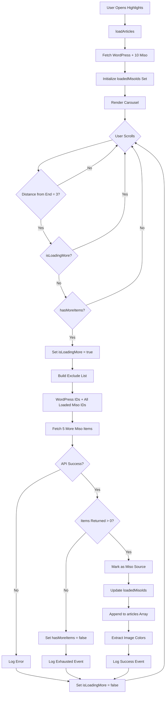

# Highlights Carousel Endless Scroll Implementation Plan

## Overview

Implement endless loading for Miso recommendations in the highlights carousel. When the user scrolls to within 3 items of the end, automatically fetch 5 more Miso recommendations while excluding all previously shown articles (WordPress + all loaded Miso items).

## Current Implementation Analysis

### Existing Architecture

- **Initial Load**: [`fetchHighlightsWithRecommendations()`](services/api.ts:1516) fetches WordPress articles + 10 Miso recommendations
- **Exclusion Logic**: WordPress article IDs are excluded from initial Miso fetch using [`fetchRecommendedArticlesWithExclude()`](services/api.ts:1331)
- **State Management**: [`app/(tabs)/index.tsx`](<app/(tabs)/index.tsx:1>) manages carousel state including `articles`, `currentIndex`, `wordpressArticleCount`
- **Scroll Detection**: [`handleScroll()`](<app/(tabs)/index.tsx:278>) and [`useEffect`](<app/(tabs)/index.tsx:452>) track current index and scroll behavior

### Key Integration Points

1. **Scroll Position Tracking**: Line 452-598 in [`index.tsx`](<app/(tabs)/index.tsx:452>) - monitors `currentIndex` changes
2. **Article State**: Line 38 in [`index.tsx`](<app/(tabs)/index.tsx:38>) - `articles` state array
3. **API Function**: Line 1331 in [`api.ts`](services/api.ts:1331) - `fetchRecommendedArticlesWithExclude()` already supports exclude parameter
4. **Brand Config**: Line 133-136 in [`brands/nt/config.json`](brands/nt/config.json:133) - `highlightsRecommendations` configuration

## Technical Design

### 1. State Management Updates

#### New State Variables in [`app/(tabs)/index.tsx`](<app/(tabs)/index.tsx:1>)

```typescript
// Add after existing state declarations (around line 48)
const [isLoadingMore, setIsLoadingMore] = useState(false);
const [hasMoreItems, setHasMoreItems] = useState(true);
const [loadedMisoIds, setLoadedMisoIds] = useState<Set<string>>(new Set());
const [totalMisoItemsLoaded, setTotalMisoItemsLoaded] = useState(0);
```

**Purpose:**

- `isLoadingMore`: Prevents duplicate API calls while fetching
- `hasMoreItems`: Stops fetching when Miso returns fewer items than requested
- `loadedMisoIds`: Tracks all Miso article IDs for exclusion list
- `totalMisoItemsLoaded`: Analytics and debugging

### 2. Trigger Detection Logic

#### Add Scroll Threshold Check

```typescript
// Add new useEffect after line 598 (after current index tracking)
useEffect(() => {
  if (articles.length === 0 || !hasMoreItems || isLoadingMore) return;

  // Check if Miso recommendations are enabled
  const brandConfig = brandManager.getCurrentBrand();
  if (!brandConfig.highlightsRecommendations?.enabled) return;

  // Calculate distance from end
  const distanceFromEnd = articles.length - currentIndex - 1;

  // Trigger load when 3 items from end
  if (distanceFromEnd === 3) {
    console.log("🔄 Endless scroll triggered:", {
      currentIndex,
      totalArticles: articles.length,
      distanceFromEnd,
      loadedMisoIds: loadedMisoIds.size,
    });

    loadMoreRecommendations();
  }
}, [currentIndex, articles.length, hasMoreItems, isLoadingMore]);
```

### 3. Load More Function

#### New Function: `loadMoreRecommendations()`

```typescript
// Add after loadArticles function (around line 228)
const loadMoreRecommendations = async () => {
  if (isLoadingMore || !hasMoreItems) {
    console.log("⏸️ Skipping load more:", { isLoadingMore, hasMoreItems });
    return;
  }

  try {
    setIsLoadingMore(true);

    const brandConfig = brandManager.getCurrentBrand();
    const brandPrefix = brandConfig.shortcode.toUpperCase();

    // Build comprehensive exclude list:
    // 1. All WordPress article IDs
    // 2. All previously loaded Miso article IDs
    const wordpressIds = articles
      .filter((a) => a.source === "wordpress")
      .map((a) => `${brandPrefix}-${a.id}`);

    const misoIds = Array.from(loadedMisoIds);
    const excludeIds = [...wordpressIds, ...misoIds];

    console.log("📥 Fetching more recommendations:", {
      excludeCount: excludeIds.length,
      wordpressCount: wordpressIds.length,
      misoCount: misoIds.length,
      requestingItems: 5,
    });

    // Fetch 5 more items
    const itemsPerLoad =
      brandConfig.highlightsRecommendations?.itemsPerLoad || 5;
    const newArticles = await fetchRecommendedArticlesWithExclude(
      itemsPerLoad,
      excludeIds,
      user?.userId,
      isAuthenticated
    );

    if (newArticles.length === 0) {
      console.log("✅ No more recommendations available");
      setHasMoreItems(false);

      analyticsService.logEvent("carousel_endless_scroll_exhausted", {
        total_items_loaded: articles.length,
        total_miso_items: totalMisoItemsLoaded,
        wordpress_count: wordpressArticleCount,
      });
      return;
    }

    // Mark as Miso source and recommended
    const markedNewArticles = newArticles.map((article) => ({
      ...article,
      source: "miso" as const,
      isRecommended: true,
    }));

    // Track new Miso IDs
    const newMisoIds = new Set(loadedMisoIds);
    markedNewArticles.forEach((article) => {
      newMisoIds.add(`${brandPrefix}-${article.id}`);
    });
    setLoadedMisoIds(newMisoIds);

    // Append to articles array
    setArticles((prev) => [...prev, ...markedNewArticles]);
    setTotalMisoItemsLoaded((prev) => prev + newArticles.length);

    // Check if we got fewer items than requested (might be end of content)
    if (newArticles.length < itemsPerLoad) {
      console.log("⚠️ Received fewer items than requested, might be near end");
      setHasMoreItems(false);
    }

    // Extract colors for landscape images
    const colors: { [key: string]: string[] } = {};
    for (const article of markedNewArticles) {
      if (article.isLandscape) {
        colors[article.id] = await extractImageColors(
          article.imageUrl,
          article.id
        );
      }
    }
    setImageColors((prev) => ({ ...prev, ...colors }));

    // Analytics
    analyticsService.logEvent("carousel_endless_scroll_loaded", {
      items_loaded: newArticles.length,
      total_articles_now: articles.length + newArticles.length,
      total_miso_items: totalMisoItemsLoaded + newArticles.length,
      trigger_index: currentIndex,
      exclude_list_size: excludeIds.length,
    });

    console.log("✅ Loaded more recommendations:", {
      newItems: newArticles.length,
      totalArticles: articles.length + newArticles.length,
      totalMisoLoaded: totalMisoItemsLoaded + newArticles.length,
    });
  } catch (error) {
    console.error("❌ Error loading more recommendations:", error);

    analyticsService.logEvent("carousel_endless_scroll_error", {
      error_message: error instanceof Error ? error.message : "Unknown error",
      trigger_index: currentIndex,
      total_articles: articles.length,
    });

    // Don't set hasMoreItems to false on error - allow retry
  } finally {
    setIsLoadingMore(false);
  }
};
```

### 4. Initial Load Updates

#### Update `loadArticles()` Function

```typescript
// Modify loadArticles function (around line 140-228)
const loadArticles = async () => {
  try {
    setLoading(true);
    setError(null);

    // Reset endless scroll state
    setIsLoadingMore(false);
    setHasMoreItems(true);
    setLoadedMisoIds(new Set());
    setTotalMisoItemsLoaded(0);

    // Fetch combined articles (WordPress + Miso recommendations)
    const fetchedArticles = await fetchHighlightsWithRecommendations(
      user?.userId,
      isAuthenticated
    );

    // ... existing code for wpCount calculation ...

    // Track initial Miso IDs for exclusion
    const brandConfig = brandManager.getCurrentBrand();
    const brandPrefix = brandConfig.shortcode.toUpperCase();
    const initialMisoIds = new Set<string>();

    fetchedArticles.forEach((article) => {
      if (article.source === "miso") {
        initialMisoIds.add(`${brandPrefix}-${article.id}`);
      }
    });

    setLoadedMisoIds(initialMisoIds);
    setTotalMisoItemsLoaded(initialMisoIds.size);

    console.log("📊 Initial load complete:", {
      totalArticles: fetchedArticles.length,
      wordpressCount: wpCount,
      initialMisoCount: initialMisoIds.size,
    });

    setArticles(fetchedArticles);

    // ... rest of existing code ...
  } catch (err) {
    // ... existing error handling ...
  } finally {
    setLoading(false);
  }
};
```

### 5. Loading Indicator Component

#### Add Loading Indicator at End of List

```typescript
// Add after renderCarouselItem function (around line 800)
const renderFooterComponent = () => {
  if (!isLoadingMore) return null;

  return (
    <View style={styles.loadingFooter}>
      <ActivityIndicator
        size="large"
        color={brandConfig?.theme.colors.light.primary}
      />
      <ThemedText style={styles.loadingText}>
        Loading more recommendations...
      </ThemedText>
    </View>
  );
};

// Update FlatList component to include footer
<FlatList
  // ... existing props ...
  ListFooterComponent={renderFooterComponent}
/>;
```

#### Add Styles

```typescript
// Add to styles object (around line 900)
loadingFooter: {
  height: screenHeight,
  justifyContent: 'center',
  alignItems: 'center',
  backgroundColor: contentBackground,
},
loadingText: {
  marginTop: 16,
  fontSize: 16,
  fontFamily: brandConfig?.theme.fonts.primaryMedium,
},
```

### 6. Brand Configuration Updates

#### Add to [`brands/nt/config.json`](brands/nt/config.json:133)

```json
{
  "highlightsRecommendations": {
    "enabled": true,
    "misoItemCount": 10,
    "endlessScroll": {
      "enabled": true,
      "itemsPerLoad": 5,
      "triggerThreshold": 3
    }
  }
}
```

#### Update Brand Config Interface in [`brands/index.ts`](brands/index.ts:1)

```typescript
export interface BrandConfig {
  // ... existing fields
  highlightsRecommendations?: {
    enabled: boolean;
    misoItemCount: number;
    endlessScroll?: {
      enabled: boolean;
      itemsPerLoad: number;
      triggerThreshold: number;
    };
  };
}
```

### 7. Analytics Events

#### New Events to Track

1. **carousel_endless_scroll_triggered**

   - When: User reaches trigger threshold
   - Data: `currentIndex`, `totalArticles`, `distanceFromEnd`

2. **carousel_endless_scroll_loaded**

   - When: Successfully loaded more items
   - Data: `items_loaded`, `total_articles_now`, `total_miso_items`, `trigger_index`, `exclude_list_size`

3. **carousel_endless_scroll_error**

   - When: API call fails
   - Data: `error_message`, `trigger_index`, `total_articles`

4. **carousel_endless_scroll_exhausted**
   - When: No more items available
   - Data: `total_items_loaded`, `total_miso_items`, `wordpress_count`

### 8. Edge Cases & Error Handling

#### Scenarios to Handle

1. **Rapid Scrolling**

   - Solution: `isLoadingMore` flag prevents duplicate calls
   - User can scroll past trigger point while loading

2. **API Failure**

   - Solution: Don't set `hasMoreItems = false` on error
   - Allow retry on next trigger
   - Log error event for monitoring

3. **No More Items**

   - Solution: Set `hasMoreItems = false` when API returns 0 items
   - Prevent further API calls
   - Log exhausted event

4. **Duplicate Items**

   - Solution: Comprehensive exclude list (WordPress + all loaded Miso IDs)
   - Track IDs in `loadedMisoIds` Set for O(1) lookups

5. **Network Offline**

   - Solution: Existing error handling catches network errors
   - User sees current items, no crash

6. **User Scrolls Backward**

   - Solution: No impact - trigger only fires when moving forward
   - `currentIndex` tracking handles backward scrolling

7. **App Backgrounded During Load**

   - Solution: React Native handles this automatically
   - Load completes when app returns to foreground

8. **FlatList Performance**
   - Solution: FlatList already optimized for large lists
   - Only renders visible items + buffer
   - No performance impact from growing list

## Implementation Flow



## Files to Modify

### 1. [`app/(tabs)/index.tsx`](<app/(tabs)/index.tsx:1>)

- Add new state variables (lines ~48)
- Add `loadMoreRecommendations()` function (after line 228)
- Update `loadArticles()` to initialize endless scroll state (line 140)
- Add scroll trigger `useEffect` (after line 598)
- Add `renderFooterComponent()` (after line 800)
- Update FlatList with `ListFooterComponent`
- Add loading footer styles

### 2. [`brands/nt/config.json`](brands/nt/config.json:133)

- Add `endlessScroll` configuration to `highlightsRecommendations`

### 3. [`brands/cn/config.json`](brands/cn/config.json:1)

- Add same `endlessScroll` configuration

### 4. [`brands/jnl/config.json`](brands/jnl/config.json:1)

- Add same `endlessScroll` configuration

### 5. [`brands/index.ts`](brands/index.ts:1)

- Update `BrandConfig` interface with `endlessScroll` type

### 6. [`services/analytics.ts`](services/analytics.ts:1)

- No changes needed - uses existing `logEvent()` function

### 7. [`services/api.ts`](services/api.ts:1331)

- No changes needed - `fetchRecommendedArticlesWithExclude()` already supports exclude parameter

## Testing Checklist

### Functional Testing

- [ ] Initial load shows WordPress + 10 Miso items
- [ ] Scrolling to 3 items from end triggers load
- [ ] 5 new Miso items are appended to carousel
- [ ] No duplicate articles appear
- [ ] Loading indicator shows during fetch
- [ ] Subsequent triggers load more items
- [ ] Stops loading when no more items available
- [ ] Works for authenticated users
- [ ] Works for anonymous users

### Edge Case Testing

- [ ] Rapid scrolling doesn't cause duplicate loads
- [ ] API failure doesn't crash app
- [ ] Network offline handled gracefully
- [ ] Backward scrolling doesn't trigger load
- [ ] App backgrounding during load completes correctly
- [ ] FlatList performance remains smooth with 50+ items
- [ ] Progress bars still work correctly
- [ ] Auto-advance still works for WordPress items
- [ ] Manual navigation works for Miso items

### Analytics Testing

- [ ] `carousel_endless_scroll_loaded` fires on success
- [ ] `carousel_endless_scroll_error` fires on failure
- [ ] `carousel_endless_scroll_exhausted` fires when done
- [ ] Exclude list size tracked correctly
- [ ] Total Miso items count accurate

### Multi-Brand Testing

- [ ] Works for NT brand
- [ ] Works for CN brand
- [ ] Works for JNL brand
- [ ] Configuration can disable feature per brand

## Performance Considerations

### Memory Management

- **FlatList Optimization**: Already uses `windowSize` and `removeClippedSubviews`
- **Image Caching**: FadeInImage component handles caching
- **State Updates**: Minimal re-renders with proper dependency arrays

### Network Efficiency

- **Batch Loading**: Load 5 items at once, not one-by-one
- **Caching**: API responses cached by `cacheService`
- **Exclude List**: Prevents fetching already-seen items

### User Experience

- **Smooth Scrolling**: No janky behavior during load
- **Loading Indicator**: Clear feedback during fetch
- **Error Recovery**: Graceful degradation on failure

## Configuration Options

### Per-Brand Customization

```json
{
  "highlightsRecommendations": {
    "enabled": true,
    "misoItemCount": 10,
    "endlessScroll": {
      "enabled": true, // Toggle feature on/off
      "itemsPerLoad": 5, // How many items to fetch each time
      "triggerThreshold": 3 // Distance from end to trigger load
    }
  }
}
```

### Recommended Values

- `itemsPerLoad`: 5 (balance between UX and API calls)
- `triggerThreshold`: 3 (gives time for API call before user reaches end)

## Estimated Effort

- State management setup: **1 hour**
- Load more function implementation: **2 hours**
- Trigger detection logic: **1 hour**
- Loading indicator UI: **1 hour**
- Brand configuration updates: **30 minutes**
- Analytics integration: **1 hour**
- Testing and debugging: **2 hours**
- **Total: ~8.5 hours**

## Future Enhancements

1. **Smart Preloading**: Load next batch when user reaches 5 items from end
2. **Batch Size Optimization**: Adjust `itemsPerLoad` based on user behavior
3. **Infinite Scroll Limit**: Cap total items at 100 to prevent memory issues
4. **Pull-to-Refresh**: Allow manual refresh of recommendations
5. **Personalization Feedback**: Track which loaded items user engages with
6. **A/B Testing**: Test different trigger thresholds and batch sizes

## Success Metrics

### Key Performance Indicators

- **Engagement Rate**: % of users who scroll past initial 10 Miso items
- **Load Success Rate**: % of successful endless scroll API calls
- **Average Items Viewed**: Mean number of items viewed per session
- **Scroll Depth**: % of users reaching 20, 30, 40+ items
- **Error Rate**: % of failed endless scroll attempts

### Target Goals

- 30%+ of users engage with endless scroll
- 95%+ load success rate
- <500ms average load time
- <1% error rate
