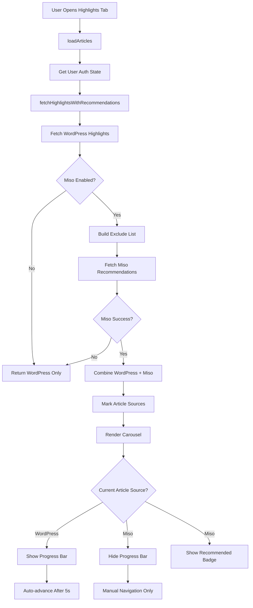

# Highlights Carousel with Miso Recommendations - Architecture Plan

## Overview

Add user-recommended content from Miso API to the highlights carousel after WordPress articles, with distinct behavior for each source type.

## Requirements

### Functional Requirements

1. **Content Sources**

   - WordPress highlights (existing): Auto-advancing with progress bars
   - Miso recommendations (new): Manual navigation only, no progress bars
   - Total: WordPress items + 10 Miso recommendations (configurable)

2. **User Experience**

   - WordPress articles: Auto-advance every 5 seconds with progress indicators
   - Miso articles: Manual swipe only, no auto-advance, no progress bar
   - Visual badge: "Recommended for you" on Miso articles
   - Seamless transition between WordPress and Miso sections

3. **Authentication Handling**

   - Anonymous users: Use anonymous_id for Miso recommendations
   - Authenticated users: Use "sub:{userId}" format for personalized recommendations

4. **Error Handling**
   - If Miso API fails: Show only WordPress highlights
   - If Miso returns < 10 items: Show whatever is returned
   - Graceful degradation to WordPress-only mode

### Configuration

Add to `brands/{brand}/config.json`:

```json
{
  "highlightsRecommendations": {
    "enabled": true,
    "misoItemCount": 10
  }
}
```

## Technical Design

### 1. Data Structure Changes

#### Update Article Interface (`types/index.ts`)

```typescript
export interface Article {
  id: string;
  title: string;
  subtitle?: string;
  leadText: string;
  content: string | StructuredContentNode[];
  imageUrl: string;
  timestamp: string;
  category: string;
  isLandscape?: boolean;
  // NEW FIELDS
  source?: "wordpress" | "miso"; // Article source
  isRecommended?: boolean; // Flag for recommended articles
}
```

#### Update Brand Config Interface (`brands/index.ts`)

```typescript
export interface BrandConfig {
  // ... existing fields
  highlightsRecommendations?: {
    enabled: boolean;
    misoItemCount: number;
  };
}
```

### 2. API Changes

#### New Function: `fetchHighlightsWithRecommendations` (`services/api.ts`)

```typescript
export async function fetchHighlightsWithRecommendations(
  userId?: string,
  isAuthenticated: boolean = false
): Promise<Article[]> {
  // 1. Fetch WordPress highlights (existing function)
  const wordpressArticles = await fetchFeaturedArticles();

  // Mark as WordPress source
  const markedWordpressArticles = wordpressArticles.map((article) => ({
    ...article,
    source: "wordpress" as const,
    isRecommended: false,
  }));

  // 2. Check if Miso recommendations are enabled
  const brandConfig = brandManager.getCurrentBrand();
  if (!brandConfig.highlightsRecommendations?.enabled) {
    return markedWordpressArticles;
  }

  try {
    // 3. Build exclude list from WordPress article IDs
    const excludeIds = wordpressArticles.map((article) => {
      const brandPrefix = brandConfig.shortcode.toUpperCase();
      return `${brandPrefix}-${article.id}`;
    });

    // 4. Fetch Miso recommendations with exclude parameter
    const misoCount = brandConfig.highlightsRecommendations.misoItemCount || 10;
    const misoArticles = await fetchRecommendedArticlesWithExclude(
      misoCount,
      excludeIds,
      userId,
      isAuthenticated
    );

    // Mark as Miso source
    const markedMisoArticles = misoArticles.map((article) => ({
      ...article,
      source: "miso" as const,
      isRecommended: true,
    }));

    // 5. Combine: WordPress first, then Miso
    return [...markedWordpressArticles, ...markedMisoArticles];
  } catch (error) {
    console.error(
      "Error fetching Miso recommendations, falling back to WordPress only:",
      error
    );
    return markedWordpressArticles;
  }
}
```

#### Update: `fetchRecommendedArticles` to support exclude parameter

```typescript
export async function fetchRecommendedArticlesWithExclude(
  limit: number = 5,
  excludeIds: string[] = [],
  userId?: string,
  isAuthenticated: boolean = false
): Promise<Article[]> {
  // ... existing setup code

  const requestBody: any = {
    fl: ["*"],
    rows: limit,
    boost_fq: `published_at:[${oneYearAgoISO} TO *]`,
    fq: `brand:"${brandFilter}"`,
    // NEW: Add exclude parameter
    exclude: excludeIds,
  };

  // ... rest of existing implementation
}
```

### 3. Component Changes

#### Update Carousel Component (`app/(tabs)/index.tsx`)

**State Changes:**

```typescript
// Add new state to track WordPress article count
const [wordpressArticleCount, setWordpressArticleCount] = useState(0);

// Modify loadArticles function
const loadArticles = async () => {
  try {
    setLoading(true);
    setError(null);

    // Get user authentication state
    const { userId, isAuthenticated } = await getUserAuthState();

    // Fetch combined articles
    const fetchedArticles = await fetchHighlightsWithRecommendations(
      userId,
      isAuthenticated
    );

    // Track WordPress count for progress bar logic
    const wpCount = fetchedArticles.filter(
      (a) => a.source === "wordpress"
    ).length;
    setWordpressArticleCount(wpCount);

    setArticles(fetchedArticles);
    // ... rest of existing code
  } catch (err) {
    // ... error handling
  }
};
```

**Auto-advance Logic:**

```typescript
const handleProgressComplete = () => {
  // Only auto-advance if current article is from WordPress
  const currentArticle = articles[currentIndex];
  if (
    !isUserInteracting &&
    isCarouselVisible &&
    currentArticle?.source === "wordpress"
  ) {
    analyticsService.logEvent("carousel_auto_advance", {
      from_position: currentIndex,
      to_position: (currentIndex + 1) % articles.length,
      article_source: currentArticle.source,
    });
    goToNextSlide();
  }
};
```

**Render Item Changes:**

```typescript
const renderCarouselItem = ({ item }: { item: Article }) => {
  // Add badge for recommended articles
  const renderRecommendedBadge = () => {
    if (!item.isRecommended) return null;

    return (
      <View style={styles.recommendedBadge}>
        <ThemedText style={styles.recommendedBadgeText}>
          ✨ Recommended for you
        </ThemedText>
      </View>
    );
  };

  // ... existing render logic with badge added
  return (
    <TouchableOpacity ...>
      {/* Existing image and content */}
      {renderRecommendedBadge()}
      {/* Rest of content */}
    </TouchableOpacity>
  );
};
```

#### Update Progress Indicator (`components/CarouselProgressIndicator.tsx`)

**Props Changes:**

```typescript
interface CarouselProgressIndicatorProps {
  totalItems: number;
  currentIndex: number;
  duration?: number;
  isPlaying?: boolean;
  onProgressComplete?: () => void;
  style?: any;
  // NEW: Only show progress for WordPress items
  wordpressItemCount: number;
}
```

**Render Logic:**

```typescript
export const CarouselProgressIndicator: React.FC<
  CarouselProgressIndicatorProps
> = ({
  totalItems,
  currentIndex,
  duration = 5000,
  isPlaying = true,
  onProgressComplete,
  style,
  wordpressItemCount,
}) => {
  // Only render progress bars for WordPress articles
  const displayItemCount = wordpressItemCount;
  const indicatorWidth = (screenWidth - 48) / displayItemCount;

  // Only show progress if we're viewing a WordPress article
  const shouldShowProgress = currentIndex < wordpressItemCount;

  if (!shouldShowProgress) {
    return null; // Don't show progress indicator for Miso articles
  }

  return (
    <View style={[styles.container, style]}>
      <LinearGradient colors={gradientColors} style={styles.gradientBackground}>
        <View style={styles.progressContainer}>
          {Array.from({ length: displayItemCount }, (_, index) => (
            <ProgressBar
              key={index}
              index={index}
              currentIndex={currentIndex}
              width={indicatorWidth}
              duration={duration}
              isPlaying={isPlaying && currentIndex < wordpressItemCount}
              progressFillColor={progressFillColor}
              progressBackgroundColor={progressBackgroundColor}
              onProgressComplete={
                index === currentIndex ? onProgressComplete : undefined
              }
            />
          ))}
        </View>
      </LinearGradient>
    </View>
  );
};
```

### 4. Styling

#### New Styles for Recommended Badge

```typescript
const styles = StyleSheet.create({
  // ... existing styles

  recommendedBadge: {
    position: "absolute",
    top: 80, // Below progress indicator
    left: 24,
    backgroundColor: "rgba(16, 209, 240, 0.9)",
    paddingHorizontal: 12,
    paddingVertical: 6,
    borderRadius: 16,
    zIndex: 20,
  },
  recommendedBadgeText: {
    color: "#011620",
    fontSize: 12,
    fontWeight: "600",
  },
});
```

### 5. Analytics Updates

Track article source in all carousel events:

```typescript
analyticsService.logEvent("carousel_article_view", {
  // ... existing fields
  article_source: currentArticle.source,
  is_recommended: currentArticle.isRecommended,
  wordpress_count: wordpressArticleCount,
  miso_count: articles.length - wordpressArticleCount,
});
```

## Implementation Flow Diagram



## Configuration Example

### `brands/nt/config.json`

```json
{
  "shortcode": "nt",
  "name": "Nursing Times",
  "apiConfig": {
    "maxNbOfItems": 10
  },
  "highlightsRecommendations": {
    "enabled": true,
    "misoItemCount": 10
  },
  "misoConfig": {
    "apiKey": "...",
    "brandFilter": "Nursing Times",
    "baseUrl": "https://api.askmiso.com/v1"
  }
}
```

## Testing Checklist

- [ ] WordPress articles auto-advance with progress bars
- [ ] Miso articles require manual swipe (no auto-advance)
- [ ] Progress bars only show for WordPress articles
- [ ] "Recommended for you" badge appears on Miso articles
- [ ] Exclude parameter prevents duplicate articles
- [ ] Anonymous user gets anonymous recommendations
- [ ] Authenticated user gets personalized recommendations
- [ ] Graceful fallback when Miso API fails
- [ ] Analytics track article source correctly
- [ ] Configuration can enable/disable feature per brand
- [ ] Smooth transition between WordPress and Miso sections

## Edge Cases

1. **No WordPress articles**: Show error state (existing behavior)
2. **Miso API timeout**: Fall back to WordPress-only mode
3. **Miso returns 0 items**: Show only WordPress articles
4. **User scrolls backward**: Progress bars reset correctly
5. **App backgrounded during Miso article**: No auto-advance on resume
6. **Network offline**: Use cached WordPress articles only

## Performance Considerations

1. **Caching**: Cache Miso recommendations separately from WordPress
2. **Lazy loading**: Load Miso recommendations after WordPress renders
3. **Error boundaries**: Isolate Miso failures from WordPress display
4. **Analytics batching**: Batch analytics events for performance

## Future Enhancements

1. **A/B Testing**: Test different Miso item counts
2. **Smart ordering**: Interleave Miso items with WordPress
3. **Refresh strategy**: Pull-to-refresh for new recommendations
4. **Personalization**: Track which recommendations users engage with
5. **Fallback content**: Use trending articles if Miso fails

## Files to Modify

1. `types/index.ts` - Update Article interface
2. `brands/index.ts` - Update BrandConfig interface
3. `brands/nt/config.json` - Add configuration
4. `services/api.ts` - Add new functions
5. `app/(tabs)/index.tsx` - Update carousel logic
6. `components/CarouselProgressIndicator.tsx` - Conditional rendering
7. `services/analytics.ts` - Track article source (if needed)

## Estimated Effort

- Configuration setup: 30 minutes
- API changes: 2 hours
- Component updates: 3 hours
- Styling and badge: 1 hour
- Testing: 2 hours
- **Total: ~8 hours**
