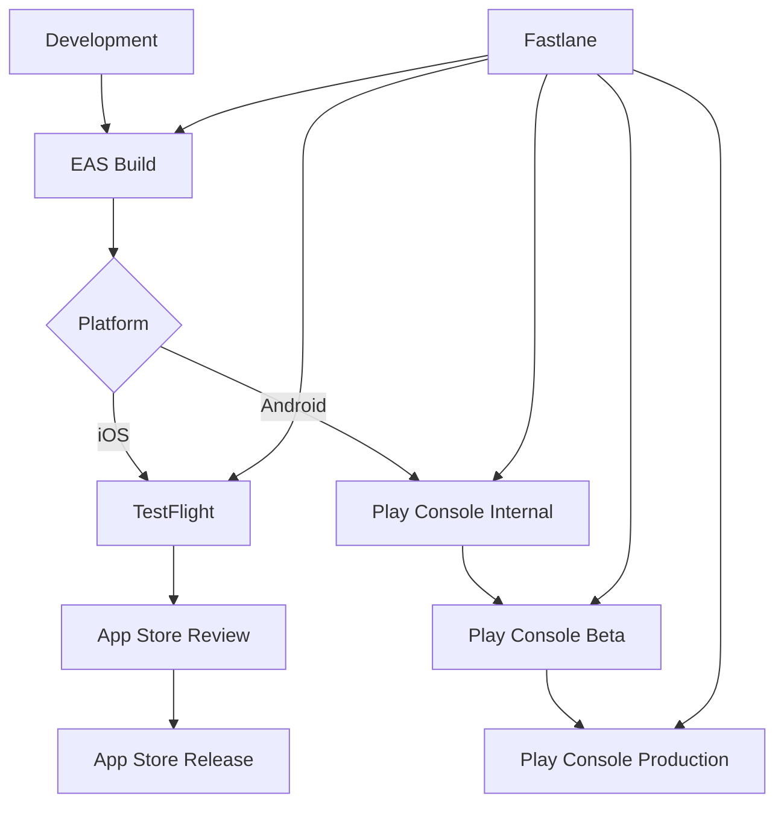

# Master Deployment Workflow Documentation

This comprehensive guide provides the complete end-to-end deployment workflow for both Construction News and Nursing Times apps, including quick reference commands and daily operational procedures.

## 📋 Table of Contents

- [Overview](#overview)
- [Quick Reference Commands](#quick-reference-commands)
- [Complete Deployment Workflow](#complete-deployment-workflow)
- [Daily Operations](#daily-operations)
- [Release Management](#release-management)
- [Emergency Procedures](#emergency-procedures)
- [Monitoring and Maintenance](#monitoring-and-maintenance)

## 🎯 Overview

### Deployment Architecture



### Multi-Brand Support

- **Construction News** (`cn`): `metropolis.co.uk.constructionnews`
- **Nursing Times** (`nt`): `metropolis.net.nursingtimes`

Each brand follows the same deployment workflow with brand-specific configurations.

## ⚡ Quick Reference Commands

### Environment Setup

```bash
# Set brand for all subsequent commands
export EXPO_PUBLIC_BRAND=cn  # or nt

# Verify environment
fastlane validate_env
eas credentials:list
```

### Build Commands

```bash
# Development builds
eas build --platform all --profile development

# Production builds
eas build --platform ios --profile production-cn --wait
eas build --platform android --profile production-nt --wait

# Check build status
eas build:list --limit 5
eas build:view BUILD_ID
```

### Deployment Commands

```bash
# iOS Deployments
./scripts/deploy-cn-ios.sh testflight
./scripts/deploy-nt-ios.sh testflight
fastlane ios upload_cn_appstore
fastlane ios upload_nt_appstore

# Android Deployments
./scripts/deploy-cn-android.sh internal
./scripts/deploy-nt-android.sh beta
fastlane android upload_cn_production
fastlane android upload_nt_production
```

### Credential Management

```bash
# Configure credentials
eas credentials:configure --platform ios
eas credentials:configure --platform android

# List credentials
eas credentials:list --platform all

# Delete credentials (DANGEROUS)
eas credentials:delete --platform ios --type DistributionCertificate
```

### Troubleshooting

```bash
# Clear and reconfigure
eas credentials:delete --platform android
eas credentials:configure --platform android

# Verbose build
eas build --platform ios --profile production-cn --verbose

# Check logs
eas build:view BUILD_ID --logs
```

## 🔄 Complete Deployment Workflow

### Phase 1: Pre-Deployment Preparation

#### Step 1: Environment Verification

```bash
#!/bin/bash
# pre-deployment-check.sh

echo "=== Pre-Deployment Verification ==="

# Check tools
echo "Verifying tools..."
node --version || exit 1
npm --version || exit 1
eas --version || exit 1
fastlane --version || exit 1

# Check project
echo "Verifying project..."
[ -f "package.json" ] || { echo "❌ package.json not found"; exit 1; }
[ -f "eas.json" ] || { echo "❌ eas.json not found"; exit 1; }
[ -f "app.json" ] || { echo "❌ app.json not found"; exit 1; }

# Check brands
echo "Verifying brands..."
[ -d "brands/cn" ] || { echo "❌ Construction News brand not found"; exit 1; }
[ -d "brands/nt" ] || { echo "❌ Nursing Times brand not found"; exit 1; }

# Check credentials
echo "Verifying credentials..."
fastlane validate_env

echo "✅ Pre-deployment verification complete"
```

#### Step 2: Code Quality Checks

```bash
#!/bin/bash
# code-quality-check.sh

echo "=== Code Quality Verification ==="

# Lint check
echo "Running linter..."
npm run lint || { echo "❌ Linting failed"; exit 1; }

# Type check
echo "Running type check..."
npx tsc --noEmit || { echo "❌ Type check failed"; exit 1; }

# Security audit
echo "Running security audit..."
npm audit --audit-level=high || echo "⚠️  Security vulnerabilities found"

# Dependency check
echo "Checking dependencies..."
npx expo doctor

echo "✅ Code quality verification complete"
```

#### Step 3: Version Management

```bash
#!/bin/bash
# version-management.sh

BRAND=${1:-"cn"}
VERSION_TYPE=${2:-"patch"}  # patch, minor, major

echo "=== Version Management ==="
echo "Brand: $BRAND"
echo "Version type: $VERSION_TYPE"

# Update version in package.json
npm version $VERSION_TYPE --no-git-tag-version

# Update version in app.json (if needed)
NEW_VERSION=$(node -p "require('./package.json').version")
echo "New version: $NEW_VERSION"

# Update brand-specific configurations if needed
# This depends on your specific setup

echo "✅ Version updated to $NEW_VERSION"
```

### Phase 2: Build Process

#### Step 1: Development Build Testing

```bash
#!/bin/bash
# development-build.sh

BRAND=${1:-"cn"}
PLATFORM=${2:-"all"}

echo "=== Development Build ==="
echo "Brand: $BRAND"
echo "Platform: $PLATFORM"

export EXPO_PUBLIC_BRAND=$BRAND

# Start development build
echo "Starting development build..."
eas build --platform $PLATFORM --profile development --non-interactive

echo "✅ Development build initiated"
echo "Monitor progress: https://expo.dev/accounts/[account]/projects/[project]/builds"
```

#### Step 2: Production Build

```bash
#!/bin/bash
# production-build.sh

BRAND=${1:-"cn"}
PLATFORM=${2:-"all"}
WAIT=${3:-"false"}

echo "=== Production Build ==="
echo "Brand: $BRAND"
echo "Platform: $PLATFORM"

export EXPO_PUBLIC_BRAND=$BRAND
PROFILE="production-$BRAND"

# Build options
BUILD_OPTS="--platform $PLATFORM --profile $PROFILE --non-interactive"
if [ "$WAIT" = "true" ]; then
    BUILD_OPTS="$BUILD_OPTS --wait"
fi

# Start production build
echo "Starting production build with profile: $PROFILE"
BUILD_ID=$(eas build $BUILD_OPTS --json | jq -r '.id')

if [ "$BUILD_ID" != "null" ] && [ "$BUILD_ID" != "" ]; then
    echo "✅ Production build started: $BUILD_ID"
    echo "Monitor: https://expo.dev/accounts/[account]/projects/[project]/builds/$BUILD_ID"

    if [ "$WAIT" = "true" ]; then
        echo "Waiting for build completion..."
        eas build:view $BUILD_ID --wait
    fi
else
    echo "❌ Failed to start production build"
    exit 1
fi
```

### Phase 3: Deployment Process

#### Step 1: Internal/TestFlight Deployment

```bash
#!/bin/bash
# internal-deployment.sh

BRAND=${1:-"cn"}
PLATFORM=${2:-"ios"}

echo "=== Internal Deployment ==="
echo "Brand: $BRAND"
echo "Platform: $PLATFORM"

export EXPO_PUBLIC_BRAND=$BRAND

case $PLATFORM in
    "ios")
        echo "Deploying to TestFlight..."
        ./scripts/deploy-${BRAND}-ios.sh testflight
        ;;
    "android")
        echo "Deploying to Play Console Internal..."
        ./scripts/deploy-${BRAND}-android.sh internal
        ;;
    "all")
        echo "Deploying to both platforms..."
        ./scripts/deploy-${BRAND}-ios.sh testflight
        ./scripts/deploy-${BRAND}-android.sh internal
        ;;
    *)
        echo "❌ Invalid platform: $PLATFORM"
        exit 1
        ;;
esac

echo "✅ Internal deployment complete"
```

#### Step 2: Beta Deployment

```bash
#!/bin/bash
# beta-deployment.sh

BRAND=${1:-"cn"}
PLATFORM=${2:-"android"}

echo "=== Beta Deployment ==="
echo "Brand: $BRAND"
echo "Platform: $PLATFORM"

export EXPO_PUBLIC_BRAND=$BRAND

case $PLATFORM in
    "ios")
        echo "iOS beta deployment uses TestFlight external testing"
        echo "Configure external testing in App Store Connect"
        ;;
    "android")
        echo "Deploying to Play Console Beta..."
        ./scripts/deploy-${BRAND}-android.sh beta
        ;;
    "all")
        echo "Deploying to beta on both platforms..."
        echo "iOS: Configure external testing in App Store Connect"
        ./scripts/deploy-${BRAND}-android.sh beta
        ;;
    *)
        echo "❌ Invalid platform: $PLATFORM"
        exit 1
        ;;
esac

echo "✅ Beta deployment complete"
```

#### Step 3: Production Deployment

```bash
#!/bin/bash
# production-deployment.sh

BRAND=${1:-"cn"}
PLATFORM=${2:-"all"}

echo "=== Production Deployment ==="
echo "Brand: $BRAND"
echo "Platform: $PLATFORM"

export EXPO_PUBLIC_BRAND=$BRAND

# Confirmation prompt
read -p "Are you sure you want to deploy to production? (y/N): " confirm
if [ "$confirm" != "y" ] && [ "$confirm" != "Y" ]; then
    echo "Production deployment cancelled"
    exit 0
fi

case $PLATFORM in
    "ios")
        echo "Deploying to App Store..."
        ./scripts/deploy-${BRAND}-ios.sh appstore
        ;;
    "android")
        echo "Deploying to Play Store Production..."
        ./scripts/deploy-${BRAND}-android.sh production
        ;;
    "all")
        echo "Deploying to both stores..."
        ./scripts/deploy-${BRAND}-ios.sh appstore
        ./scripts/deploy-${BRAND}-android.sh production
        ;;
    *)
        echo "❌ Invalid platform: $PLATFORM"
        exit 1
        ;;
esac

echo "✅ Production deployment complete"
echo "⚠️  Monitor store review process"
```

### Phase 4: Post-Deployment Verification

#### Step 1: Deployment Verification

```bash
#!/bin/bash
# verify-deployment.sh

BRAND=${1:-"cn"}
PLATFORM=${2:-"all"}

echo "=== Deployment Verification ==="
echo "Brand: $BRAND"
echo "Platform: $PLATFORM"

case $BRAND in
    "cn")
        APP_NAME="Construction News"
        IOS_BUNDLE="metropolis.co.uk.constructionnews"
        ANDROID_PACKAGE="metropolis.co.uk.constructionnews"
        ;;
    "nt")
        APP_NAME="Nursing Times"
        IOS_BUNDLE="metropolis.net.nursingtimes"
        ANDROID_PACKAGE="metropolis.net.nursingtimes"
        ;;
esac

echo "App: $APP_NAME"

if [ "$PLATFORM" = "ios" ] || [ "$PLATFORM" = "all" ]; then
    echo ""
    echo "iOS Verification:"
    echo "=================="
    echo "1. Check TestFlight: https://appstoreconnect.apple.com/apps"
    echo "2. Verify bundle ID: $IOS_BUNDLE"
    echo "3. Test installation on device"
    echo "4. Verify app functionality"
fi

if [ "$PLATFORM" = "android" ] || [ "$PLATFORM" = "all" ]; then
    echo ""
    echo "Android Verification:"
    echo "===================="
    echo "1. Check Play Console: https://play.google.com/console"
    echo "2. Verify package name: $ANDROID_PACKAGE"
    echo "3. Test installation from Play Store"
    echo "4. Verify app functionality"
fi

echo ""
echo "✅ Verification checklist complete"
```

## 📅 Daily Operations

### Morning Checklist

```bash
#!/bin/bash
# daily-morning-check.sh

echo "=== Daily Morning Checklist ==="

# Check build status
echo "1. Checking recent builds..."
eas build:list --limit 10

# Check credentials status
echo "2. Checking credentials..."
for brand in cn nt; do
    export EXPO_PUBLIC_BRAND=$brand
    echo "Brand: $brand"
    eas credentials:list --platform all
done

# Check store status
echo "3. Store status check..."
echo "   - Check App Store Connect for review status"
echo "   - Check Google Play Console for review status"
echo "   - Monitor user reviews and ratings"

# Check dependencies
echo "4. Checking dependencies..."
npm outdated

echo "✅ Morning checklist complete"
```

### Evening Wrap-up

```bash
#!/bin/bash
# daily-evening-wrap.sh

echo "=== Daily Evening Wrap-up ==="

# Generate daily report
echo "1. Generating daily report..."
cat > daily-report-$(date +%Y%m%d).md << EOF
# Daily Report - $(date +%Y-%m-%d)

## Builds Today
$(eas build:list --limit 5)

## Deployments Today
- Check Fastlane logs
- Review deployment status

## Issues
- List any issues encountered
- Document resolutions

## Tomorrow's Plan
- Planned builds
- Scheduled deployments
- Maintenance tasks

EOF

echo "2. Backing up credentials..."
eas credentials:list --json > credentials-backup-$(date +%Y%m%d).json

echo "3. Checking for updates..."
npm outdated
eas --version

echo "✅ Evening wrap-up complete"
echo "Report saved: daily-report-$(date +%Y%m%d).md"
```

## 🚀 Release Management

### Release Planning

```bash
#!/bin/bash
# release-planning.sh

RELEASE_VERSION=${1:-"1.0.0"}
RELEASE_DATE=${2:-$(date +%Y-%m-%d)}

echo "=== Release Planning ==="
echo "Version: $RELEASE_VERSION"
echo "Date: $RELEASE_DATE"

# Create release plan
cat > release-plan-$RELEASE_VERSION.md << EOF
# Release Plan - Version $RELEASE_VERSION

**Release Date**: $RELEASE_DATE
**Release Manager**: $(whoami)

## Pre-Release Checklist

### Development
- [ ] All features complete
- [ ] Code review completed
- [ ] Tests passing
- [ ] Documentation updated

### Testing
- [ ] Development builds tested
- [ ] Internal testing completed
- [ ] Beta testing completed
- [ ] Performance testing completed

### Preparation
- [ ] Version numbers updated
- [ ] Release notes prepared
- [ ] Store metadata updated
- [ ] Screenshots updated

## Release Process

### Phase 1: Build
- [ ] Production builds created
- [ ] Build artifacts verified
- [ ] Signing verified

### Phase 2: Internal Deployment
- [ ] TestFlight deployment
- [ ] Play Console internal deployment
- [ ] Internal team testing

### Phase 3: Beta Deployment
- [ ] External TestFlight testing
- [ ] Play Console beta deployment
- [ ] Beta user feedback collected

### Phase 4: Production Deployment
- [ ] App Store submission
- [ ] Play Store submission
- [ ] Store review monitoring

### Phase 5: Post-Release
- [ ] Release monitoring
- [ ] User feedback monitoring
- [ ] Performance monitoring
- [ ] Issue tracking

## Rollback Plan

If issues are discovered:
1. Stop store rollout
2. Investigate and fix issues
3. Create hotfix build
4. Redeploy with fixes

## Success Criteria

- [ ] Apps available in stores
- [ ] No critical issues reported
- [ ] User ratings maintained
- [ ] Performance metrics stable

EOF

echo "✅ Release plan created: release-plan-$RELEASE_VERSION.md"
```

### Release Execution

```bash
#!/bin/bash
# execute-release.sh

BRAND=${1:-"cn"}
VERSION=${2:-"1.0.0"}

echo "=== Release Execution ==="
echo "Brand: $BRAND"
echo "Version: $VERSION"

# Confirmation
read -p "Execute release for $BRAND version $VERSION? (y/N): " confirm
if [ "$confirm" != "y" ] && [ "$confirm" != "Y" ]; then
    echo "Release cancelled"
    exit 0
fi

# Execute release phases
echo "Phase 1: Production builds..."
./production-build.sh $BRAND all true

echo "Phase 2: Internal deployment..."
./internal-deployment.sh $BRAND all

echo "Phase 3: Beta deployment..."
./beta-deployment.sh $BRAND all

echo "Phase 4: Production deployment..."
./production-deployment.sh $BRAND all

echo "Phase 5: Post-release verification..."
./verify-deployment.sh $BRAND all

echo "✅ Release execution complete"
echo "Monitor store review process and user feedback"
```

## 🚨 Emergency Procedures

### Emergency Hotfix

```bash
#!/bin/bash
# emergency-hotfix.sh

BRAND=${1:-"cn"}
ISSUE_DESCRIPTION=${2:-"Critical issue"}

echo "=== Emergency Hotfix ==="
echo "Brand: $BRAND"
echo "Issue: $ISSUE_DESCRIPTION"

# Create hotfix branch
HOTFIX_BRANCH="hotfix/$(date +%Y%m%d)-$BRAND"
git checkout -b $HOTFIX_BRANCH

echo "1. Fix the issue in code"
echo "2. Test the fix locally"
echo "3. Commit the fix"

read -p "Press enter when fix is ready..."

# Build and deploy hotfix
echo "Building hotfix..."
./production-build.sh $BRAND all true

echo "Deploying hotfix..."
./production-deployment.sh $BRAND all

echo "✅ Emergency hotfix deployed"
echo "Monitor for resolution of: $ISSUE_DESCRIPTION"
```

### Rollback Procedure

```bash
#!/bin/bash
# rollback-procedure.sh

BRAND=${1:-"cn"}
PLATFORM=${2:-"all"}

echo "=== Rollback Procedure ==="
echo "Brand: $BRAND"
echo "Platform: $PLATFORM"

# Confirmation
read -p "Are you sure you want to rollback? (y/N): " confirm
if [ "$confirm" != "y" ] && [ "$confirm" != "Y" ]; then
    echo "Rollback cancelled"
    exit 0
fi

case $PLATFORM in
    "ios")
        echo "iOS Rollback:"
        echo "1. Go to App Store Connect"
        echo "2. Select previous version"
        echo "3. Submit for review"
        ;;
    "android")
        echo "Android Rollback:"
        echo "1. Go to Google Play Console"
        echo "2. Halt current rollout"
        echo "3. Promote previous version"
        ;;
    "all")
        echo "Full Rollback:"
        echo "1. Rollback iOS (see above)"
        echo "2. Rollback Android (see above)"
        ;;
esac

echo "✅ Rollback procedure initiated"
```

## 📊 Monitoring and Maintenance

### Health Check

```bash
#!/bin/bash
# health-check.sh

echo "=== System Health Check ==="

# Check EAS service
echo "1. Checking EAS service..."
curl -s https://status.expo.dev/api/v2/status.json | jq '.status.description'

# Check recent builds
echo "2. Checking recent builds..."
eas build:list --limit 5 --json | jq '.[] | {id, status, platform, createdAt}'

# Check credentials
echo "3. Checking credentials..."
for brand in cn nt; do
    export EXPO_PUBLIC_BRAND=$brand
    echo "Brand: $brand"
    eas credentials:list --platform all --json | jq 'length'
done

# Check store status
echo "4. Store status..."
echo "   - App Store Connect: Manual check required"
echo "   - Google Play Console: Manual check required"

echo "✅ Health check complete"
```

### Performance Monitoring

```bash
#!/bin/bash
# performance-monitoring.sh

echo "=== Performance Monitoring ==="

# Build performance
echo "1. Build performance..."
eas build:list --limit 10 --json | jq '.[] | {id, status, platform, createdAt, completedAt}'

# Deployment success rate
echo "2. Deployment success rate..."
echo "   - Check Fastlane logs for success/failure rates"
echo "   - Monitor deployment times"

# Store metrics
echo "3. Store metrics..."
echo "   - App Store: Downloads, ratings, reviews"
echo "   - Play Store: Downloads, ratings, reviews"

echo "✅ Performance monitoring complete"
```

## 📚 Quick Reference Cards

### Command Cheat Sheet

```bash
# === ENVIRONMENT ===
export EXPO_PUBLIC_BRAND=cn  # Set brand
fastlane validate_env        # Check environment

# === BUILDS ===
eas build --platform ios --profile production-cn --wait
eas build:list --limit 5
eas build:view BUILD_ID

# === CREDENTIALS ===
eas credentials:configure --platform ios
eas credentials:list --platform all
eas credentials:delete --platform android

# === DEPLOYMENTS ===
./scripts/deploy-cn-ios.sh testflight
./scripts/deploy-nt-android.sh beta
fastlane ios upload_cn_appstore
fastlane android upload_nt_production

# === TROUBLESHOOTING ===
eas build --verbose
eas build:view BUILD_ID --logs
fastlane validate_env
```

### File Locations

```
Project Structure:
├── docs/                          # Documentation
├── fastlane/                      # Fastlane configuration
│   ├── .env.fastlane             # Environment variables
│   ├── Fastfile                  # Fastlane lanes
│   └── google-play-service-account.json
├── scripts/                       # Deployment scripts
│   ├── deploy-cn-ios.sh
│   ├── deploy-nt-android.sh
│   └── ...
├── brands/                        # Brand configurations
│   ├── cn/config.json
│   └── nt/config.json
├── eas.json                       # EAS configuration
├── app.json                       # Expo configuration
└── package.json                   # Dependencies
```

---

**Last Updated**: December 2024  
**Version**: 1.0  
**Next Review**: Monthly

This master workflow documentation provides everything needed for successful daily operations and deployment management of both Construction News and Nursing Times applications.
