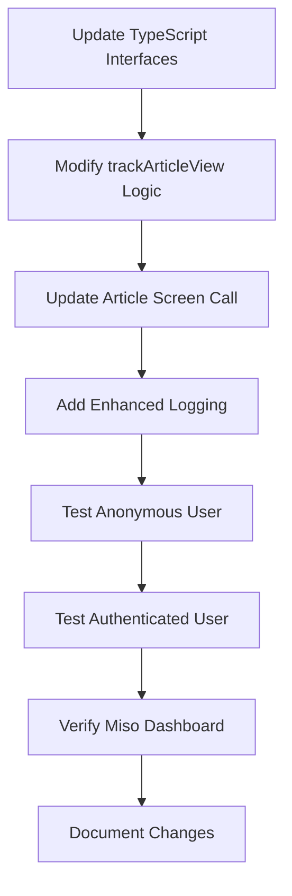

# Miso User ID Implementation Plan

## Overview

Implement proper user identification in Miso API calls according to their documentation, supporting both authenticated subscribers and anonymous users.

## Current State

### Current Implementation

- **File**: `services/miso.ts`
- **Current behavior**: Always sends both `user_id` and `anonymous_id` in every request
- **Problem**: Miso documentation specifies these should be mutually exclusive based on authentication status

### Current Tracking Call (app/article/[id].tsx:113-119)

```typescript
trackArticleView({
  articleId: id,
  userId: isAuthenticated ? user?.userId : undefined,
  anonymousId,
});
```

## Miso API Requirements

According to Miso documentation, the logic should be:

1. **Authenticated Subscriber**: Send `user_id` with prefix `"sub:"`

   ```json
   {
     "user_id": "sub:464219"
   }
   ```

2. **Anonymous User**: Send `anonymous_id` only
   ```json
   {
     "anonymous_id": "1658570109.1761120937"
   }
   ```

### Simplification

For initial implementation, we'll support two types:

- **Subscriber**: Any successfully logged-in user (assume they have subscription)
- **Anonymous**: Not logged in

Future enhancement could add "registered but not subscribed" type if needed.

## Implementation Plan

### 1. Update Miso Service Types

**File**: `services/miso.ts`

#### Update TrackArticleViewParams Interface

```typescript
interface TrackArticleViewParams {
  articleId: string;
  userId?: string; // User ID from auth (e.g., "464219")
  isAuthenticated: boolean; // NEW: Authentication status
  anonymousId: string; // Always provided as fallback
}
```

#### Update MisoInteractionPayload Interface

Make `user_id` and `anonymous_id` mutually exclusive:

```typescript
interface MisoInteractionPayload {
  data: {
    type: "product_detail_page_view";
    product_ids: string[];
    timestamp: string;
    user_id?: string; // Optional: only for authenticated users
    anonymous_id?: string; // Optional: only for anonymous users
  }[];
}
```

### 2. Update trackArticleView Function Logic

**File**: `services/miso.ts` (lines 45-152)

#### New Logic Flow

```typescript
export async function trackArticleView({
  articleId,
  userId,
  isAuthenticated,
  anonymousId,
}: TrackArticleViewParams): Promise<boolean> {
  // Determine which ID to use based on authentication
  let misoUserId: string | undefined;
  let misoAnonymousId: string | undefined;

  if (isAuthenticated && userId) {
    // Authenticated user: use "sub:" prefix
    misoUserId = `sub:${userId}`;
    misoAnonymousId = undefined;
  } else {
    // Anonymous user: use anonymous_id
    misoUserId = undefined;
    misoAnonymousId = anonymousId;
  }

  // Build payload with only the appropriate ID
  const payload: MisoInteractionPayload = {
    data: [
      {
        type: "product_detail_page_view",
        product_ids: [productId],
        timestamp,
        ...(misoUserId && { user_id: misoUserId }),
        ...(misoAnonymousId && { anonymous_id: misoAnonymousId }),
      },
    ],
  };

  // ... rest of the function
}
```

### 3. Update Article Screen Call

**File**: `app/article/[id].tsx` (lines 113-119)

#### Updated Call

```typescript
// Track article view with Miso
const anonymousId = await getAnonymousId();
trackArticleView({
  articleId: id,
  userId: user?.userId,
  isAuthenticated, // NEW: Pass authentication status
  anonymousId,
});
```

### 4. Enhanced Logging

Add detailed logging to show which ID type is being used:

```typescript
console.log("📊 Miso Tracking Mode:", {
  mode: isAuthenticated ? "AUTHENTICATED" : "ANONYMOUS",
  userId: isAuthenticated ? `sub:${userId}` : "N/A",
  anonymousId: !isAuthenticated ? anonymousId : "N/A",
});
```

## Testing Strategy

### Test Cases

1. **Anonymous User**

   - User not logged in
   - Should send: `anonymous_id` only
   - Expected format: `"anonymous_id": "1658570109.1761120937"`

2. **Authenticated Subscriber**

   - User successfully logged in
   - Should send: `user_id` with "sub:" prefix
   - Expected format: `"user_id": "sub:464219"`

3. **Edge Cases**
   - User logs in mid-session (should switch from anonymous to subscriber)
   - User logs out (should switch from subscriber to anonymous)
   - Invalid user_id (should fall back to anonymous)

### Validation Steps

1. Check console logs for correct ID format
2. Verify Miso API accepts the payload
3. Confirm no errors in Miso dashboard
4. Test article view tracking in both states

## Implementation Sequence



## Files to Modify

1. **services/miso.ts** (Primary changes)

   - Update `TrackArticleViewParams` interface
   - Update `MisoInteractionPayload` interface
   - Modify `trackArticleView` function logic
   - Add enhanced logging

2. **app/article/[id].tsx** (Minor change)
   - Update `trackArticleView` call to pass `isAuthenticated`

## Benefits

1. **Compliance**: Follows Miso API documentation exactly
2. **Better Analytics**: Proper user identification for personalization
3. **Privacy**: Clear separation between authenticated and anonymous tracking
4. **Maintainability**: Clear logic for future subscription type additions

## Future Enhancements

If needed, we can add support for "registered but not subscribed" users:

```typescript
// Future enhancement
if (isAuthenticated && hasActiveSubscription) {
  misoUserId = `sub:${userId}`;
} else if (isAuthenticated && !hasActiveSubscription) {
  misoUserId = `reg:${userId}`;
} else {
  misoAnonymousId = anonymousId;
}
```

## Rollback Plan

If issues arise:

1. Revert `services/miso.ts` to send both IDs (current behavior)
2. Keep `isAuthenticated` parameter for future use
3. Monitor Miso dashboard for any tracking gaps

## Success Criteria

- ✅ Anonymous users tracked with `anonymous_id` only
- ✅ Authenticated users tracked with `user_id: "sub:464219"` format
- ✅ No Miso API errors
- ✅ Proper logging shows which mode is active
- ✅ Smooth transition when user logs in/out
