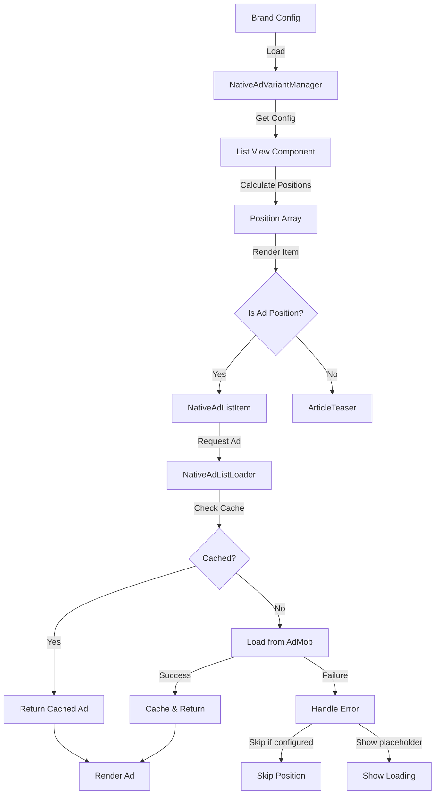

# Native Ad List View Variant - Implementation Plan

## Overview

This document outlines the architecture and implementation plan for adding native ad variants that appear in list views (news, clinical, events) styled like non-hero article teasers.

## Current State Analysis

### Existing Components

- **ArticleTeaser**: Horizontal layout with thumbnail (left) and content (right)
- **ArticleTeaserHero**: Full-width image with overlay text
- **NativeAdCarouselItem**: Full-screen carousel ad for highlights
- **DisplayAd**: Banner ads for article detail and list views

### Existing Native Ad Infrastructure

- **nativeAdService**: Configuration and position management
- **nativeAdLoader**: Ad loading and SDK initialization
- **nativeAdInstanceManager**: Ad lifecycle and caching
- **nativeAdPositionManager**: Position calculations for carousel

### Current Native Ad Configuration

```json
{
  "nativeAds": {
    "enabled": true,
    "testMode": true,
    "firstAdPosition": 2,
    "adInterval": 5,
    "preloadDistance": 1,
    "unloadDistance": 3,
    "maxCachedAds": 3,
    "maxAdsPerSession": null,
    "showLoadingIndicator": true,
    "skipIfNotReady": false,
    "adUnitIds": {
      "ios": "ca-app-pub-xxx",
      "android": "ca-app-pub-xxx"
    }
  }
}
```

## Requirements

### Functional Requirements

1. Native ads should appear in list views styled like ArticleTeaser
2. Configurable per list view (news, clinical, events)
3. Position-based placement (not interval-based)
4. Support for section-based lists with block positioning
5. Configurable ad unit IDs per brand (can be same or different from carousel)
6. Maximum ads per list view configurable
7. Google AdMob compliance for native ad display

### Non-Functional Requirements

1. Maintain existing carousel native ad functionality
2. Reuse existing ad loading infrastructure
3. Minimal performance impact on list scrolling
4. Clear visual indication of sponsored content
5. Proper ad lifecycle management (load/unload)

## Architecture Design

### 1. Configuration Schema

#### New Type Definitions (`types/ads.ts`)

```typescript
/**
 * Native ad variant types
 */
export type NativeAdVariant = "carousel" | "listItem";

/**
 * Configuration for a single list view's native ads
 */
export interface ListViewNativeAdConfig {
  /** Whether native ads are enabled for this list view */
  enabled: boolean;
  /** Specific positions where ads should appear (0-based indices) */
  positions: number[];
  /** Maximum number of ads to show in this list */
  maxAdsPerList: number;
  /** For section-based lists: which block indices can have ads */
  blockPositions?: number[];
  /** Maximum ads per block (for section lists) */
  maxAdsPerBlock?: number;
}

/**
 * Native ads configuration with variant support
 */
export interface NativeAdsConfig {
  /** Master switch for all native ads */
  enabled: boolean;
  /** Whether to use test ads */
  testMode: boolean;

  // Carousel variant (existing)
  carousel?: {
    enabled: boolean;
    firstAdPosition: number;
    adInterval: number;
    preloadDistance: number;
    unloadDistance: number;
    maxCachedAds: number;
    maxAdsPerSession: number | null;
    showLoadingIndicator: boolean;
    skipIfNotReady: boolean;
  };

  // List view variant (new)
  listView?: {
    enabled: boolean;
    /** Configuration per list view type */
    views: {
      news?: ListViewNativeAdConfig;
      clinical?: ListViewNativeAdConfig;
      events?: ListViewNativeAdConfig;
    };
    /** Whether to preload ads */
    preloadAds: boolean;
    /** Show loading placeholder */
    showLoadingIndicator: boolean;
    /** Skip position if ad not ready */
    skipIfNotReady: boolean;
  };

  // Ad unit IDs per variant and platform
  adUnitIds: {
    carousel: {
      ios: string;
      android: string;
    };
    listView: {
      ios: string;
      android: string;
    };
  };
}
```

#### Example Brand Configuration

```json
{
  "nativeAds": {
    "enabled": true,
    "testMode": true,
    "carousel": {
      "enabled": true,
      "firstAdPosition": 2,
      "adInterval": 5,
      "preloadDistance": 1,
      "unloadDistance": 3,
      "maxCachedAds": 3,
      "maxAdsPerSession": null,
      "showLoadingIndicator": true,
      "skipIfNotReady": false
    },
    "listView": {
      "enabled": true,
      "views": {
        "news": {
          "enabled": true,
          "positions": [3, 8, 15, 22],
          "maxAdsPerList": 4,
          "blockPositions": [1, 3],
          "maxAdsPerBlock": 2
        },
        "clinical": {
          "enabled": true,
          "positions": [5, 12, 20],
          "maxAdsPerList": 3
        },
        "events": {
          "enabled": false,
          "positions": [],
          "maxAdsPerList": 0
        }
      },
      "preloadAds": true,
      "showLoadingIndicator": false,
      "skipIfNotReady": true
    },
    "adUnitIds": {
      "carousel": {
        "ios": "ca-app-pub-3940256099942544/3986624511",
        "android": "ca-app-pub-3940256099942544/2247696110"
      },
      "listView": {
        "ios": "ca-app-pub-3940256099942544/3986624511",
        "android": "ca-app-pub-3940256099942544/2247696110"
      }
    }
  }
}
```

### 2. Component Architecture

#### NativeAdListItem Component

**File**: `components/NativeAdListItem.tsx`

**Purpose**: Render native ad in ArticleTeaser style

**Key Features**:

- Match ArticleTeaser layout exactly
- Display "Sponsored" badge (Google requirement)
- Show AdChoices icon (Google requirement)
- Use NativeAdView wrapper
- Handle ad click tracking
- Support loading and error states

**Layout Structure**:

```
┌─────────────────────────────────────┐
│ ┌────────┐  ┌──────────────────┐   │
│ │        │  │ Sponsored        │   │
│ │ Image  │  │ Headline         │   │
│ │        │  │ Body text...     │   │
│ │        │  │ Advertiser  [ⓘ]  │   │
│ └────────┘  └──────────────────┘   │
└─────────────────────────────────────┘
```

**Props Interface**:

```typescript
interface NativeAdListItemProps {
  position: number;
  viewType: "news" | "clinical" | "events";
  onAdLoaded?: (position: number) => void;
  onAdFailed?: (position: number) => void;
  onAdClicked?: (position: number) => void;
}
```

### 3. Service Layer Updates

#### NativeAdVariantManager Service

**File**: `services/nativeAdVariantManager.ts`

**Purpose**: Manage different native ad variants and their configurations

**Key Methods**:

```typescript
class NativeAdVariantManager {
  // Get ad unit ID for specific variant
  getAdUnitId(variant: NativeAdVariant): string;

  // Check if variant is enabled
  isVariantEnabled(variant: NativeAdVariant): boolean;

  // Get configuration for list view
  getListViewConfig(viewType: string): ListViewNativeAdConfig | null;

  // Calculate ad positions for list view
  calculateListViewPositions(
    viewType: string,
    totalItems: number,
    blockIndex?: number
  ): number[];

  // Check if position should show ad
  shouldShowAdAtPosition(
    viewType: string,
    position: number,
    blockIndex?: number
  ): boolean;
}
```

#### NativeAdListLoader Service

**File**: `services/nativeAdListLoader.ts`

**Purpose**: Handle loading and caching of list view native ads

**Key Methods**:

```typescript
class NativeAdListLoader {
  // Load ad for specific position in list
  loadAdForListPosition(
    viewType: string,
    position: number
  ): Promise<NativeAd | null>;

  // Preload ads for upcoming positions
  preloadAdsForPositions(viewType: string, positions: number[]): Promise<void>;

  // Get cached ad for position
  getCachedAd(viewType: string, position: number): NativeAd | null;

  // Clear ads for specific view
  clearViewAds(viewType: string): void;
}
```

### 4. Integration Points

#### FlatList Integration Pattern

**Example for news.tsx**:

```typescript
// In renderItem function
const renderItem = ({ item, index }: { item: Article; index: number }) => {
  // Check if this position should show a native ad
  if (nativeAdVariantManager.shouldShowAdAtPosition("news", index)) {
    return (
      <NativeAdListItem
        position={index}
        viewType="news"
        onAdLoaded={(pos) => console.log(`Ad loaded at ${pos}`)}
        onAdFailed={(pos) => console.log(`Ad failed at ${pos}`)}
      />
    );
  }

  // Regular article teaser
  if (index === 0) {
    return <ArticleTeaserHero article={item} />;
  }
  return <ArticleTeaser article={item} />;
};

// Calculate total items including ads
const totalItems =
  articles.length +
  nativeAdVariantManager.calculateListViewPositions("news", articles.length)
    .length;
```

#### Section-Based List Integration

**Example for news.tsx with blocks**:

```typescript
const renderBlock = (block: Block, blockIndex: number) => {
  const blockConfig = nativeAdVariantManager.getListViewConfig("news");
  const shouldShowAdsInBlock =
    blockConfig?.blockPositions?.includes(blockIndex);

  return (
    <FlatList
      data={block.items}
      renderItem={({ item, index }) => {
        // Check if this block and position should show ad
        if (
          shouldShowAdsInBlock &&
          nativeAdVariantManager.shouldShowAdAtPosition(
            "news",
            index,
            blockIndex
          )
        ) {
          return <NativeAdListItem position={index} viewType="news" />;
        }
        return <ArticleTeaser article={item} />;
      }}
    />
  );
};
```

### 5. Google AdMob Compliance

#### Required Elements for Native Ads

1. **Ad Badge**: Must display "Ad" or "Sponsored" prominently
2. **AdChoices Icon**: Must be visible and clickable
3. **NativeAdView Wrapper**: All ad content must be wrapped
4. **Asset Attribution**: Use NativeAsset components for headline, body, etc.
5. **Click Handling**: Entire ad should be clickable

#### Implementation Checklist

- [ ] Display "Sponsored" badge in top-left or top-right
- [ ] Include AdChoices icon (ⓘ) that opens ad preferences
- [ ] Wrap all content in NativeAdView component
- [ ] Use NativeAsset for headline, body, advertiser, CTA
- [ ] Make entire ad area clickable (TouchableOpacity)
- [ ] Track impressions when ad becomes visible
- [ ] Track clicks when ad is tapped
- [ ] Properly destroy ads when unmounted

### 6. Data Flow Diagram



### 7. File Structure

```
components/
  ├── NativeAdListItem.tsx          # New: List view native ad component
  ├── ArticleTeaser.tsx              # Existing: Reference for styling
  └── NativeAdCarouselItem.tsx       # Existing: Carousel variant

services/
  ├── nativeAdVariantManager.ts      # New: Variant management
  ├── nativeAdListLoader.ts          # New: List ad loading
  ├── nativeAds.ts                   # Update: Add variant support
  ├── nativeAdLoader.ts              # Update: Support variants
  └── nativeAdInstanceManager.ts     # Update: Track by variant

types/
  └── ads.ts                         # Update: Add native ad types

app/(tabs)/
  ├── news.tsx                       # Update: Integrate list ads
  ├── clinical.tsx                   # Update: Integrate list ads
  └── events.tsx                     # Update: Integrate list ads

brands/
  └── [brand]/
      └── config.json                # Update: Add listView config

docs/
  └── native-ad-listview-implementation-plan.md  # This document
```

## Implementation Phases

### Phase 1: Foundation (Types & Configuration)

1. Update `types/ads.ts` with new native ad types
2. Update `brands/index.ts` BrandConfig interface
3. Create example configuration in `brands/nt/config.json`
4. Update `services/nativeAds.ts` to support variants

### Phase 2: Service Layer

1. Create `services/nativeAdVariantManager.ts`
2. Create `services/nativeAdListLoader.ts`
3. Update `services/nativeAdLoader.ts` for variant support
4. Update `services/nativeAdInstanceManager.ts` for variant tracking

### Phase 3: Component Development

1. Create `components/NativeAdListItem.tsx`
2. Implement Google AdMob compliance requirements
3. Add loading and error states
4. Test ad rendering and interactions

### Phase 4: Integration

1. Update `app/(tabs)/news.tsx` with native ad integration
2. Update `app/(tabs)/clinical.tsx` with native ad integration
3. Update `app/(tabs)/events.tsx` with native ad integration
4. Handle section-based lists with block positioning

### Phase 5: Testing & Documentation

1. Test with Google test ad units
2. Verify AdMob policy compliance
3. Test across different screen sizes
4. Create usage documentation
5. Update brand configuration guide

## Testing Strategy

### Unit Tests

- [ ] NativeAdVariantManager position calculations
- [ ] Configuration parsing and validation
- [ ] Ad unit ID selection logic

### Integration Tests

- [ ] Ad loading and caching
- [ ] Position calculation in different list contexts
- [ ] Section-based list positioning

### Manual Testing

- [ ] Visual appearance matches ArticleTeaser
- [ ] Sponsored badge visibility
- [ ] AdChoices icon functionality
- [ ] Ad click tracking
- [ ] Loading states
- [ ] Error handling
- [ ] Multiple ads in single list
- [ ] Section-based list ads

### Compliance Testing

- [ ] All required elements present
- [ ] Proper asset attribution
- [ ] Click handling works correctly
- [ ] Impression tracking accurate
- [ ] Ad destruction on unmount

## Migration Path

### Backward Compatibility

- Existing carousel native ads continue to work unchanged
- New listView configuration is optional
- Brands can enable list ads independently
- Default behavior: list ads disabled

### Configuration Migration

```json
// Old format (still supported)
{
  "nativeAds": {
    "enabled": true,
    "firstAdPosition": 2,
    "adInterval": 5,
    "adUnitIds": { ... }
  }
}

// New format (recommended)
{
  "nativeAds": {
    "enabled": true,
    "carousel": {
      "enabled": true,
      "firstAdPosition": 2,
      "adInterval": 5
    },
    "listView": {
      "enabled": true,
      "views": { ... }
    },
    "adUnitIds": {
      "carousel": { ... },
      "listView": { ... }
    }
  }
}
```

## Performance Considerations

### Optimization Strategies

1. **Lazy Loading**: Only load ads when positions become visible
2. **Caching**: Reuse loaded ads when scrolling back
3. **Preloading**: Load next ad before position is reached
4. **Memory Management**: Destroy ads that scroll far off-screen
5. **Throttling**: Limit concurrent ad requests

### Performance Metrics

- Ad load time: < 2 seconds
- List scroll performance: 60 FPS maintained
- Memory usage: < 50MB for cached ads
- Network requests: Batched when possible

## Security & Privacy

### Data Handling

- No PII sent to ad network
- Respect user tracking preferences
- Follow GDPR/CCPA requirements
- Use Google's consent SDK if required

### Ad Safety

- Only use official Google AdMob SDK
- Validate ad content before display
- Handle malformed ad responses
- Log security-related events

## Monitoring & Analytics

### Key Metrics

- Ad load success rate
- Ad impression rate
- Ad click-through rate (CTR)
- Revenue per thousand impressions (RPM)
- Ad position performance
- Error rates by position

### Analytics Events

```typescript
// Ad lifecycle events
"native_ad_list_requested";
"native_ad_list_loaded";
"native_ad_list_failed";
"native_ad_list_impression";
"native_ad_list_click";
"native_ad_list_destroyed";

// Performance events
"native_ad_list_load_time";
"native_ad_list_cache_hit";
"native_ad_list_cache_miss";
```

## Future Enhancements

### Potential Features

1. A/B testing different ad positions
2. Dynamic position optimization based on performance
3. Multiple ad sizes in list views
4. Video native ads in lists
5. Personalized ad frequency
6. Ad refresh on scroll
7. Cross-promotion with carousel ads

## References

### Documentation

- [Google AdMob Native Ads Guide](https://developers.google.com/admob/android/native)
- [React Native Google Mobile Ads](https://docs.page/invertase/react-native-google-mobile-ads)
- [Native Ads Policy](https://support.google.com/admob/answer/6329638)

### Related Files

- [`components/ArticleTeaser.tsx`](../components/ArticleTeaser.tsx)
- [`components/NativeAdCarouselItem.tsx`](../components/NativeAdCarouselItem.tsx)
- [`services/nativeAds.ts`](../services/nativeAds.ts)
- [`types/ads.ts`](../types/ads.ts)

## Conclusion

This implementation plan provides a comprehensive approach to adding native ad variants for list views while maintaining the existing carousel functionality. The architecture is designed to be:

- **Flexible**: Per-view configuration with position control
- **Maintainable**: Clear separation of concerns
- **Compliant**: Follows Google AdMob policies
- **Performant**: Optimized loading and caching
- **Extensible**: Easy to add new variants or features

The phased approach allows for incremental development and testing, reducing risk and ensuring quality at each step.
