# Native Ads Lazy Loading Implementation Plan

## Overview

Implement lazy loading for native ads in the highlights carousel to improve performance and memory usage. Ads will load just before they come into view and unload when they move out of view, with support for endless carousel scrolling.

## Current Implementation Analysis

### Current Behavior

- **Static Loading**: All native ad positions are determined at initial load
- **Immediate Loading**: Each [`NativeAdCarouselItem`](../components/NativeAdCarouselItem.tsx:49-63) loads its ad immediately on mount
- **No Cleanup**: Ads are only destroyed when component unmounts
- **Fixed Positions**: Uses `firstAdPosition` and `adFrequency` from config
- **Memory Impact**: All ads remain in memory throughout carousel session

### Current Configuration

```json
"nativeAds": {
  "enabled": true,
  "testMode": true,
  "firstAdPosition": 2,
  "adFrequency": 5,  // ← Will be renamed to adInterval
  "adUnitIds": {
    "ios": "ca-app-pub-...",
    "android": "ca-app-pub-..."
  }
}
```

### Current Flow

1. [`app/(tabs)/index.tsx`](<../app/(tabs)/index.tsx>) loads articles with [`fetchHighlightsWithRecommendations()`](<../app/(tabs)/index.tsx:194-277>)
2. Native ad placeholders are inserted at calculated positions
3. Each ad position renders [`NativeAdCarouselItem`](../components/NativeAdCarouselItem.tsx)
4. Component immediately calls [`loadAd()`](../components/NativeAdCarouselItem.tsx:65-129) on mount
5. Ad stays loaded until component unmounts

## New Implementation Design

### Goals

1. ✅ Load ads only when needed (just before viewing)
2. ✅ Unload ads when far from current position
3. ✅ Support endless carousel with unlimited ad positions
4. ✅ Maintain smooth scrolling experience
5. ✅ Reduce memory footprint
6. ✅ Show loading indicators for ads being loaded
7. ✅ Skip ad positions if not ready (configurable)

### New Configuration Schema

```typescript
interface NativeAdConfig {
  enabled: boolean;
  testMode: boolean;
  firstAdPosition: number;
  adInterval: number; // ← Renamed from adFrequency
  preloadDistance: number; // ← NEW: slides ahead to start loading
  unloadDistance: number; // ← NEW: slides away before unloading
  maxCachedAds: number; // ← NEW: max ads in memory
  maxAdsPerSession?: number; // ← NEW: optional limit (undefined = unlimited)
  showLoadingIndicator: boolean; // ← NEW: always true per requirements
  skipIfNotReady: boolean; // ← NEW: default true per requirements
  adUnitIds: {
    ios: string;
    android: string;
  };
}
```

### Default Configuration Values

```json
"nativeAds": {
  "enabled": true,
  "testMode": true,
  "firstAdPosition": 2,
  "adInterval": 5,
  "preloadDistance": 2,
  "unloadDistance": 3,
  "maxCachedAds": 3,
  "maxAdsPerSession": null,
  "showLoadingIndicator": true,
  "skipIfNotReady": true,
  "adUnitIds": {
    "ios": "ca-app-pub-...",
    "android": "ca-app-pub-..."
  }
}
```

## Architecture Changes

### 1. Ad Position Management

#### New Service: `NativeAdPositionManager`

Create [`services/nativeAdPositionManager.ts`](../services/nativeAdPositionManager.ts) to handle:

```typescript
class NativeAdPositionManager {
  // Calculate if position should have an ad
  shouldShowAdAtPosition(position: number): boolean;

  // Get all ad positions up to a given index
  getAdPositionsUpTo(maxPosition: number): number[];

  // Get next ad position after current
  getNextAdPosition(currentPosition: number): number | null;

  // Check if position is within preload range
  shouldPreloadAd(adPosition: number, currentPosition: number): boolean;

  // Check if ad should be unloaded
  shouldUnloadAd(adPosition: number, currentPosition: number): boolean;
}
```

**Logic:**

- First ad at `firstAdPosition`
- Subsequent ads every `adInterval` slides
- Example: `firstAdPosition=2, adInterval=5` → ads at positions: 2, 7, 12, 17, 22...
- Supports endless carousel by calculating positions on-demand

### 2. Ad Instance Management

#### New Service: `NativeAdInstanceManager`

Create [`services/nativeAdInstanceManager.ts`](../services/nativeAdInstanceManager.ts) to handle:

```typescript
interface AdInstance {
  position: number;
  nativeAd: NativeAd | null;
  status: "loading" | "loaded" | "failed" | "unloaded";
  loadStartTime: number;
  loadEndTime?: number;
}

class NativeAdInstanceManager {
  private adInstances: Map<number, AdInstance>;
  private loadingQueue: Set<number>;

  // Request ad load for position
  async loadAdForPosition(position: number): Promise<NativeAd | null>;

  // Get ad instance for position
  getAdInstance(position: number): AdInstance | null;

  // Unload and destroy ad at position
  unloadAdAtPosition(position: number): void;

  // Clean up old ads based on distance from current position
  cleanupDistantAds(currentPosition: number, unloadDistance: number): void;

  // Get cache statistics
  getCacheStats(): { loaded: number; loading: number; failed: number };
}
```

**Features:**

- Maintains map of ad instances by position
- Prevents duplicate loads for same position
- Enforces `maxCachedAds` limit
- Tracks load times for analytics
- Handles cleanup of distant ads

### 3. Viewability Tracking

#### Update [`app/(tabs)/index.tsx`](<../app/(tabs)/index.tsx>)

Add viewability tracking in the carousel scroll handler:

```typescript
const handleScroll = (event: NativeSyntheticEvent<NativeScrollEvent>) => {
  const offsetX = event.nativeEvent.contentOffset.x;
  const newIndex = Math.round(offsetX / screenWidth);

  if (newIndex !== currentIndex) {
    setCurrentIndex(newIndex);

    // Trigger ad loading/unloading based on position
    nativeAdInstanceManager.handlePositionChange(
      newIndex,
      config.preloadDistance,
      config.unloadDistance
    );
  }
};
```

**Triggers:**

- **Preload**: When user is `preloadDistance` slides away from ad position
- **Unload**: When user is `unloadDistance` slides away from ad position
- **Example**: With `preloadDistance=2, unloadDistance=3`:
  - At position 0: preload ad at position 2
  - At position 5: unload ad at position 2, preload ad at position 7

### 4. Component Updates

#### Update [`NativeAdCarouselItem`](../components/NativeAdCarouselItem.tsx)

Transform from eager loading to lazy loading:

**Current:**

```typescript
useEffect(() => {
  loadAd(); // Loads immediately on mount
}, []);
```

**New:**

```typescript
interface NativeAdCarouselItemProps {
  item: Article;
  onAdClicked?: () => void;
  insets: { top: number; bottom: number; left: number; right: number };
  showingProgress?: boolean;
  shouldLoad: boolean; // ← NEW: controlled loading
  onLoadComplete?: (success: boolean) => void; // ← NEW: callback
}

useEffect(() => {
  if (shouldLoad && !nativeAd && !isLoading) {
    loadAd();
  }
}, [shouldLoad]);

// Cleanup when shouldLoad becomes false
useEffect(() => {
  if (!shouldLoad && nativeAd) {
    unloadAd();
  }
}, [shouldLoad]);
```

**States:**

1. **Not Ready**: `shouldLoad=false` → Show nothing or placeholder
2. **Loading**: `shouldLoad=true, isLoading=true` → Show loading indicator
3. **Loaded**: `shouldLoad=true, nativeAd!=null` → Show ad
4. **Failed**: `shouldLoad=true, hasError=true` → Skip (return null)
5. **Unloaded**: `shouldLoad=false` → Destroy ad, clear state

### 5. Carousel Integration

#### Update [`app/(tabs)/index.tsx`](<../app/(tabs)/index.tsx>) renderCarouselItem

```typescript
const renderCarouselItem = ({
  item,
  index,
}: {
  item: Article;
  index: number;
}) => {
  if (item.isNativeAd) {
    const shouldLoad = nativeAdPositionManager.shouldPreloadAd(
      index,
      currentIndex
    );

    return (
      <NativeAdCarouselItem
        item={item}
        shouldLoad={shouldLoad}
        onAdClicked={() => handleAdClick(item)}
        onLoadComplete={(success) => handleAdLoadComplete(index, success)}
        insets={insets}
        showingProgress={false}
      />
    );
  }

  // Regular article rendering...
};
```

## Implementation Flow

### Sequence Diagram


### State Transitions

```mermaid
stateDiagram-v2
    [*] --> NotInRange: Ad position exists
    NotInRange --> Preloading: User within preloadDistance
    Preloading --> Loaded: Ad loaded successfully
    Preloading --> Failed: Ad load failed
    Loaded --> Visible: User reaches ad position
    Visible --> Loaded: User scrolls away (within unloadDistance)
    Loaded --> Unloaded: User beyond unloadDistance
    Failed --> NotInRange: User beyond unloadDistance
    Unloaded --> [*]: Ad destroyed
```



## Analytics Events

### New Events to Track

```typescript
// Ad lifecycle events
analyticsService.logEvent("native_ad_preload_triggered", {
  position: number,
  current_position: number,
  distance: number,
});

analyticsService.logEvent("native_ad_lazy_loaded", {
  position: number,
  load_time_ms: number,
  was_preloaded: boolean,
});

analyticsService.logEvent("native_ad_unloaded", {
  position: number,
  time_visible_ms: number,
  distance_from_current: number,
});

analyticsService.logEvent("native_ad_cache_stats", {
  loaded_count: number,
  loading_count: number,
  failed_count: number,
  max_cached: number,
});

analyticsService.logEvent("native_ad_skipped_not_ready", {
  position: number,
  current_position: number,
});
```

## File Changes Summary

### Files to Modify

1. **[`brands/nt/config.json`](../brands/nt/config.json)**

   - Rename `adFrequency` → `adInterval`
   - Add new lazy loading properties

2. **[`brands/jnl/config.json`](../brands/jnl/config.json)**

   - Add `nativeAds` configuration (currently missing)
   - Include all new properties

3. **[`services/nativeAds.ts`](../services/nativeAds.ts)**

   - Update `NativeAdConfig` interface
   - Update `shouldShowAdAtIndex()` to use `adInterval`
   - Update `calculateAdPositions()` to use `adInterval`

4. **[`services/nativeAdLoader.ts`](../services/nativeAdLoader.ts)**

   - Add methods for lazy loading support
   - Add instance tracking

5. **[`components/NativeAdCarouselItem.tsx`](../components/NativeAdCarouselItem.tsx)**

   - Add `shouldLoad` prop
   - Implement lazy loading logic
   - Add unload mechanism
   - Update loading states

6. **[`app/(tabs)/index.tsx`](<../app/(tabs)/index.tsx>)**
   - Add viewability tracking
   - Implement preload/unload triggers
   - Pass `shouldLoad` to ad components
   - Handle ad load callbacks

### Files to Create

1. **`services/nativeAdPositionManager.ts`**

   - Position calculation logic
   - Preload/unload distance checks

2. **`services/nativeAdInstanceManager.ts`**

   - Ad instance lifecycle management
   - Cache management
   - Cleanup logic

3. **`docs/native-ads-lazy-loading-guide.md`**
   - User-facing documentation
   - Configuration guide
   - Troubleshooting

## Testing Strategy

### Unit Tests

- Position calculation logic
- Cache management
- Distance calculations
- Config validation

### Integration Tests

1. **Preload Behavior**

   - Verify ads load at correct distance
   - Check multiple ads preload correctly
   - Validate cache limits enforced

2. **Unload Behavior**

   - Verify ads unload at correct distance
   - Check memory is freed
   - Validate cleanup on unmount

3. **Endless Scroll**

   - Test ad positions beyond initial load
   - Verify unlimited ads work correctly
   - Check maxAdsPerSession limit (if set)

4. **Edge Cases**
   - Rapid scrolling
   - Scroll backwards
   - Jump to position
   - Network failures
   - Ad load failures

### Performance Tests

- Memory usage over time
- Scroll performance (FPS)
- Ad load times
- Cache hit rates

## Migration Path

### Phase 1: Configuration Update

1. Update config schema in both brands
2. Add backward compatibility for `adFrequency`
3. Update TypeScript types

### Phase 2: Service Layer

1. Create position manager
2. Create instance manager
3. Update existing services

### Phase 3: Component Updates

1. Update `NativeAdCarouselItem`
2. Add lazy loading logic
3. Maintain backward compatibility

### Phase 4: Carousel Integration

1. Add viewability tracking
2. Implement preload/unload triggers
3. Update analytics

### Phase 5: Testing & Optimization

1. Test all scenarios
2. Optimize performance
3. Update documentation

## Rollout Plan

### Stage 1: Development (Code Mode)

- Implement all code changes
- Add comprehensive logging
- Test in development environment

### Stage 2: Testing

- Test with different configurations
- Verify memory improvements
- Check scroll performance

### Stage 3: Staged Rollout

- Enable for one brand first (NT)
- Monitor analytics and performance
- Fix any issues discovered

### Stage 4: Full Rollout

- Enable for all brands
- Update documentation
- Monitor production metrics

## Success Metrics

### Performance Improvements

- **Memory Usage**: Reduce by 60-80% (only 3 ads vs all ads in memory)
- **Initial Load Time**: Faster (no upfront ad loading)
- **Scroll Performance**: Maintain 60 FPS
- **Ad Load Success Rate**: Maintain >95%

### User Experience

- **Smooth Scrolling**: No jank when ads load
- **Quick Ad Display**: Ads ready when user reaches them
- **No Blank Spaces**: Loading indicators or skip behavior

### Analytics to Monitor

- Ad impression rates
- Ad click-through rates
- Scroll depth
- Session duration
- Error rates

## Risk Mitigation

### Potential Issues

1. **Ads Not Ready When Viewed**

   - **Mitigation**: Preload at safe distance (2 slides)
   - **Fallback**: Show loading indicator or skip

2. **Memory Leaks**

   - **Mitigation**: Strict cleanup in unload logic
   - **Monitoring**: Track cache size over time

3. **Rapid Scrolling**

   - **Mitigation**: Debounce preload triggers
   - **Fallback**: Cancel in-flight loads

4. **Network Issues**

   - **Mitigation**: Retry logic with exponential backoff
   - **Fallback**: Skip failed positions

5. **Backward Compatibility**
   - **Mitigation**: Support old `adFrequency` config
   - **Migration**: Automatic conversion on load

## Configuration Examples

### Conservative (Low Memory)

```json
{
  "preloadDistance": 1,
  "unloadDistance": 2,
  "maxCachedAds": 2,
  "maxAdsPerSession": 10
}
```

### Balanced (Recommended)

```json
{
  "preloadDistance": 2,
  "unloadDistance": 3,
  "maxCachedAds": 3,
  "maxAdsPerSession": null
}
```

### Aggressive (Best UX)

```json
{
  "preloadDistance": 3,
  "unloadDistance": 5,
  "maxCachedAds": 5,
  "maxAdsPerSession": null
}
```

## Next Steps

1. Review and approve this plan
2. Switch to Code mode for implementation
3. Follow the implementation order in the todo list
4. Test thoroughly at each phase
5. Monitor metrics after deployment

---

**Plan Status**: Ready for Review
**Estimated Implementation Time**: 8-12 hours
**Complexity**: Medium-High
**Risk Level**: Medium (requires careful memory management)
