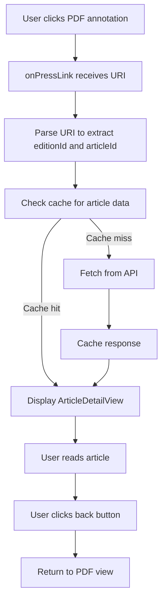

# PDF Article Detail View Implementation Plan

## Overview

Implement a feature that allows users to click on article annotations in the PDF viewer and view the full article content in a dedicated reading view.

## Architecture Decision Record

### Navigation Pattern

- **Decision**: Full-screen view replacement with back button
- **Rationale**: Provides focused reading experience without modal complexity
- **Implementation**: Add view state to PDFViewer component to toggle between 'pdf' and 'article' views

### API Configuration

- **Decision**: Fixed emap-epaper endpoint for all brands
- **Endpoint**: `https://emap-epaper-development.gdkzr.com`
- **Rationale**: Magazine/epaper content is centralized and not brand-specific

### Reading Experience

- **Decision**: Basic text-only view with clean formatting
- **Features**:
  - Article title
  - Plain text content from blocks
  - Scrollable view
  - Simple, readable typography
- **Future Enhancements**: Images, infoboxes, text size controls can be added later

### Error Handling

- **Decision**: Show error message with retry option, back button returns to PDF
- **Rationale**: Keeps user in control, provides recovery path

## Data Flow



## Component Structure

```
PDFViewer (Modified)
├── State: currentView ('pdf' | 'article')
├── State: selectedArticle (ArticleDetail | null)
├── PDF View (when currentView === 'pdf')
│   └── Pdf component with onPressLink handler
└── Article View (when currentView === 'article')
    └── ArticleDetailView component
        ├── Header with back button
        ├── ScrollView with article content
        ├── Loading state
        └── Error state with retry
```

## Implementation Steps

### 1. Type Definitions (types/index.ts)

Add new interfaces for the article detail API response:

```typescript
export interface PDFArticleBlock {
  bbox: number[];
  text: string;
  type: string;
  avg_size: number;
  bg_rgb: number[];
}

export interface PDFArticleInfobox {
  bbox: number[];
  text: string;
  type: string;
  avg_size: number;
  bg_rgb: number[];
}

export interface PDFArticleContent {
  plain: string;
  paragraphs: string[];
}

export interface PDFArticleDetail {
  article_id: string;
  page: number;
  title: string;
  bbox: number[];
  blocks: PDFArticleBlock[];
  infoboxes: PDFArticleInfobox[];
  content: PDFArticleContent;
  endpoints: {
    self: string;
  };
}
```

### 2. API Service Function (services/api.ts)

Add function to fetch article details:

```typescript
const EPAPER_BASE_URL = "https://emap-epaper-development.gdkzr.com";

export async function fetchPDFArticleDetail(
  editionId: string,
  articleId: string
): Promise<PDFArticleDetail> {
  const { cacheService } = await import("./cache");
  const cacheKey = "pdf_article_detail";

  // Try cache first
  const cached = await cacheService.get<PDFArticleDetail>(cacheKey, {
    editionId,
    articleId,
  });
  if (cached) {
    console.log(`Returning cached article ${articleId}`);
    return cached;
  }

  try {
    const url = `${EPAPER_BASE_URL}/articles/${editionId}/${articleId}`;
    console.log(`Fetching article from: ${url}`);

    const response = await fetch(url);
    if (!response.ok) {
      throw new Error(`Failed to fetch article: ${response.status}`);
    }

    const articleData: PDFArticleDetail = await response.json();

    // Cache the result
    await cacheService.set(cacheKey, articleData, {
      editionId,
      articleId,
    });

    return articleData;
  } catch (error) {
    console.error("Error fetching PDF article:", error);

    // Try stale cache
    const staleCache = await cacheService.get<PDFArticleDetail>(cacheKey, {
      editionId,
      articleId,
    });
    if (staleCache) {
      console.log("Returning stale cached article due to error");
      return staleCache;
    }

    throw error;
  }
}
```

### 3. URI Parser Utility (utils/pdfUriParser.ts)

Create utility to parse PDF annotation URIs:

```typescript
export interface ParsedPDFUri {
  editionId: string;
  articleId: string;
}

/**
 * Parse PDF annotation URI to extract edition ID and article ID
 * Example: /articles/e4a4395e135a5524/p8-a10
 * Returns: { editionId: 'e4a4395e135a5524', articleId: 'p8-a10' }
 */
export function parsePDFArticleUri(uri: string): ParsedPDFUri | null {
  try {
    // Remove leading slash if present
    const cleanUri = uri.startsWith("/") ? uri.slice(1) : uri;

    // Expected format: articles/{editionId}/{articleId}
    const parts = cleanUri.split("/");

    if (parts.length !== 3 || parts[0] !== "articles") {
      console.warn("Invalid PDF article URI format:", uri);
      return null;
    }

    return {
      editionId: parts[1],
      articleId: parts[2],
    };
  } catch (error) {
    console.error("Error parsing PDF article URI:", error);
    return null;
  }
}
```

### 4. ArticleDetailView Component (components/ArticleDetailView.tsx)

Create new component for displaying article content:

```typescript
import React, { useEffect, useState, useCallback } from "react";
import {
  View,
  ScrollView,
  StyleSheet,
  ActivityIndicator,
  TouchableOpacity,
} from "react-native";
import { ThemedText } from "./ThemedText";
import { ThemedView } from "./ThemedView";
import { Ionicons } from "@expo/vector-icons";
import { fetchPDFArticleDetail } from "@/services/api";
import { PDFArticleDetail } from "@/types";

interface ArticleDetailViewProps {
  editionId: string;
  articleId: string;
  onBack: () => void;
}

export default function ArticleDetailView({
  editionId,
  articleId,
  onBack,
}: ArticleDetailViewProps) {
  const [article, setArticle] = useState<PDFArticleDetail | null>(null);
  const [loading, setLoading] = useState(true);
  const [error, setError] = useState<string | null>(null);

  const loadArticle = useCallback(async () => {
    try {
      setLoading(true);
      setError(null);
      console.log(`Loading article: ${editionId}/${articleId}`);

      const articleData = await fetchPDFArticleDetail(editionId, articleId);
      setArticle(articleData);
    } catch (err) {
      console.error("Error loading article:", err);
      const errorMessage =
        err instanceof Error ? err.message : "Failed to load article";
      setError(errorMessage);
    } finally {
      setLoading(false);
    }
  }, [editionId, articleId]);

  useEffect(() => {
    loadArticle();
  }, [loadArticle]);

  const renderLoading = () => (
    <ThemedView style={styles.centerContainer}>
      <ActivityIndicator size="large" />
      <ThemedText style={styles.loadingText}>Loading article...</ThemedText>
    </ThemedView>
  );

  const renderError = () => (
    <ThemedView style={styles.centerContainer}>
      <Ionicons name="alert-circle-outline" size={64} color="#999" />
      <ThemedText style={styles.errorTitle}>Unable to load article</ThemedText>
      <ThemedText style={styles.errorMessage}>{error}</ThemedText>
      <TouchableOpacity style={styles.retryButton} onPress={loadArticle}>
        <ThemedText style={styles.retryButtonText}>Try Again</ThemedText>
      </TouchableOpacity>
    </ThemedView>
  );

  const renderArticle = () => {
    if (!article) return null;

    return (
      <ScrollView
        style={styles.scrollView}
        contentContainerStyle={styles.content}
      >
        <ThemedText type="title" style={styles.title}>
          {article.title}
        </ThemedText>

        <ThemedText style={styles.articleText}>
          {article.content.plain}
        </ThemedText>
      </ScrollView>
    );
  };

  return (
    <ThemedView style={styles.container}>
      {/* Header with back button */}
      <ThemedView style={styles.header}>
        <TouchableOpacity
          style={styles.backButton}
          onPress={onBack}
          accessibilityRole="button"
          accessibilityLabel="Go back to PDF"
        >
          <Ionicons name="arrow-back" size={24} color="#007AFF" />
          <ThemedText style={styles.backButtonText}>Back to PDF</ThemedText>
        </TouchableOpacity>
      </ThemedView>

      {/* Content */}
      {loading && renderLoading()}
      {error && !loading && renderError()}
      {article && !loading && !error && renderArticle()}
    </ThemedView>
  );
}

const styles = StyleSheet.create({
  container: {
    flex: 1,
  },
  header: {
    paddingHorizontal: 16,
    paddingVertical: 12,
    borderBottomWidth: StyleSheet.hairlineWidth,
    borderBottomColor: "rgba(0,0,0,0.1)",
  },
  backButton: {
    flexDirection: "row",
    alignItems: "center",
    gap: 8,
  },
  backButtonText: {
    fontSize: 17,
    color: "#007AFF",
  },
  scrollView: {
    flex: 1,
  },
  content: {
    padding: 20,
  },
  title: {
    marginBottom: 20,
  },
  articleText: {
    fontSize: 17,
    lineHeight: 28,
    letterSpacing: 0.3,
  },
  centerContainer: {
    flex: 1,
    justifyContent: "center",
    alignItems: "center",
    padding: 32,
  },
  loadingText: {
    marginTop: 16,
    fontSize: 16,
    opacity: 0.7,
  },
  errorTitle: {
    fontSize: 20,
    fontWeight: "600",
    marginTop: 16,
    marginBottom: 8,
    textAlign: "center",
  },
  errorMessage: {
    fontSize: 16,
    opacity: 0.7,
    textAlign: "center",
    marginBottom: 24,
    lineHeight: 22,
  },
  retryButton: {
    backgroundColor: "#007AFF",
    paddingHorizontal: 24,
    paddingVertical: 12,
    borderRadius: 8,
  },
  retryButtonText: {
    color: "white",
    fontSize: 16,
    fontWeight: "600",
  },
});
```

### 5. Update PDFViewer Component (components/PDFViewer.tsx)

Modify PDFViewer to support article view:

**Key Changes:**

1. Add view state: `'pdf' | 'article'`
2. Add state for selected article IDs
3. Update `onPressLink` handler to parse URI and switch views
4. Conditionally render PDF or ArticleDetailView based on state
5. Add handler to return from article view to PDF

**Modified sections:**

```typescript
// Add imports
import ArticleDetailView from "./ArticleDetailView";
import { parsePDFArticleUri } from "@/utils/pdfUriParser";

// Add state
type ViewState = "pdf" | "article";
const [currentView, setCurrentView] = useState<ViewState>("pdf");
const [selectedArticle, setSelectedArticle] = useState<{
  editionId: string;
  articleId: string;
} | null>(null);

// Update onPressLink handler
const handlePdfPressLink = useCallback((uri: string) => {
  console.log("🔗 PDF annotation clicked:", uri);

  const parsed = parsePDFArticleUri(uri);
  if (parsed) {
    console.log("📄 Opening article:", parsed);
    setSelectedArticle(parsed);
    setCurrentView("article");
  } else {
    console.warn("⚠️ Could not parse article URI:", uri);
    Alert.alert("Invalid Link", "This link format is not supported.");
  }
}, []);

// Add handler to return to PDF
const handleBackToPDF = useCallback(() => {
  console.log("🔙 Returning to PDF view");
  setCurrentView("pdf");
  setSelectedArticle(null);
}, []);

// Update render to conditionally show views
return (
  <>
    {currentView === "pdf" && <>{/* Existing PDF view code */}</>}

    {currentView === "article" && selectedArticle && (
      <ArticleDetailView
        editionId={selectedArticle.editionId}
        articleId={selectedArticle.articleId}
        onBack={handleBackToPDF}
      />
    )}
  </>
);
```

## Testing Strategy

### Manual Testing Checklist

- [ ] Click on article annotation in PDF
- [ ] Verify URI is parsed correctly
- [ ] Verify article loads and displays
- [ ] Verify loading state shows during fetch
- [ ] Test error handling (disconnect network)
- [ ] Verify retry button works
- [ ] Verify back button returns to PDF
- [ ] Test cache functionality (second load should be instant)
- [ ] Test with different article IDs
- [ ] Verify scrolling works in article view

### Edge Cases to Test

- [ ] Invalid URI format
- [ ] Non-existent article ID
- [ ] Network timeout
- [ ] Malformed API response
- [ ] Very long article content
- [ ] Special characters in article text

## Performance Considerations

1. **Caching**: Article data is cached to avoid repeated API calls
2. **Lazy Loading**: ArticleDetailView component only loads when needed
3. **Memory**: Article content is released when returning to PDF view
4. **Network**: Single API call per article with cache fallback

## Future Enhancements

1. **Rich Content**: Add support for images and infoboxes from blocks
2. **Text Controls**: Font size adjustment, theme switching
3. **Sharing**: Share article content or link
4. **Bookmarking**: Save articles for later reading
5. **Search**: Search within article text
6. **Related Articles**: Show related content from same edition

## Files to Create/Modify

### New Files

- `types/index.ts` - Add PDFArticleDetail types
- `utils/pdfUriParser.ts` - URI parsing utility
- `components/ArticleDetailView.tsx` - Article display component

### Modified Files

- `services/api.ts` - Add fetchPDFArticleDetail function
- `components/PDFViewer.tsx` - Add article view state and navigation

## Estimated Implementation Time

- Type definitions: 15 minutes
- URI parser utility: 20 minutes
- API service function: 30 minutes
- ArticleDetailView component: 1 hour
- PDFViewer modifications: 45 minutes
- Testing and refinement: 1 hour

**Total: ~3.5 hours**

## Success Criteria

✅ User can click article annotation in PDF
✅ Article content loads and displays correctly
✅ Loading and error states work properly
✅ Back navigation returns to PDF view
✅ Article data is cached for performance
✅ Error handling provides good user experience
✅ Code follows existing project patterns and conventions
